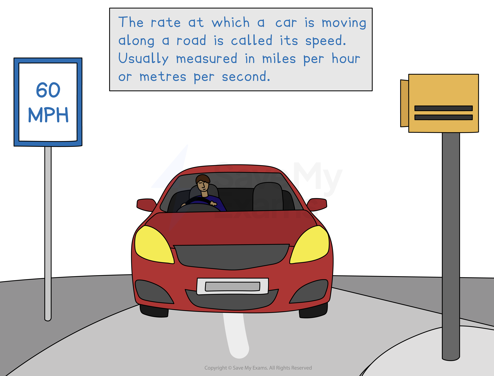
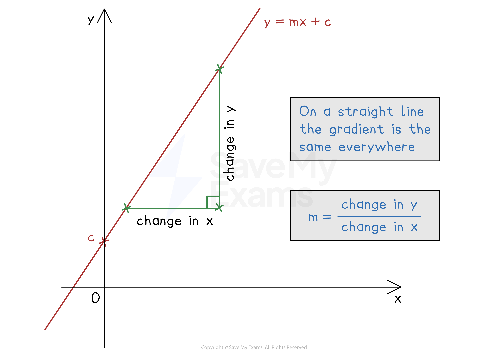
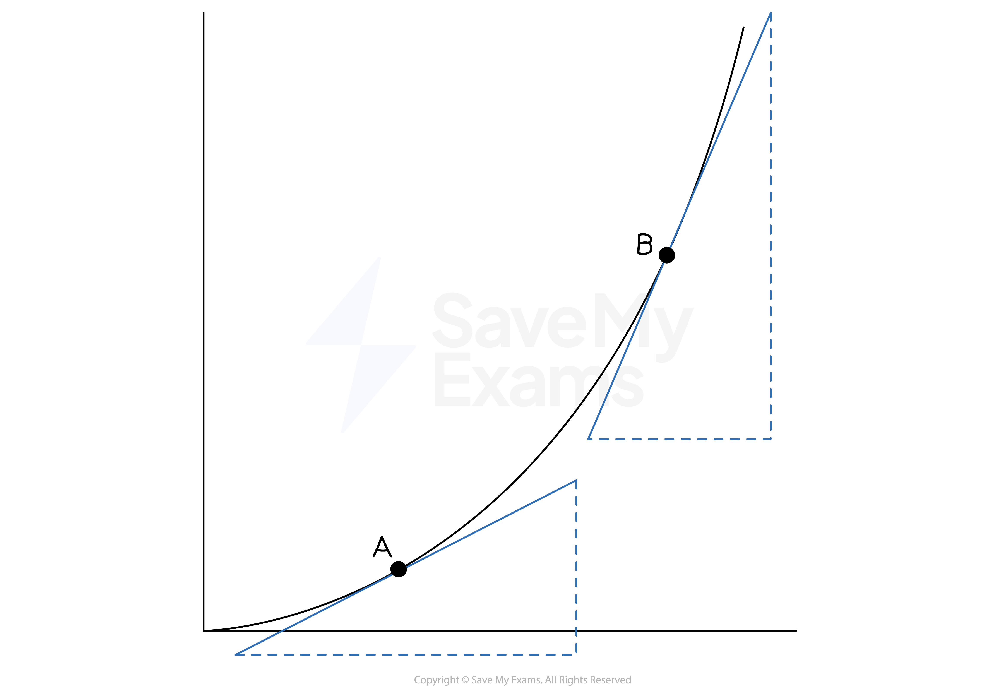

# Rates-of-Change Graphs

## Rates of Change of Graphs

> **Spec point** — `spcpt_DrvNQjR2z6ZmYQxv`

## Rates of change of graphs

### What is a rate-of-change graph?

- A **rate-of-change graph** usually shows how **a variable changes with time**
- The following are** examples** of rates-of-change graphs:

  - **Speed** against time
  
    - Speed is the rate of change of distance **as time increases**
  - **Acceleration** against time
  
    - Acceleration is the rate of change of velocity as time increases
  - The **depth** of water against time (e.g. in a container as it is filled with water)

### Do rates-of-change graphs always include time as a variable?

- More generally, rate-of-change graphs can show any **two different variables** plotted against each other, **not just time**

  - E.g. the volume of air inside an inflating balloon plotted against the balloon's radius
  
    - This shows the rate of change of volume as **radius increases**
  - E.g. the speed of an object plotted against its distance from the starting point
  
    - This shows the rate of change of the speed of an object as it moves further away from the starting point

### How can I use gradients to find rates of change?

- The **gradient **of the graph of *y* against *x* represents:

  - the** amount of change** **in *****y*** for every **1 unit of increase **in the** *****x-*****direction**
  
    - This is the amount of *y* **per** unit of *x*
  - This is called the **rate of change of *****y***** against *****x***
- The **units** of **gradients** are the units of the *y*-axis, divided by the units of the *x*-axis

  - E.g. If the graph shows volume in cm3 on the *y*-axis and time in seconds on the *x*-axis, the rate of change is measured in cm3/s (or cm3s-1)
- If the graph is a **straight line** the rate of change is **constant**

  - If the graph is **horizontal**, the rate of change is **zero **
  
    - *y* is not changing as *x* changes

### How can I use tangents to find rates of change?

- If the graph is a **curve**, you can draw a** tangent **at a point on the graph and find its **gradient**

  - This will be an **estimate** of the rate of change of* y* against *x*
- The **rate of change is greater** when the graph is **steeper**

  - In the below image
  
    - tangents drawn at points A and B show the graph is steeper at B
    - therefore the rate of change at B is greater

- On a **distance-time graph**, a tangent at a point on the curve can be used to estimate the** velocity** at that particular time
- On a **speed-time graph**, a tangent at a point on the curve can be used to estimate the **acceleration** at that particular time

> **Exam Hint**
> The **units of the gradient **can help you understand what is happening in the context of an exam question.
> 
> For example, if the *y*-axis is in dollars and the *x*-axis is in hours, the gradient represents the change in dollars per hour.

> **Worked Example**
> (a) Each of the graphs below shows the depth of water, *d* cm, in different containers that are being filled from a running tap of water with a constant flow rate.
> 
> Match each of the graphs 1, 2, 3, 4 with the containers A, B, C, D.
> 
> 
> 
> **Answer:**
> 
> > *Considering graph 1: the gradient is constant*
> *This means the rate of change is constant*
> *So the depth increases at the same rate throughout*
> 
> > *This matches container D which has vertical sides, so depth increases uniformly*
> 
> 
> 
> **Final answer:** **Graph 1 is container D**
> 
> > *Considering graph 2: the gradient starts shallow and becomes steeper, meaning that the depth increases faster and faster at the end*
> 
> > *This matches container A, which gets narrower towards the top, causing the depth to increase faster at the end*
> 
> 
> 
> **Final answer:** **Graph 2 is container A**
> 
> > *Considering graph 3: the gradient starts steep and becomes shallower, meaning that the depth increases at a slower and slower rate as time increases*
> 
> > *This matches container B, which gets wider towards the top, causing the depth to increase more slowly at the end*
> 
> 
> 
> **Final answer:** **Graph 3 is container B**
> 
> > *Considering graph 4: the gradient starts steep, then becomes shallow, then becomes steep again. This means that the depth increases quickly, then slowly, then quickly again*
> 
> > *This matches container C, which is narrow at the bottom (fast depth increase), gets wider in the middle (slower depth increase) and narrow again at the top (faster depth increase)*
> 
> 
> 
> **Final answer:** **Graph 4 is container C**
> 
> (b) The graph below shows a model of the volume, *v* litres, of diesel fuel in the tank of George’s truck after it has travelled a distance of *d* kilometres.
> 
> 
> 
> (i) Find the gradient of the graph, stating its units clearly.
> 
> **Answer:**
> 
> $\mathrm{Gradient}=\frac{\mathrm{change} \mathrm{in}y}{\mathrm{change} \mathrm{in}x}$
> 
> $\mathrm{Gradient}=\frac{-54\mathrm{litres}}{600\mathrm{kilometres}}$
> 
> **Final answer:** **-0.09 litres per kilometre**
> 
> (ii) Interpret what the gradient of this graph represents.
> 
> **Answer:**
> 
> > *Consider the units of the gradient: litres per kilometre*
> *An increase in 1 kilometres causes a decrease of 0.09 litres in diesel fuel*
> 
> **Final answer:** **The gradient represents the amount of diesel fuel used to travel one kilometre**
> **Travelling 1 km uses up 0.09 litres of diesel fuel**
> 
> (iii) Give one reason why this model may not be realistic.
> 
> **Answer:**
> 
> **Final answer:** **Fuel may not be consumed at a constant rate**
