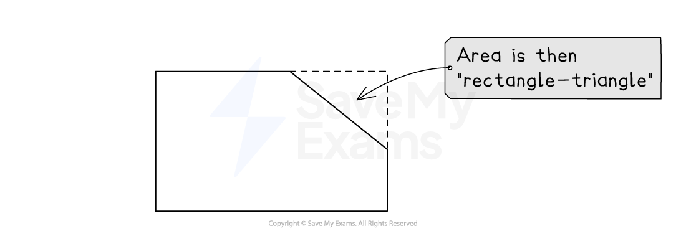

# Adding & Subtracting Areas

## Adding & Subtracting Areas

> **Spec point** — `spcpt_2NQRqtzTGgzNksfC`

## Adding & subtracting areas

### What is a compound shape?

- Sometimes you will have a shape that is **not a standard shape** such as a rectangle, triangle, trapezium etc.

  - These are often called **compound shapes**
  - We can **split** the non-standard shape into **standard shapes**

### How do I find the area of a compound shape?

- **Split** the **compound** shape into **standard shapes**
- Find the **areas** of the **standard shapes**
- **Add **these areas together to find the area of the **compound shape**
- Occasionally it may be easier to **add an extra shape **to the diagram and **subtract the area **of the **extra shape** from the **new bigger shape**

  - For the shape below you might complete the rectangle by putting a triangle in the top right corner
  - The area of the **original shape** is the rectangle minus the triangle

> **Exam Hint**
> Take a moment to think about how to split up the shape into the easiest shapes possible – there will probably be more than one way to do it!

> **Worked Example**
> Find the area of the pentagon shown in the diagram below.
> 
> 
> 
> **Answer:**
> 
> > *Separate the diagram into two shapes that you are familiar with and know the area formulae for*
> *This pentagon can easily be split into a rectangle and a triangle*
> 
> *Use the values given to find the length of the base and the height of the triangle and add these to the diagram.*
> 
> 
> 
> > *The total area will be the area of the rectangle + the area of the triangle.*
> 
> `table row cell Total space area space end cell equals cell space open parentheses 12 cross times space 4 close parentheses space plus 1 half open parentheses 7 cross times 5 close parentheses end cell row blank equals cell space 48 plus 1 half open parentheses 35 close parentheses end cell end table`
> 
> **Final answer:** **Area = 65.5 cm****2**
