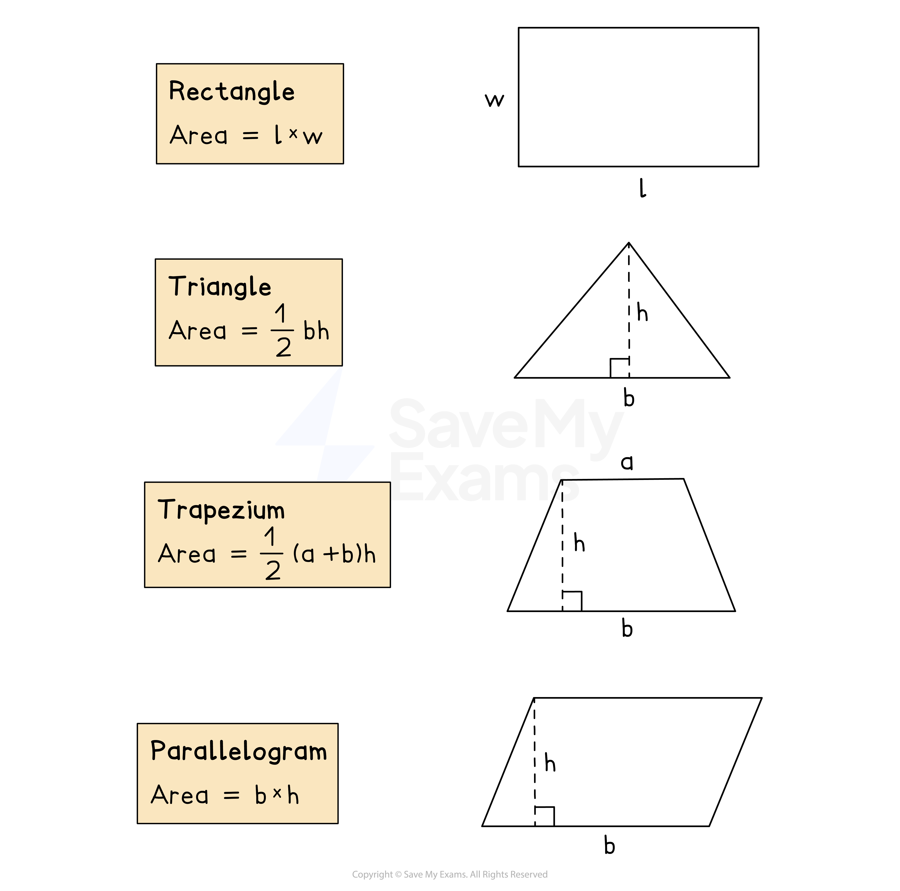

# Area

## Area Formulas

> **Spec point** — `spcpt_pSX9GyS8bW7N5CH7`

## Area formulas

### What is area?

- **Area** is the **amount of space** within the perimeter of a 2D shape

  - For example, the size of a sports field
- Area is calculated using lengths in **two dimensions**

  - **Units of measure **include mm2, cm2, m2 etc

### How do I find the area of a shape on a square grid?

- Count the **total number **of **whole squares** inside the shape

  - You can **shade** or **mark** the squares you have counted so far
- Parts of the shape **may not contain whole squares**

  - Pair up **half squares**, or **parts** of squares, to form whole ones
- There will be a **scale **telling you how much area **one square** represents

  - **Multiply **the number of squares you have counted by this value to find the **total area **of the shape

### Which area formulas do I need to know?

*Formulas for the areas of common shapes*

### How do I find the area of a rectangle?

- The area, *A*, of a **rectangle** of length, *l*, and width, *w*, using the formula

  - $A=l\timesw$
  
    - Multiply together the length and the width

### How do I find the area of a triangle?

- The area, *A*, of a **triangle** with base, *b*, and length, *l*, can be found using the formula

  - $A=\frac{1}{2}bh$
  
    - **Multiply** the length of the **base** (*b*) by the **perpendicular height **(*h*)
    - **Halve** the answer
- The **perpendicular height **may not be the length of one of the sides of the triangle

### How do I find the area of a trapezium?

- The area, *A*, of a **trapezium** with parallel lengths, *a* and *b*, and perpendicular height, *h*, can be found using the formula

  - `A equals 1 half open parentheses a plus b close parentheses h`
  
    - **Add **together the lengths of the **parallel sides**
    - **Multiply **the result by the distance between the parallel sides
    - **Halve** the answer
- You are **given **this formula in the exam

### How do I find the area of a parallelogram?

- You can find the area, *A*, of a **parallelogram** of length, *l*, and perpendicular height, *h*, by using the formula

  - $A=bh$
  
    - **Multiply** the length of the **base** by the **perpendicular height**
- The **perpendicular height** is **not a length** of the parallelogram
- It is the **distance between** the **base** and its **opposite side**
- You can work the area of a parallelogram out by **splitting the shape** into a rectangle and triangles if you can't remember the formula

> **Exam Hint**
> - You may have to do some work to find **missing lengths **first
> 
>   - For example, you may need to use **Pythagoras' Theorem **to find a missing length on a triangle
> - The **area of a trapezium **is given to you in the exam but you will need to remember the other formulas

> **Worked Example**
> Calculate the area of the following shapes.
> 
> (a)
> 
> 
> 
> **Answer:**
> 
> > *Find the area of the trapezium using *`A equals 1 half open parentheses a plus b close parentheses h`
> *Remember that **a**  and **b**  are the two parallel sides and **h**  is the perpendicular height*
> 
> `A equals 1 half open parentheses 30 plus 15 close parentheses cross times 20`
> 
> **Final answer:** **450 cm****2**
> 
> (b)
> 
> 
> 
> **Answer:**
> 
> *Find the area of the parallelogram using *$A=b\timesh$
> *Remember that **b**  is the base and **h**  is the perpendicular height*
> 
> $A=15\times12$
> 
> **Final answer:** **180 cm****2**
> 
> (c)
> 
> 
> 
> **Answer:**
> 
> > *Find the area of the right-angled triangle using *$A=\frac{1}{2}bh$
> *Remember that **b**  is the base and **h ** is the perpendicular height*
> 
> $A=\frac{1}{2}\times8\times7$
> 
> **Final answer:** **28 cm****2**
