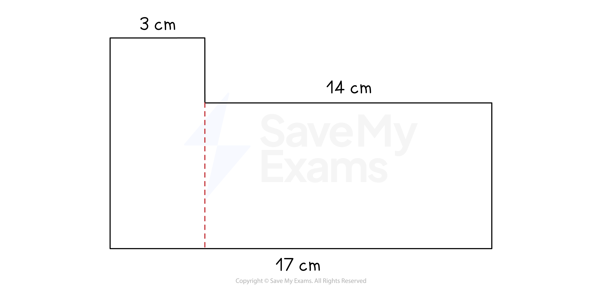

# Perimeter

## Perimeter

> **Spec point** — `spcpt_W2yYk784rNVZBxPh`

## Perimeter

### What is perimeter?

- Perimeter is the **total distance** around the **outside** of a 2D shape

  - The perimeter of a **circle** is called the **circumference**
- Perimeter is a length** **in** one dimension**

  - **Units of measure** include mm, cm, m etc

### How do I find the perimeter of a 2D shape?

- **Add together** the **lengths** of all of the sides of the shape
- For any ***regular***** **2D shape, the perimeter will be the **number of sides**, multiplied by the **length of one side**

  - For example, the perimeter of a square of side length *x*  cm will be 4*x*  cm

### How do I find the perimeter of a compound shape?

- Shapes may be made up of two or more 2D shapes, these are called **compound shapes**

  - Compound shapes can usually be split into** rectangles**, **triangles **and** parts of circles**
  - You will need to be confident with the **properties of 2D shapes**
  
    - For example, the distance between the** centre point **of a** circle **and a** **point on the** circumference **is its** radius**
  - Look out for **sides** that are** equal**, for example in a rectangle, parallelogram, or isosceles triangle
  
    - **Dashes** may be used to mark the **equal sides**, or the question may tell you which sides are equal
  - You may need to use certain** formulas** to calculate lengths
  
    - For example, you may need to use **Pythagoras' theorem** to calculate a length on a **right-angled triangle**
  - You may need to use the **given information **to find the lengths of some of the sides
  
    - For example, the L-shape below can be split into two rectangles
    - The **sum of the lengths of two shorter sides** will be the same as the length of the **longer side opposite**

> **Exam Hint**
> Understanding properties of different 2D shapes can be essential for missing lengths.

> **Worked Example**
> Find the perimeter of the compound shape.
> 
> 
> 
> **Answer:**
> 
> > *The shape can be split up into a triangle and two rectangles*
> 
> > *The dashes on the triangle mean that the lengths are equal *
> 
> > *Therefore, the missing length is 6 cm*
> 
> > *The horizontal lengths of the two rectangles add up to the length of the longest horizontal line*
> *15 cm and the missing length, are equal to the 18 cm length at the top*
> *The missing horizontal length is therefore 3 cm *
> 
> 
> 
> > *You can now find the sum of all the sides to find the total perimeter*
> 
> *6 + 6 + 18 + 2 + 3 + 4 + 15*
> 
> **Final answer:** **54 cm**
