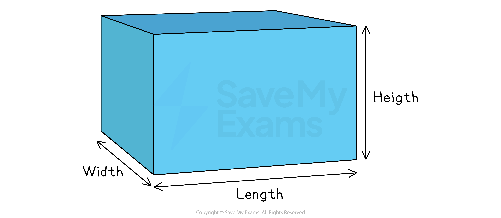
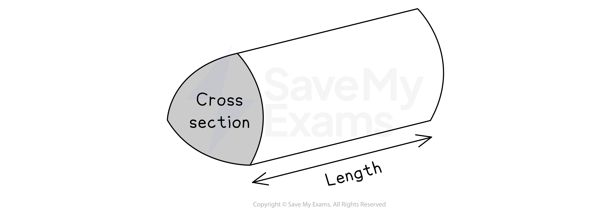
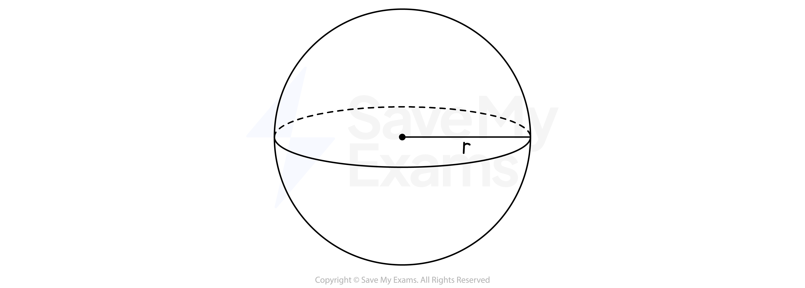

# Volume

## Volume

> **Spec point** — `spcpt_pKCFj25GzzqW6sr3`

## Volume

### What is volume?

- The **volume **of a 3D shape is a measure of how much **space** it takes up
- You need to be able to calculate the volumes of a number of **common 3D shapes**, including:

  - Cubes and cuboids
  - Prisms
  - Cylinders
  - Spheres
  - Cones

### How do I find the volume of a cube or a cuboid?

- A **cube** is a special **cuboid**, where the length, width and height are all of **equal length**
- A** cuboid** is another name for a rectangular-based **prism**
- To find the volume, *V*, of a **cube** or a **cuboid**, with length, *l*, width, *w*, and height, *h*, use the formula

  - $V=lwh$
  - This formula is **not** given to you in the exam

- You will sometimes see the terms  'depth' or 'breadth' instead of 'height' or 'width'

### How do I find the volume of a prism?

- A **prism** is a 3D object with a **constant cross-sectional area**
- To find the volume, *V*, of a **prism**, with cross-sectional area, *A*, and length, *l*, use the formula

  - $V=Al$
  - This formula is given to you in the exam

- Note that the cross-section can be **any shape**, so as long as you know its **area **and the** length **of the prism, you can calculate its **volume**

  - If you know the **volume **and** length** of the prism, you can calculate the **area** of the **cross-section**

### How do I find the volume of a cylinder?

- To calculate the volume, *V*, of a **cylinder** with radius, *r*, and height, *h*, use the formula

  - $V=πr^{2}h$
  - This formula is given to you in the exam

- Note that a cylinder is similar to a **prism,** its cross-section is a circle with area $πr^{2}$, and its length is *h*

### How do I find the volume of a cone?

- To calculate the volume, *V*, of a **cone** with base radius, *r,* and perpendicular height, *h*, use the formula

  - $V=\frac{1}{3}πr^{2}h$
  - This formula is given to you in the exam
- The height must be a line from the top of the cone that is **perpendicular** to the base

### How do I find the volume of a sphere?

- To calculate the volume, *V*, of a **sphere** with radius, *r*, use the formula

  - $V=\frac{4}{3}πr^{3}$
  - This formula is given to you in your exam

> **Exam Hint**
> You only need to memorise the volume formulae for **cuboids**!

> **Worked Example**
> A cylinder is shown.
> 
> 
> 
> The radius, *r*, is 8 cm and the height, *h*, is 20 cm.
> 
> Calculate the volume of the cylinder, giving your answer correct to 3 significant figures.
> 
> **Answer:**
> 
> > *A cylinder is similar to a prism but with a circular base*
> *The volume of any prism, **V**, is its base area × height, **h**, where the base area here is for a circle, *$πr^{2}$
> 
> $V=πr^{2}h$
> 
> *Substitute **r ** = 8 and **h ** = 20 into the formula*
> 
> $V=π\times8^{2}\times20$
> 
> > *Work out this value on a calculator*
> 
> *4021.238...*
> 
> > *Round the answer to 3 significant figures*
> 
> **Final answer:** **4020 cm****3**
