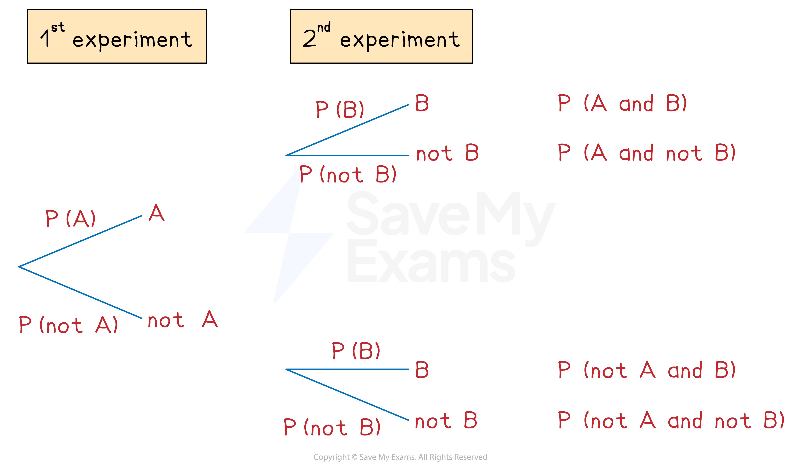

# Probability Tree Diagrams

## Tree Diagrams

> **Spec point** — `spcpt_hTsm2dz7xmwM4jwW`

## Tree diagrams

### How do I draw a tree diagram?

- **Tree diagrams** can be used for** repeated** **experiments** with **two outcomes**

  - The **1st experiment **has outcome **A** or **not A**
  - The **2nd experiment **has outcome **B** or not **B**
- Read the tree diagram from** left to right** along its **branches**

  - For example, the top branches give A followed by B
  
    - This is called A** and** B

### How do I find probabilities from tree diagrams?

- Write the **probabilities** on each branch

  - Remember that P(**not **A) = 1 - P(A)
  
    - Probabilities on each **pair** of branches **add to 1**
- **Multiply** along the branches from** left to right**

  - This gives P(1st outcome **and** 2nd outcome)
- **Add** between the **separate cases**

  - For example
  
    - P(AA **or **BB) = P(AA) + P(BB)
- The probabilities of **all** possible cases **add to 1**
- If asked to find the probability of **at least one** outcome, it is quicker to do **1 - P(none)**

### How do I use tree diagrams with conditional probability?

- Probabilities that depend on a particular thing having happened first in a tree diagram are called **conditional probabilities**
- For example, the probability that a team wins a game may** depend** on whether they won or lost the previous game

  - The **probabilities** for 'win' on the first set of branches may be **different** to those for 'win' on the second set of branches
- Another example of conditional probabilities is **"without replacement"** scenarios

  - e.g. two items are drawn from a bag of different coloured items without the first item drawn being replaced
  - The **probabilities** on the second set of branches will **change** depending on which branch has been followed on the first set of branches
  
    - The **denominators** in the probabilities for the second set of branches will be **one less** than those on the first set of branches
    - The **numerators** on the second set of branches will also change
- Conditional probability questions are sometimes introduced by the expression **'given that...'**

  - e.g. 'Find the probability that the team win their next game given that they lost their previous game'
- The** notation** `straight P open parentheses A vertical line B close parentheses` is often used for conditional probabilities

  - That is read as 'the probability of *A* given *B'*
  - e.g. `straight P open parentheses win vertical line lose close parentheses` is the probability a team wins, given that they lost the previous game

> **Exam Hint**
> When multiplying along branches with fractions, **don't cancel fractions** in your working.
> 
> Having the same denominator makes them easier to add together.

> **Worked Example**
> A worker drives through two sets of traffic lights on their way to work.
> Each set of traffic lights has only two options: green or red.
> The probability of the first set of traffic lights being on green is $\frac{5}{7}$.
> The probability of the second set of traffic lights being on green is $\frac{8}{9}$.
> 
> (a) Draw and label a tree diagram. Show the probabilities of every possible outcome.
> 
> **Answer:**
> 
> > *Work out the probabilities of each set of traffic lights being on red, R*
> *Use P(red) = 1 - P(green)*
> 
> `straight P open parentheses 1 to the power of st space straight R close parentheses equals 1 minus straight P open parentheses 1 to the power of st space straight G close parentheses equals 1 minus 5 over 7 equals 2 over 7`
> `straight P open parentheses 2 to the power of nd space straight R close parentheses equals 1 minus straight P open parentheses 2 to the power of nd space straight G close parentheses equals 1 minus 8 over 9 equals 1 over 9`
> 
> > *Draw the branches (with a label of G or R on the ends)*
> *Write the probabilities above each branch*
> *Calculate probabilities of each outcome by multiplying along the branches from left to right*
> 
> 
> 
> (b) Find the probability that both sets of traffic lights are on red.
> 
> **Answer:**
> 
> > *This is the answer for P(R, R) from the tree diagram*
> 
> **Final answer:** ** **$\frac{2}{63}$
> 
> (c) Find the probability that at least one set of traffic lights is on red.
> 
> **Answer:**
> 
> **Method 1**
> 
> > *This means the 1st is green and the 2nd is red*
> *Or the 1st is red and the 2nd is green*
> *Or the 1st is red and the 2nd is red ('at least one' could mean both)*
> 
> > *Add between the separate cases*
> 
> `straight P open parentheses at space least space one space straight R close parentheses space equals space straight P open parentheses straight G comma space straight R close parentheses space plus space straight P open parentheses straight R comma space straight G close parentheses space plus space straight P open parentheses straight R comma space straight R close parentheses space equals space 5 over 63 space plus space 16 over 63 space plus space 2 over 63 space equals space 23 over 63`
> 
> $\frac{23}{63}$
> 
> **Method 2**
> 
> > *At least one red means all the possible cases shown except two greens*
> 
> > *So P(at least 1 red) = 1 - P(two greens)*
> 
> `space 1 space minus space straight P open parentheses straight G comma space straight G close parentheses space equals space 1 space minus space 40 over 63 space equals space 23 over 63`* *
> 
> $\frac{23}{63}$

> **Worked Example**
> Liana has 10 pets. She has 7 guinea pigs (G) and 3 rabbits (R).
> 
> Liana is choosing two pets to feature in her latest online video.
> 
> First she is going to choose one of the pets at random.  Once she has carried that pet to her video studio she is going to go back and choose a second pet at random to also feature in the video.
> 
> (a) Draw and label a tree diagram including the probabilities of all possible outcomes.
> 
> **Answer:**
> 
> > *For the 1st pet chosen, there will be a 7/10 probability of choosing a guinea pig, and a 3/10 probability of choosing a rabbit.*
> 
> > *If the first pet is a guinea pig, there will only be 6 guinea pigs and 3 rabbits left (9 animals total)*
> *So for the second pet the probability of choosing a guinea pig would be 6/9, and probability of choosing a rabbit would be 3/9*
> 
> > *If the first pet is a rabbit, there will only be 7 guinea pigs and 2 rabbits left (9 animals total) *
> *So for the second pet the probability of choosing a guinea pig would be 7/9, and probability of choosing a rabbit would be 2/9*
> 
> > *Put these probabilities into the correct places on the tree diagram, and then multiply along the branches to find the probabilities for each outcome*
> 
> 
> 
> (b) Find the probability that Liana chooses two rabbits.
> 
> **Answer:**
> 
> > *As we have already calculated this probability in the table, we can just write the answer down*
> 
> $P(\mathrm{two} \mathrm{rabbits})=P(R,R)=\frac{6}{90}(=\frac{1}{15})$
> 
> (c) Find the probability that Liana chooses two different kinds of animal.
> 
> **Answer:**
> 
> > *This would be "G AND R" OR "R AND G" so we need to add two of the final probabilities*
> 
> `straight P open parentheses two space different space kinds close parentheses space equals space straight P open parentheses straight G comma space straight R close parentheses space plus space straight P open parentheses straight R comma space straight G close parentheses space equals space 21 over 90 plus 21 over 90 equals 42 over 90`
> 
> $P(\mathrm{two} \mathrm{different} \mathrm{kinds})=\frac{42}{90}(=\frac{7}{15})$
