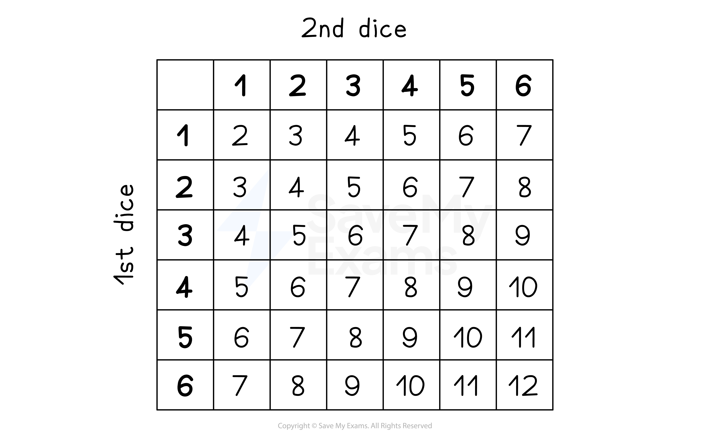

# Sample Space Diagrams

## Sample Space Diagrams

> **Spec point** — `spcpt_d96BnpMKqDSDxSkx`

## Sample space diagrams

### What is a sample space diagram?

- In probability, the **sample space** means **all the possible outcomes**
- In simple situations it can be given as a **list**

  - For flipping a coin, the sample space is: Heads, Tails
  
    - the letters H, T can be used
  - For rolling a six-sided dice, the sample space is:  1, 2, 3, 4, 5, 6
- If there are **two **sets of outcomes, a **grid** can be used

  - These are called **sample space diagrams** (or possibility diagrams)
  - For example, roll two six-sided dice and add their scores
  - A list of all the possibilities would be very long
  
    - You might miss a possibility
    - It would be hard to spot any patterns in the sample space

- Combining **more than two** sets of outcomes must be done by** listing** the possibilities

  - For example, flipping three coins
  
    - The sample space is HHH, HHT, HTH, THH, HTT, THT, TTH, TTT (8 possible outcomes)

### How do I use a sample space diagram to calculate probabilities?

- Probabilities can be found by **counting** the **number **of possibilities you **want**, then **dividing** by the **total** number of possibilities in the sample space

  - In the sample space 1, 2, 3, 4, 5, 6, 7, 8, 9, 10, there are four prime numbers (2, 3, 5 and 7)
  
    - The probability of getting a prime number is  $\frac{4}{10}=\frac{2}{5}$
  - Using the sample space diagram above for rolling two dice, the probability of getting an eight is  $\frac{5}{36}$
  
    - There are 5 eights in the grid, out of the total 36 numbers
- **Be careful**,** **this **counting** method **only** works if all possibilities in the sample space are **equally likely**

  - For a **fair** six-sided dice: 1, 2, 3, 4, 5, 6 are all equally likely
  - For a fair (**unbiased**) coin: H, T are equally likely
  - Winning the lottery: Win, Lose are are not equally likely!
  
    - You cannot count possibilities here to say the probability of winning the lottery is  $\frac{1}{2}$

> **Exam Hint**
> - Some harder questions may not say "by drawing a sample space diagram" so you may have to do it on your own.

> **Worked Example**
> Two fair six-sided dice are rolled.
> 
> (a) Find the probability that the sum of the numbers showing on the two dice is an odd number greater than 5, giving your answer as a fraction in simplest form.
> 
> **Answer:**
> 
> > *Draw a sample space diagram to show all the possible outcomes*
> 
> 
> 
> > *Circle the possibilities that are odd numbers greater than 5*
> *(5 is not included)*
> 
> 
> 
> > *Count the number of possibilities that are circled (12) and divide them by the total number of possibilities in the diagram (36)*
> 
> $\frac{12}{36}$
> 
> > *Cancel the fraction*
> 
> $\frac{12}{36}=\frac{12\times1}{12\times3}=\frac{1}{3}$
> 
> $\frac{1}{3}$
> 
> (b) Given that the sum of the numbers showing on the two dice is an odd number greater than 5, find the probability that one of the dice shows the number 2. Give your answer as a fraction in simplest form.
> 
> **Answer:**
> 
> > *From part (a) you already know there are 12 ways to get an odd number greater than 5*
> *Out of these 12 possibilities, only two possibilities had the number 2 on a dice: (2, 5) and (5, 2)*
> *So the probability we are looking for is 2 divided by 12*
> 
> $\frac{2}{12}$
> 
> > *Cancel the fraction*
> 
> $\frac{2}{12}=\frac{2\times1}{2\times6}=\frac{1}{6}$
> 
> $\frac{1}{6}$
