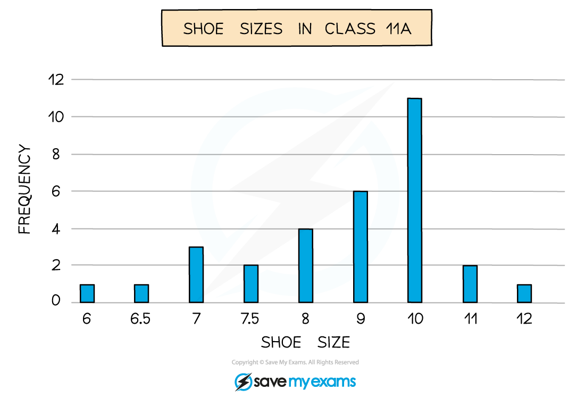
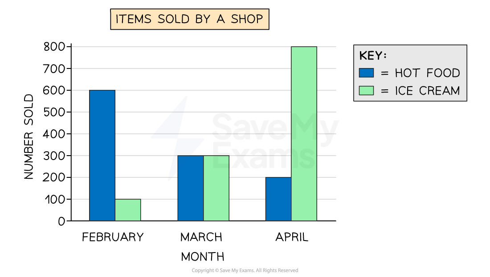

# Bar Charts

## Bar Charts

> **Spec point** — `spcpt_Mg5kHQs2xhx8M5vm`

## Bar charts

### What is a bar chart?

- A **bar chart** is a visual way to represent **discrete** data

  - Discrete data is data that can be **counted**
  
    - This can be **numerical **like** **shoe sizes in a class
    - Or **non-numerical **(categorical) like colours of cars down a road
- The **horizontal axis** shows the different **outcomes**
- The **vertical axis** shows the **frequency**
- The **heights** of the **bars **show the frequency

  - Bars should be **separated** by gaps
  - Bars should have **equal widths**

- The** mode** is the **outcome** with the **highest** bar

> **Exam Hint**
> If you need to find the **median** for data given in a bar chart
> 
> - Turn the data from the bar chart into a **table**
> - Then use the method for finding the median in the 'Averages from Tables' revision note

- You can also get **dual bar charts** to compare two data sets

  - Bars are in **pairs** (side-by-side) for each outcome

> **Exam Hint**
> If asked to draw a bar chart, find the largest frequency and choose a scale which allows that to fit in the space provided.

> **Worked Example**
> Mr Barr teaches students in Year 7 and Year 8.
> He records the number of pets that students in each year have.
> His results are shown below.
> 
> 
> 
> (a) Write down the modal number of pets for his Year 7 students.
> 
> **Answer:**
> 
> > *The modal number (mode) is the number of pets that occurs the most*
> *Visually, this will be the highest bar for Year 7s*
> 
> **Final answer:** **The mode for Year 7 is 1 pet**
> 
> (b) How many Year 8 students does he teach?
> 
> **Answer:**
> 
> > *Add up all the heights (frequencies) of the Year 8 bars*
> 
> *4 + 8 + 4 + 3 + 0 + 2*
> 
> **Final answer:** **He teaches 21 Year 8 students**
