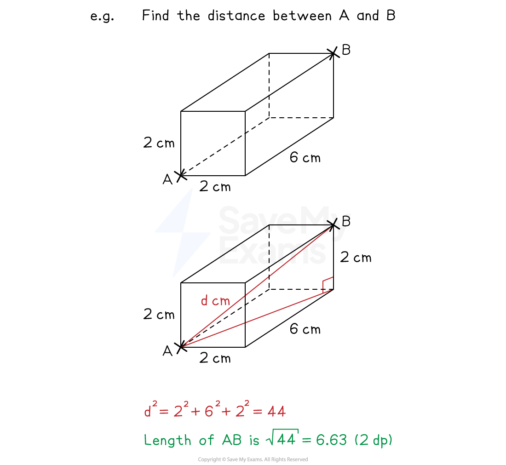
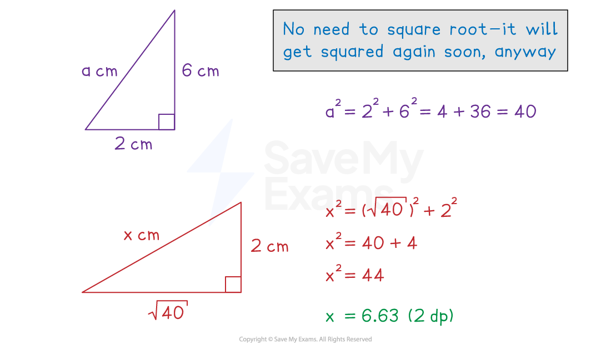

# 3D Pythagoras & Trigonometry

## 3D Pythagoras & Trigonometry

> **Spec point** — `spcpt_YQTm89bBFQBWdt2g`

## 3D Pythagoras & trigonometry

### How do I use Pythagoras' theorem in a 3D shape?

- You can often find **right-angled triangles** within 3D shapes

  - If two sides of the triangle are known, you can use **Pythagoras’ theorem**

### Is there a 3D version of the Pythagoras' theorem formula?

- There is a **3D version** of Pythagoras’ theorem: $d^{2}=x^{2}+y^{2}+z^{2}$

  - $d$ is the distance between two points
  - $x,y$ and $z$ are the distances in the **three different perpendicular directions** between the two points

- However, all 3D situations can be broken into **two 2D problems**

  - Form two right-angle triangles

> **Exam Hint**
> You are not given the 3D Pythagoras formula in the exam.
> 
> You can always split 3D problems into two 2D problems (which don't need this formula).

### How do I use SOHCAHTOA in 3D?

- Again, look for **right-angled triangles** to use with **SOHCAHTOA**

  - You may need combinations of triangles that lead to the missing **side** or **angle**

> **Exam Hint**
> If you are stuck in the exam with a complicated 3D diagram, it is always better to just start finding any lengths and angles in the shape, as:
> 
> - these may end up being useful
> - you may score more marks than if you had left the question blank

> **Worked Example**
> A pencil is being put into a cuboid shaped box.
> 
> The box has dimensions 3 cm by 4 cm by 6 cm.
> 
> 
> 
> (a) Find the length of the longest pencil that can fit inside the box.
> 
> **Answer:**
> 
> > *The longest possible pencil will fit between diagonally opposite vertices, e.g. AF*
> 
> > *Form a 2D right-angled triangle, such as triangle ABF*
> 
> 
> 
> **Method 1**
> 
> > *To find the length AF, there are a few different options*
> *One option is to find length BF (from triangle BEF) then AF (from triangle ABF)*
> *Draw triangle BEF flat and use Pythagoras' theorem to find BF*
> 
> 
> 
> $a^{2}=4^{2}+6^{2}\,a^{2}=16+36\,a^{2}=52$
> 
> > *Draw triangle ABF flat and use Pythagoras' theorem to calculate AF *
> 
> 
> 
> `table row cell b squared end cell equals cell 3 squared plus a squared end cell row cell b squared end cell equals cell 9 plus 52 end cell row cell b squared end cell equals 61 row b equals cell square root of 61 equals 7.81024... end cell end table`
> 
> **Final answer:** **The longest pencil that can fit inside the box is 7.81 cm (3 s.f.)**
> 
> **Method 2**
> 
> > *Apply the **3D version** of Pythagoras’ theorem: *$d^{2}=x^{2}+y^{2}+z^{2}$
> 
> > *The distance in the **x** direction is 4 cm*
> *The distance in the **y** direction is 6 cm*
> *The distance in the **z** direction is 3 cm*
> 
> `table row cell d squared end cell equals cell 4 squared plus 6 squared plus 3 squared end cell row d equals cell square root of 4 squared plus 6 squared plus 3 squared end root end cell row d equals cell square root of 61 equals 7.81024... end cell end table`
> 
> **Final answer:** **The longest pencil that can fit inside the box is 7.81 cm (3 s.f.)**
