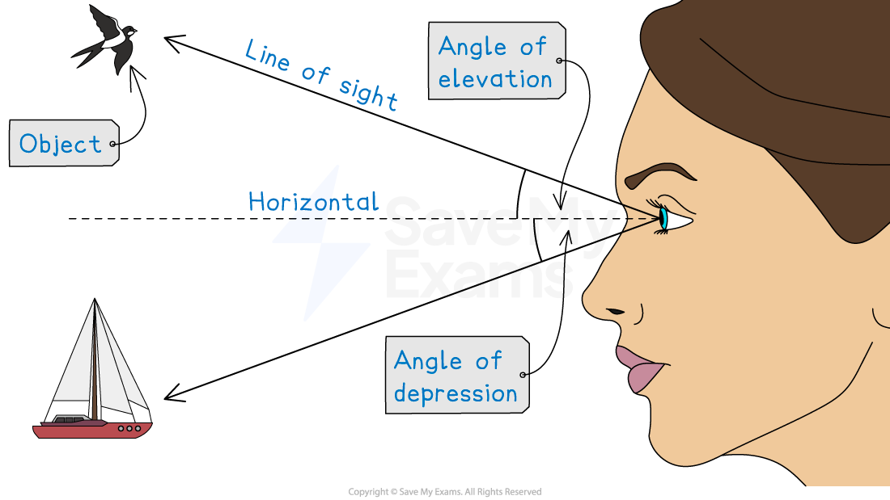

# Angles of Elevation & Depression

## Elevation & Depression

> **Spec point** — `spcpt_9JzR7VMzsQqT4KHq`

## Elevation & depression

### What are angles of elevation and depression?

- An **angle of elevation **or** depression** is the angle measured between the **horizontal** and the **line of sight**

  - Looking **up** at an object creates an angle of **elevation**
  - Looking **down** at an object creates an angle of** depression**
- **Right-angled trigonometry **can be used to find

  - an **angle** of elevation or depression
  - or a missing **distance**
- The** tan ratio** is often used in real-life scenarios

  - You may **know the** **height** of an object and want to **find the** **distance** you are from it
  - You may** know the distance** you are from an object and want to **find its height**

> **Exam Hint**
> It may be useful to draw more than one diagram if the triangles that you are interested in overlap one another.

> **Worked Example**
> A cliff is perpendicular to the sea and the top of the cliff, *T*, stands 24 metres above the level of the sea.
> 
> The angle of depression from the top of the cliff to a boat at sea is 35°.
> 
> At a point $x$metres vertically up from the foot the cliff is a flag marker, *M*.
> 
> The angle of elevation from the boat, *B*, to the flag marker is 18°.
> 
> (a) Draw a diagram of the situation. Label all the angles and distances given above.
> 
> **Answer:**
> 
> 
> 
> (b) Find the distance from the boat to the foot of the cliff.
> 
> **Answer:**
> 
> > *Consider triangle **TBF **where **F** is the foot of the cliff*
> *Angle **TBF** = 35º because of alternate angles*
> 
> > *Use SOHCAHTOA to find the missing distance*
> *We know the opposite (**TF**) and we want to find the adjacent (**BF**), so use *$\mathrm{tan}θ=\frac{O}{A}$
> 
> 
> 
> `table row cell tan space 35 end cell equals cell fraction numerator 24 over denominator B F end fraction end cell row cell B F end cell equals cell fraction numerator 24 over denominator tan space 35 end fraction end cell row cell B F end cell equals cell 34.27555... end cell end table`
> 
> **Final answer:** **BF**** = 34.3 m (3 s.f.)**
> 
> (c) Find the value of $x$.
> 
> **Answer:**
> 
> > *Consider triangle **MBF*
> 
> > *Use SOHCAHTOA to find the missing distance*
> *We know the adjacent (**BF**) and we want to find opposite (**MF**), so use *$\mathrm{tan}θ=\frac{O}{A}$
> 
> 
> 
> `table row cell tan space 18 end cell equals cell fraction numerator x over denominator 34.27555... end fraction end cell row cell 34.27555... space tan space 18 end cell equals x row x equals cell 11.1368... end cell end table`
> 
> **Final answer:** $x=11.1m$** (3 s.f.)**
