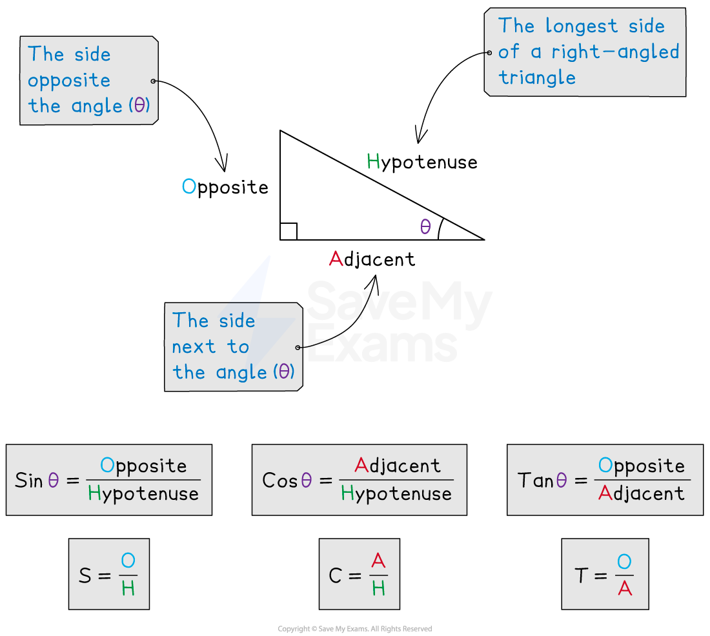
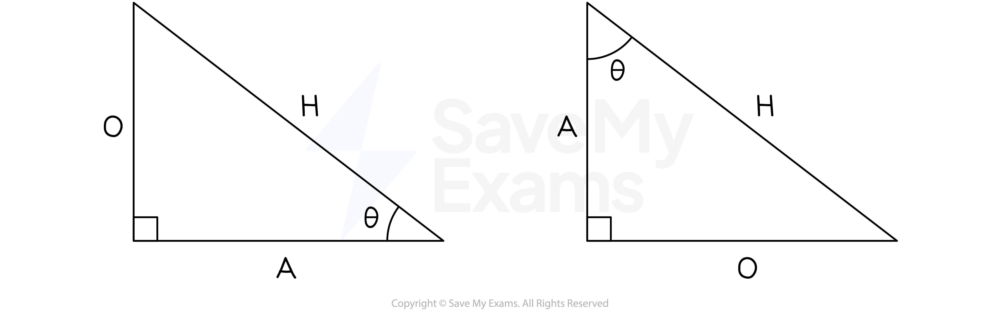

# SOHCAHTOA

## SOHCAHTOA

> **Spec point** — `spcpt_h2SHkwgcS67NJYVP`

## SOHCAHTOA

### What is trigonometry?

- Trigonometry is the mathematics of **angles **in triangles
- It looks at the relationship between **side lengths** and **angles of triangles**

### What are sin, cos and tan?

- The **three** trigonometric functions **sine**, **cosine** and **tangent**

  - They come from **ratios of side lengths** in **right-angled** triangles
- You must **label the sides **of a **right-angled triangle** in relation to a **chosen angle **θ

  - The **hypotenuse, H, **is the **longest side** in a right-angled triangle
  
    - It will always be **opposite** the right angle
  - The side **opposite θ** will be labelled **opposite**, **O**
  - The* *side **next to θ** will be labelled **adjacent**, **A**
- The functions sine, cosine and tangent are the ratios of the lengths of these sides as follows

  - $\mathrm{sin}θ=\frac{\mathrm{opposite}}{\mathrm{hypotenuse}}=\frac{O}{H}$
  - $\mathrm{cos}θ=\frac{\mathrm{adjacent}}{\mathrm{hypotenuse}}=\frac{A}{H}$
  - $\mathrm{tan}θ=\frac{\mathrm{opposite}}{\mathrm{adjacent}}=\frac{O}{A}$

### What is SOHCAHTOA?

- **SOHCAHTOA** is a mnemonic often used to remember which ratio is which

  - **S**in is **O**pposite over **H**ypotenuse
  - **C**os is **A**djacent over **H**ypotenuse
  - **T**an is **O**pposite over **A**djacent
- **H** is always the same but **O** and **A** change depending on which angle is labelled as θ

### How can I use SOHCAHTOA to find missing lengths?

- **STEP 1**
**Label** the sides of the triangle as H, O and A
- **STEP 2**
**Identify** which t**rigonometric ratio **to use: sin, cos or tan

  - Write down the letter of the **length** you are **given**
  - Write down the letter of the **length** you **want to find**
  - Find the two letters in **SOHCAHTOA **to identify which ratio to use
  
    - If you have **A** and **H** then use **cos**
- **STEP 3**
**Substitute **the values into the relevant trigonometric formula

  - Remember to put brackets around the angle
  
    - `sin open parentheses 50 close parentheses equals straight A over 7`  or  `cos open parentheses 40 close parentheses equals 3 over straight H`
- **STEP 4**
**Rearrange** and **solve** for the **unknown letter**

  - You will either need to **multiply** or **divide**
  
    - `sin open parentheses 50 close parentheses equals straight A over 7` leads to `straight A equals 7 cross times sin open parentheses 50 close parentheses`
    - `cos open parentheses 40 close parentheses equals 3 over straight H` leads to `straight H equals fraction numerator 3 over denominator cos open parentheses 40 close parentheses end fraction`
- **STEP 5**
**Type **the expression** into your calculator**

  - The **question** might ask you to **round your answer**
  - If not then round to **three significant figures**

### How can I use SOHCAHTOA to find missing angles?

- **STEP 1**
**Label** the sides of the triangle as H, O and A
- **STEP 2**
**Identify** which **trigonometric ratio **to use: sin, cos or tan

  - Write down the letters of the **lengths** you are **given**
  - Find the two letters in **SOHCAHTOA **to identify which ratio to use
  
    - If you have **O** and **A** then use **tan**
- **STEP 3**
**Substitute **the values into the relevant trigonometric formula

  - The **angle** will be **unknown**
  
    - `tan open parentheses theta close parentheses equals 3 over 4`
- **STEP 4**
**Substitute** the fraction into the **inverse trigonometric function**

  - You normally need to press **SHIFT** on your calculator first
  
    - `tan open parentheses theta close parentheses equals 3 over 4` leads to `theta equals tan to the power of negative 1 end exponent open parentheses 3 over 4 close parentheses`
- **STEP 5**
**Type **the expression** into your calculator**

  - The **question** might ask you to **round your answer**
  - If not then round to **one decimal place**

### How do I find the shortest distance from a point to a line?

- The shortest distance from any point to a line will always be the **perpendicular** distance
- Form a right-angled triangle and then use SOHCAHTOA to find the relevant distance

> **Exam Hint**
> SOHCAHTOA (like Pythagoras) can only be used in **right-angled triangles.**

> **Exam Hint**
> Ensure your calculator is set to measure angles in **degrees.**
> 
> You should see the letter **D** or the word **Deg** at the top of your screen.

> **Worked Example**
> Find the length of the side $x$ cm in the following triangle.
> 
> Give your answer to 3 significant figures.
> 
> 
> 
> **Answer:**
> 
> > *First label the triangle*
> 
> 
> 
> > *We know A and we want to know O - that's TOA or *$\mathrm{tan}θ=\frac{\mathrm{opposite}}{\mathrm{adjacent}}$
> 
> `tan open parentheses 43 close parentheses equals x over 9`
> 
> > *Multiply both sides by 9*
> 
> `9 cross times tan open parentheses 43 close parentheses space equals space x`
> 
> > *Enter on your calculator*
> 
> $x=8.3926...$
> 
> > *Round to 3 significant figures*
> 
> $x=8.39\mathrm{cm}$

> **Worked Example**
> Find the value of the angle $y$° in the following triangle.
> 
> Give your answer to 1 decimal place.
> 
> 
> 
> **Answer:**
> 
> > *First label the triangle*
> 
> 
> 
> > *We know A and H - that's CAH or *$\mathrm{cos}θ=\frac{\mathrm{adjacent}}{\mathrm{hypotenuse}}$
> 
> `cos open parentheses y close parentheses equals 8 over 23`
> 
> > *Use inverse cos to find *$y$
> 
> `y equals cos to the power of negative 1 end exponent open parentheses 8 over 23 close parentheses`
> 
> > *Enter on your calculator*
> 
> $y=69.6455...$
> 
> > *Round to 1 decimal place*
> 
> $y=69.6^{\circ}$
