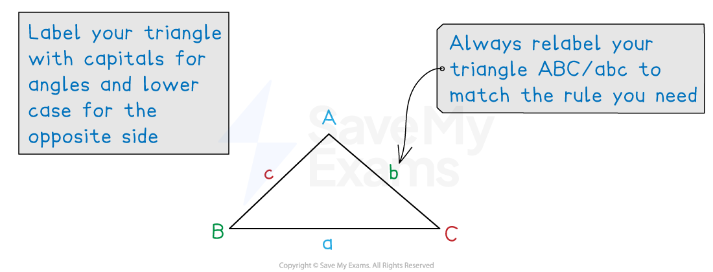

# Area of a Triangle

## Area of a Triangle

> **Spec point** — `spcpt_djG6mt4Gk3T4wJwC`

## Area of a triangle

### How do I find the area of a non-right-angled triangle?

- The area of **any triangle** can be found using the formula

$\mathrm{Area}=\frac{1}{2}ab\mathrm{sin}C$

- *C *is the angle **between **sides $a$* *and $b$

- Label your triangle correctly

  - Make sure that *C* is always the angle **between** the two sides
- If angle C is 90°, you get a right-angled triangle

  - sin 90° = 1 so the formula becomes the familiar "Area = ½ × base × height"!

> **Exam Hint**
> You are given the triangle area rule on the formula sheet.

> **Worked Example**
> The following diagram shows triangle $\mathrm{ABC}$.
> 
> $\mathrm{AB}=32\mathrm{cm}$, $\mathrm{AC}=1.1m$ and angle $\mathrm{BAC}=74^{\circ}$.
> 
> 
> 
> Calculate the area of triangle, giving your answer in m2.
> 
> **Answer:**
> 
> > *Label the sides of the triangle*
> *Convert the sides to be in the same units*
> 
> 
> 
> > *Use the area of a triangle formula, *$\mathrm{Area}=\frac{1}{2}ab\mathrm{sin}C$
> 
> > *You can either re-label the sides and angles to match the formula, or you can use the formula *$\mathrm{Area}=\frac{1}{2}bc\mathrm{sin}A$* which is equivalent*
> 
> `table row Area equals cell 1 half open parentheses 1.1 close parentheses open parentheses 0.32 close parentheses space sin space 74 end cell row blank equals cell 0.16918... end cell end table`
> 
> **Final answer:** **The area is 0.169 m****2**** (to 3 s.f.)**
