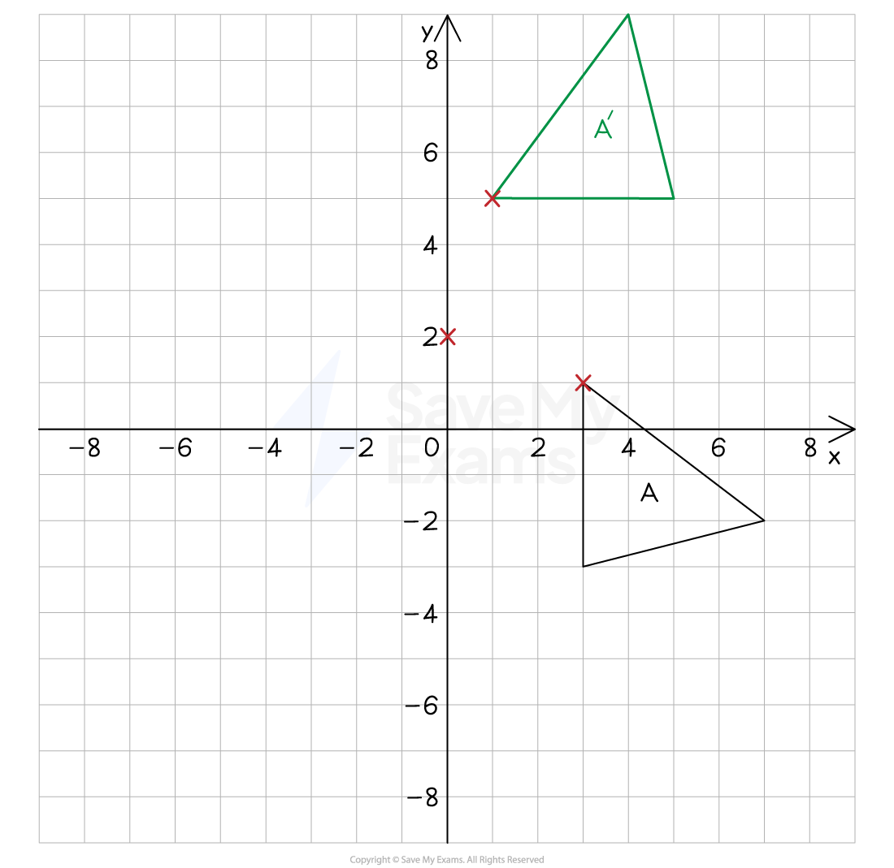
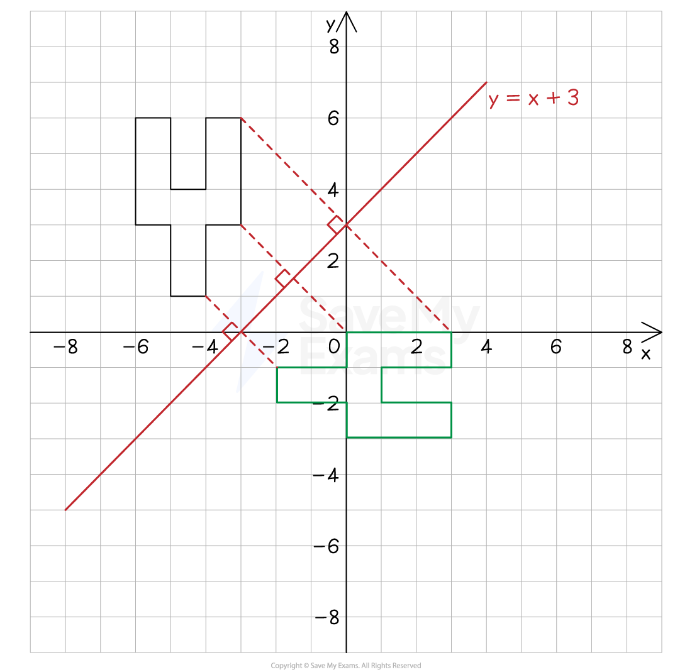
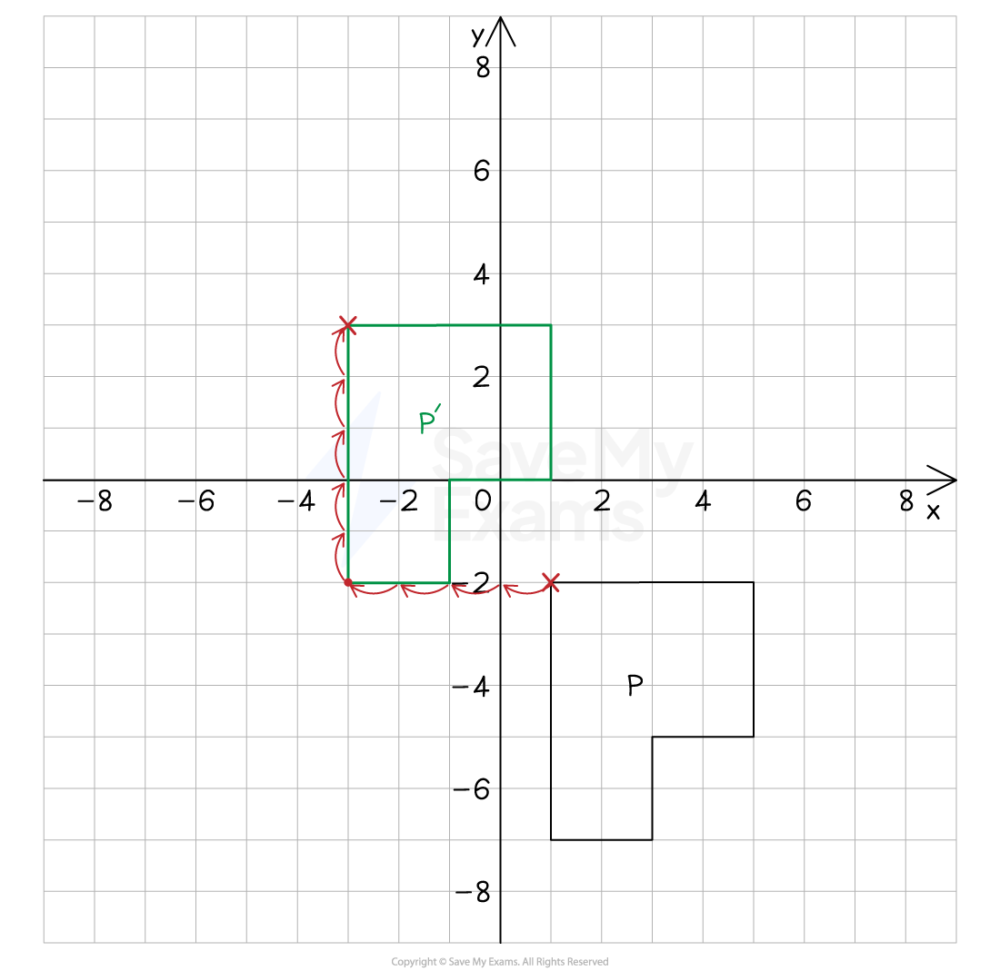

# Combination of Transformations

## Combination of Transformations

> **Spec point** — `spcpt_3w7YqY2dN68HMc4k`

## Combination of transformations

### What do I need to know about combined transformations?

- **Combined transformations** are when more than one transformation is performed, one after the other
- In many cases, two transformations can be equivalent to one alternative **single** transformation

  - Finding this single transformation is a common exam question

- **Rotation**

  - Requires an angle, direction and centre of rotation
  - It is usually easy to tell the angle from the orientation of the image
  - You can use trial and error and tracing paper to find the centre of enlargement

- **Reflection**

  - A reflection will be in a mirror line which can be vertical (x = k), horizontal (y = k) or diagonal (y = mx + c)
  - Points on the mirror line do not move
  - It is possible for a mirror line to pass through the object

- **Translation**

  - A translation is a movement which does not change the orientation or size of the shape, it simply moves location
  - A translation is described by a vector in the form `open parentheses x
  y close parentheses
  `
  
    - This represents a movement of *x* units to the right and *y *units vertically upwards

### What are common combinations of transformations?

- A combination of** two reflections** can be the same as a **single rotation**

  - One reflection using the line $x=a$ and the other using the line $y=b$
  - This is the same as a **180° rotation** about the centre `open parentheses a comma space b close parentheses`
- The **order of the combination** can be important to the** overall effect**

  - A reflection in the line ***y***** = *****x***** followed by** a reflection in the ***x*****-axis** is the same as a 90° rotation **clockwise** about the origin
  - A reflection in the ***x*****-axis followed by** a reflection in the line ***y***** = *****x*** is the same as a 90° rotation **anticlockwise** about the origin

### How do I undo a transformation to get back to the original shape?

- After transforming shape A to make shape B you could be asked to describe the transformation that maps B to A

| **Transformation from A to B** | **Transformation from B to A** |
|---|---|
| Translation by vector `open parentheses table row x row y end table close parentheses` | Translation by vector `open parentheses table row cell negative x end cell row cell negative y end cell end table close parentheses` |
| Reflection in a given line | Reflection in the same line |
| Rotation by θ° in a direction about the centre `open parentheses x comma space y close parentheses` | Rotation by θ° in the opposite direction about the centre `open parentheses x comma space y close parentheses` |
| Enlargement of scale factor $k$ about the centre `open parentheses x comma space y close parentheses` | Enlargement of scale factor $\frac{1}{k}$ about the centre `open parentheses x comma space y close parentheses` |

> **Worked Example**
> (a) On the grid below rotate shape F by 180o using the origin as the centre of rotation.
> 
> Label this shape F'.
> 
> 
> 
> **Answer:**
> 
> > *Using tracing paper, draw over the original object then place your pencil on the origin and rotate the tracing paper by 180**o*
> *Mark the position of the rotated image onto the coordinate grid*
> 
> > *Label the rotated image F'*
> 
> 
> 
> (b) Reflect shape F' in the line $y=0$. Label this shape F''.
> 
> **Answer:**
> 
> > *The line *$y=0$* is the *$x$*-axis*
> 
> > *Measure the perpendicular distance (the vertical distance) between each vertex on the original object and the *$x$*-axis, then measure the same distance on the other side of the mirror line and mark on the corresponding vertex on the reflected image*
> 
> > *Repeat this for all of the vertices and join them together to create the reflected image*
> 
> > *Label the reflected image F''*
> 
> 
> 
> (c) Fully describe the single transformation that would create shape F'' from shape F.
> 
> **Answer:**
> 
> > *The object (F) and image (F'') are reflections of each other in the *$y$*-axis*
> 
> 
> 
> **Final answer:** **The single transformation from F to F'' is a reflection in the y-axis**
