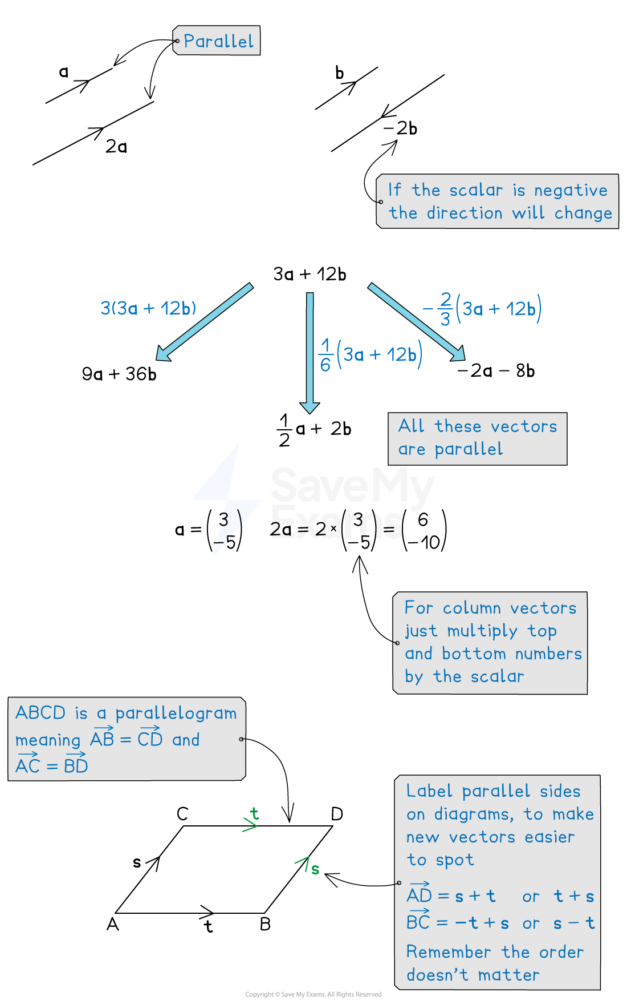

# Parallel Vectors & Unit Vectors

## Parallel Vectors

> **Spec point** — `spcpt_9Y69tw58MFQvdBvT`

## Parallel vectors

### How can I tell if two vectors are parallel?

- Two vectors are **parallel **if one is a **scalar multiple** of the other

  - This means that **all components** of the vector have been multiplied by a **common constant (scalar)**
  - For example, `open parentheses table row 1 row 3 end table close parentheses` and `open parentheses table row 2 row 6 end table close parentheses` are scalar multiples
  
    - The numbers in the first vector have each been multiplied by 2 to get the numbers in the second vector
- **Multiplying **the components of a vector by a **positive scalar **changes the **magnitude **of the vector but not the **direction**

  - For example, `open parentheses table row 2 row 6 end table close parentheses`  is double the length of `open parentheses table row 1 row 3 end table close parentheses` but in the same direction
- **Multiplying **the components of a vector by a **negative scalar **reverses the direction
- You can **factorise **a vector to help spot if two vectors are **parallel**

  - `open parentheses table row 9 row cell negative 3 end cell end table close parentheses equals 3 open parentheses table row 3 row cell negative 1 end cell end table close parentheses`
  - `open parentheses table row cell negative 6 end cell row 2 end table close parentheses equals negative 2 open parentheses table row 3 row cell negative 1 end cell end table close parentheses`
  
    - They are scalar multiples of the same vector so they are parallel

*Examples of parallel vectors*

> **Exam Hint**
> If you are told that two vectors ($a$ and $b$) are parallel, then it can be helpful to define a scalar to form an equation $a=kb$ .

> **Worked Example**
> Show that the vectors `bold a equals open parentheses table row 2 row cell negative 4 end cell end table close parentheses` and `bold b equals open parentheses table row cell negative 3 end cell row 6 end table close parentheses`** **are parallel**.**
> 
> **Answer:**
> 
> **Method 1**
> 
> > *Show that one vector is a multiple of the other*
> 
> `table row cell negative 1.5 bold a end cell equals cell negative 1.5 open parentheses table row 2 row cell negative 4 end cell end table close parentheses end cell row blank equals cell open parentheses table row cell negative 1.5 cross times 2 end cell row cell negative 1.5 cross times negative 4 end cell end table close parentheses end cell row blank equals cell open parentheses table row cell negative 3 end cell row 6 end table close parentheses end cell row blank equals bold b end table`
> 
> **Final answer:** $b=-1.5a$**, so the two vectors are parallel**
> 
> **Method 2**
> 
> > *Show that both vectors are multiples of another vector*
> 
> `bold a equals open parentheses table row 2 row cell negative 4 end cell end table close parentheses equals 2 open parentheses table row 1 row cell negative 2 end cell end table close parentheses`
> 
> `bold b equals open parentheses table row cell negative 3 end cell row 6 end table close parentheses equals negative 3 open parentheses table row 1 row cell negative 2 end cell end table close parentheses`
> 
> **Final answer:** $a$** and **$b$** are both scalar multiples of **`open parentheses table row 1 row cell negative 2 end cell end table close parentheses`**, so they are parallel to each other**

## Unit vectors

> **Spec point** — `spcpt_tmkXtCpJ4srbmNZM`

## Unit vectors

### What is a unit vector?

- A **unit vector** is a vector with a **modulus **(length) of 1
- To find a unit vector that is in the **same direction** as the vector $a$

  - **divide **the components of the vector by the **modulus **of the vector
  - I.e. `fraction numerator bold a over denominator open vertical bar bold a close vertical bar end fraction` is a unit vector in the direction of vector $a$
- For example, a unit vector in the direction `open parentheses table row 3 row cell negative 4 end cell end table close parentheses` is

`table row cell fraction numerator 1 over denominator square root of 3 squared plus open parentheses negative 4 close parentheses squared end root end fraction open parentheses table row 3 row cell negative 4 end cell end table close parentheses end cell equals cell 1 fifth open parentheses table row 3 row cell negative 4 end cell end table close parentheses end cell row blank equals cell open parentheses table row cell 3 over 5 end cell row cell negative 4 over 5 end cell end table close parentheses end cell end table`

> **Worked Example**
> Find a unit vector in the same direction as  `open parentheses table row cell negative 2 end cell row 5 end table close parentheses`.
> 
> **Answer:**
> 
> > *Find the modulus of the vector*
> 
> `square root of open parentheses negative 2 close parentheses squared plus 5 squared end root equals square root of 4 plus 25 end root equals square root of 29`
> 
> > *Divide each of the vector components by the modulus*
> 
> `open parentheses table row cell negative fraction numerator 2 over denominator square root of 29 end fraction end cell row cell fraction numerator 5 over denominator square root of 29 end fraction end cell end table close parentheses`
