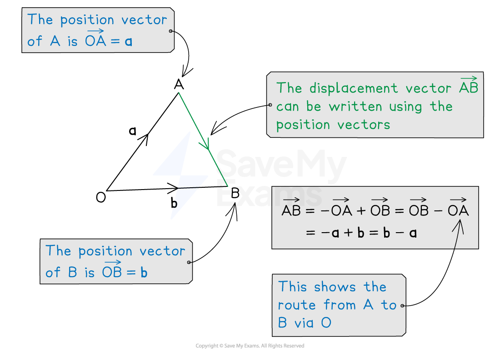

# Position & Displacement Vectors

## Position & Displacement Vectors

> **Spec point** — `spcpt_B37MzscGX3VQwSK2`

## Position & displacement vectors

### What are position vectors?

- A** position vector** describes where a specific **point**, *A *, is, relative to a fixed **origin**, *O*

  - **Lower-case bold** (or underlined) letters are used
  
    - The point *A*  has position vector **a** = $\overset{\rightarrow}{OA}$
- Their **components **are equal to their **coordinates**

  - The point with** **coordinates (3, -2) has position vector `open parentheses table row 3 row cell negative 2 end cell end table close parentheses` from the origin

### What are displacement vectors?

- A** displacement vector** describes the **direction and distance** between **two points**

  - The displacement vector from *A * to *B * is $\overset{\rightarrow}{AB}$
  
    - How to get from *A*  to *B*
- If the points *A * and *B * have position vectors **a** and **b** relative to *O *

  - then* A  *to *B * is the same as *A * to *O * (**-a**) followed by *O * to *B * (**b**)
  
    - $\overset{\rightarrow}{AB}=-a+b=b-a$
    - This is a useful rule to remember

> **Exam Hint**
> You may need to draw an origin, *O *, on to a diagram to be able to sketch position vectors.

> **Worked Example**
> The points $P$ and $Q$ have position vectors `open parentheses table row 3 row 2 end table close parentheses` and `open parentheses table row 6 row cell negative 10 end cell end table close parentheses`respectively.
> 
> Find and simplify the vector $\overset{\rightarrow}{PQ}$.
> 
> **Answer:**
> 
> > *Let *$p$* and *$q$* be position vectors of **P ** and **Q*
> $\overset{\rightarrow}{PQ}$* is the displacement vector from **P**  to **Q*
> *Use the rule that *$\overset{\rightarrow}{AB}=-a+b=b-a$
> 
> $\overset{\rightarrow}{PQ}=q-p$
> 
> > *Substitute in *$p$* and *$q$* *
> 
> `stack P Q with rightwards arrow on top equals open parentheses table row 6 row cell negative 10 end cell end table close parentheses minus open parentheses table row 3 row 2 end table close parentheses`
> 
> > *Expand and simplify*
> 
> `table row blank equals cell open parentheses table row cell 6 minus 3 end cell row cell negative 10 minus 2 end cell end table close parentheses end cell row blank equals cell open parentheses table row 3 row cell negative 12 end cell end table close parentheses end cell end table`
> 
> `stack bold italic P bold italic Q with bold rightwards arrow on top bold equals stretchy left parenthesis table row 3 row cell negative 12 end cell end table stretchy right parenthesis`
