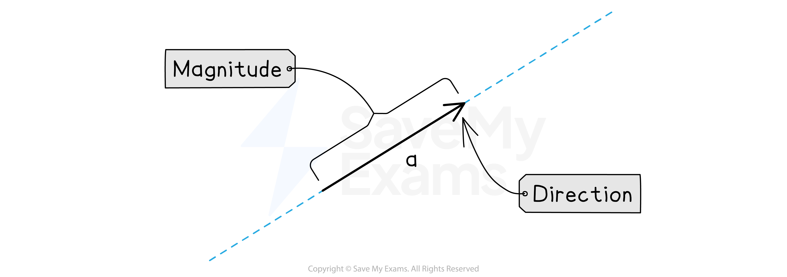
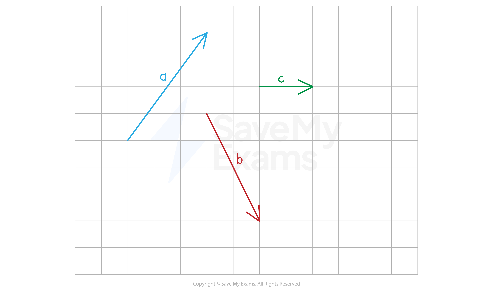
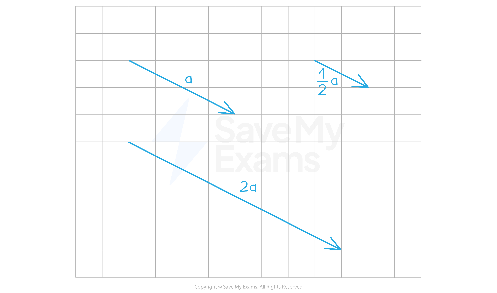
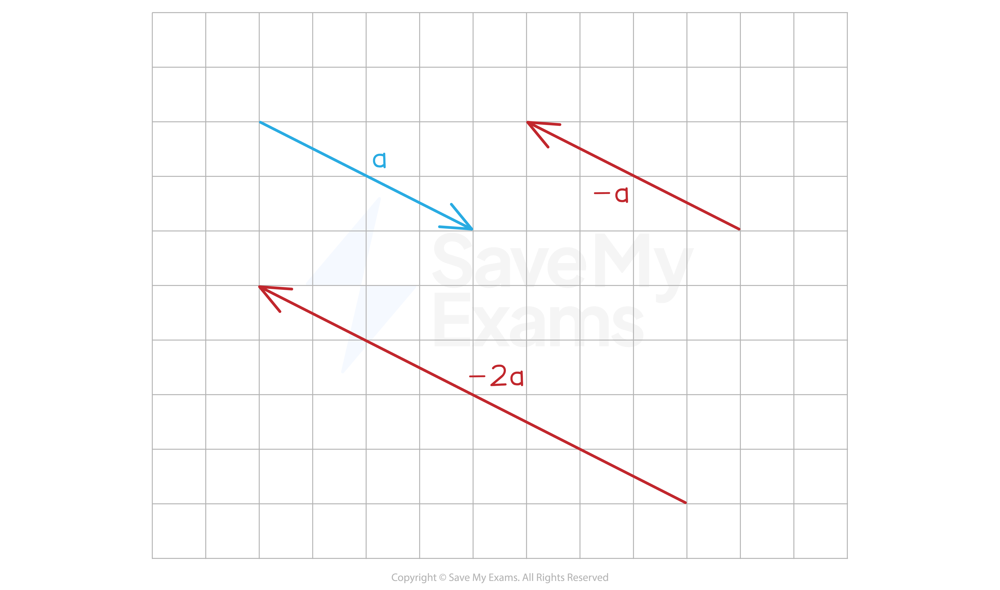

# Representing Vectors as Diagrams

## Vector Diagrams

> **Spec point** — `spcpt_zJxJnm5kJPsMM2vF`

## Vector diagrams

### How can I represent a vector visually?

- A **vector** has **both a size (magnitude) and a direction**

  - You need to draw a **line** to show the **size of the vector**
  - You also need to draw an **arrow** to show the **direction of the vector**

- Vectors are written in** bold** when typed to **show** that they are a vector and not a scalar

  - When writing a vector in an exam you should **underline** the letter to show it is a vector
  - $a$ when **typed** and `bottom enclose a` when **handwritten**
  
    - You will **not lose marks** if you forget to underline vectors

- If a vector **starts at *****A*** and **ends at***** B*** we can write it as $\overset{\rightarrow}{AB}$

  - Here the arrow will **point toward *****B***
  - Vector $\overset{\rightarrow}{BA}$ will have the **same length** but **point toward *****A***

### How do I draw a vector on a grid?

- You can draw a vector **anywhere **on a grid

  - Just make sure it has the **correct length** and the **correct direction**
- To draw the vector `bold a equals open parentheses table row 3 row 4 end table close parentheses`

  - **Pick** a point on the grid and draw a **dot** there
  - Count 3 units to the right and 4 units up and **draw another dot**
  - Draw a **line between the two dots**
  - Put an **arrow **on the line **pointing toward the second dot**
- Look out for **negatives** and **zeroes**

  - `bold b equals open parentheses table row 2 row cell negative 4 end cell end table close parentheses`  goes **2 to the right** and **4 down**
  - `bold c equals open parentheses table row 2 row 0 end table close parentheses` goes **2 to the right** but **does not go up or down**

### What happens when I multiply a vector by a scalar?

- When you **multiply** a vector by a** positive scalar**:

  - The **direction** stays the **same**
  - The **length** of the vector is **multiplied by the scalar**
- For example, `bold a equals open parentheses table row 4 row cell negative 2 end cell end table close parentheses`

  - `2 bold a equals open parentheses table row 8 row cell negative 4 end cell end table close parentheses` will have the **same direction** but **double the length**
  - `1 half bold a equals open parentheses table row 2 row cell negative 1 end cell end table close parentheses` will have the **same direction** but **half the length**

- When you **multiply** a vector by a **negative scalar**:

  - The **direction** is **reversed**
  - The** length** of the vector is **multiplied** by the **number after the negative sign**
- For example, `bold a equals open parentheses table row 4 row cell negative 2 end cell end table close parentheses`

  - `negative bold a equals open parentheses table row cell negative 4 end cell row 2 end table close parentheses` will be in the **opposite direction** and its **length will be the same**
  - `negative 2 bold a equals open parentheses table row cell negative 8 end cell row 4 end table close parentheses` will be in the **opposite direction** and its **length will be doubled**

### What happens when I add or subtract vectors?

- To **draw** the vector $a+b$

  - Draw the vector $a$
  - Draw the vector $b$ starting at the endpoint of $a$
  - Draw a line that **starts at the start** of $a$ and **ends at the end** of $b$
- To **draw** the vector $a-b$

  - Draw the vector $a$
  - Draw the vector $-b$  starting at the endpoint of $a$
  - Draw a line that **starts at the start** of $a$  and **ends at the end** of $-b$

> **Worked Example**
> The points *A*, *B* and *C* have coordinates (-4, 2), (2, 4) and (3, -4), respectively.
> 
> (a)
> 
> Write the vectors $\overset{\rightarrow}{AB},\overset{\rightarrow}{AC}$ and $\overset{\rightarrow}{CB}$ as column vectors.
> 
> **Answer:**
> 
> > *Start by drawing the three vectors onto a grid*
> 
> 
> 
> > *From **A** to **B**, it is 6 to the right and 2 up*
> 
> `stack bold A bold B with bold rightwards arrow on top bold equals stretchy left parenthesis table row 6 row 2 end table stretchy right parenthesis`
> 
> > *From **A** to **C**, it is 7 to the right and 6 down*
> 
> `stack bold A bold C with bold rightwards arrow on top bold equals stretchy left parenthesis table row 7 row cell negative 6 end cell end table stretchy right parenthesis`
> 
> > *From **C** to **B**, it is 1 to the left and 8 up*
> 
> `stack bold C bold B with bold rightwards arrow on top bold equals stretchy left parenthesis table row cell negative 1 end cell row 8 end table stretchy right parenthesis`
> 
> (b)
> 
> Without using any calculations, explain why `stack A B with rightwards arrow on top plus stack B C with rightwards arrow on top plus stack C A with rightwards arrow on top equals open parentheses table row 0 row 0 end table close parentheses`.
> 
> **Answer:**
> 
> > *The vector goes from A to B, then from B to C, then from C back to A*
> 
> **Final answer:** **The vector returns to its starting point**
