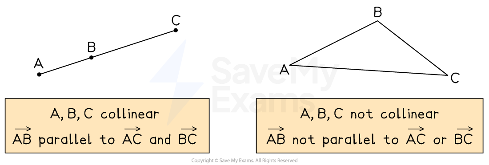

# Vector Proof

## Vector Proof

> **Spec point** — `spcpt_QxxYWb5YckkR8Wds`

## Vector proof

### What are vector proofs?

- Vectors can be used to **prove** things that are true in geometrical diagrams

  - **Vector proofs** can be used to find additional information that can help us to **solve problems**

### How do I know if two vectors are parallel?

- Two vectors are **parallel **if one is a **scalar multiple** of the other

  - This means if **b** is parallel to **a**, then **b** = *k***a**
  
    - where *k* is a **constant number **(scalar)
- For example, `bold a equals open parentheses table row 1 row 3 end table close parentheses` and `bold b equals open parentheses table row 2 row 6 end table close parentheses`

  - `open parentheses table row 2 row 6 end table close parentheses equals 2 cross times open parentheses table row 1 row 3 end table close parentheses` so $b=2a$
  - **b** is a scalar multiple of **a**, so **b** is **parallel** to **a**
- If the scalar multiple is **negative**, then the vectors are **parallel** and in **opposite** directions

  - `bold c equals open parentheses table row cell negative 3 end cell row cell negative 9 end cell end table close parentheses equals negative 3 bold a`
  
    - **c** is **parallel** to **a** and in the** opposite** direction

- If two vectors **factorise** with a **common bracket**, then they are parallel

  - They can be written as **scalar multiples**
- For example

  - 9**a** + 6**b **factorises to 3(3**a** + 2**b**)
  - 12**a** + 8**b **factorises to 4(3**a** + 2**b**)
  - This means `12 bold a plus 8 bold b equals 4 over 3 open parentheses 9 bold a plus 6 bold b close parentheses`
  
    - so they are **scalar multiples** of each other
    - and therefore **parallel**

### How do I know if three points lie on a straight line?

- You may be asked to prove that three points lie on a straight line

  - Points that lie on a straight line are **collinear**
- To show that the points *A *, *B * and *C * are **collinear**

  - prove that two line segments are **parallel**
  - and show that there is at least **one point** that **lies on both **segments
  
    - This makes them parallel and **connected **(not parallel and side-by-side)
- For example, if you show that $\overset{\rightarrow}{BC}=2\overset{\rightarrow}{AB}$ then

  - the line segments *AB*  and *BC  *are parallel
  - and they have a **common point**, *B *
  
    - So *A *, *B * and *C  *must be collinear
- Similarly, $\overset{\rightarrow}{AC}=3\overset{\rightarrow}{AB}$ means *AC * and *AB * are parallel

  - and they have a common point, *A*
  
    - so *A *, *B * and *C  *must be collinear

### How do I use ratios in vector paths?

*Example of a point dividing a line segment*

- Convert** ratios** into **fractions**
- In the example shown, if $AX:XB=3:5$ then

  - $\overset{\rightarrow}{AX}=\frac{3}{8}\overset{\rightarrow}{AB}$
  - $\overset{\rightarrow}{XB}=\frac{5}{8}\overset{\rightarrow}{AB}$
  
    - The ratio 3:5 has 3 + 5 = 8 parts
- Always **check** which ratio you are being asked for

  - $\overset{\rightarrow}{AX}=\frac{3}{5}\overset{\rightarrow}{XB}$
  - $\overset{\rightarrow}{XB}=\frac{5}{3}\overset{\rightarrow}{AX}$

> **Worked Example**
> The diagram shows trapezium *OABC.*
> 
> $\overset{\rightarrow}{OA}=2a$
> 
> $\overset{\rightarrow}{OC}=c$
> 
> *AB *is parallel to *OC, *with $\overset{\rightarrow}{AB}=3\overset{\rightarrow}{OC}$.
> 
> 
> 
> (a) Find expressions for vectors $\overset{\rightarrow}{OB}$ and $\overset{\rightarrow}{AC}$ in terms of **a*** *and **c**.
> 
> **Answer:**
> 
> > $\overset{\rightarrow}{AB}=3\overset{\rightarrow}{OC}$* and *$\overset{\rightarrow}{OC}=c$*  so  *$\overset{\rightarrow}{AB}=3c$*.*
> 
> `table row cell stack O B with rightwards arrow on top end cell equals cell stack O A with rightwards arrow on top plus stack A B with rightwards arrow on top space end cell row blank equals cell 2 bold a plus 3 bold c end cell end table`
> 
> $\overset{\rightarrow}{OB}=2a+3c$
> 
> `table row cell stack A C with rightwards arrow on top end cell equals cell stack A O with rightwards arrow on top plus stack O C with rightwards arrow on top end cell row blank equals cell negative stack O A with rightwards arrow on top plus stack O C with rightwards arrow on top end cell row blank equals cell negative 2 bold a plus bold c end cell end table`
> 
> $\overset{\rightarrow}{AC}=c-2a$
> 
> (b) Point *P *lies on *AC *such that *AP *: *PC *= 3 : 1.
> 
> Find expressions for vectors $\overset{\rightarrow}{AP}$ and $\overset{\rightarrow}{OP}$ in terms of **a** and **c**.
> 
> **Answer:**
> 
> > *AP** : **PC **= 3 : 1 means that  *$\overset{\rightarrow}{AP}=\frac{3}{3+1}\overset{\rightarrow}{AC}=\frac{3}{4}\overset{\rightarrow}{AC}$
> 
> `table row cell stack A P with rightwards arrow on top end cell equals cell 3 over 4 space stack A C with rightwards arrow on top equals 3 over 4 open parentheses negative 2 bold a space plus space bold c close parentheses end cell end table`
> 
> $\overset{\rightarrow}{AP}=-\frac{3}{2}a+\frac{3}{4}c$
> 
> `table row cell stack O P with rightwards arrow on top end cell equals cell stack O A with rightwards arrow on top plus stack A P with rightwards arrow on top end cell row blank equals cell 2 bold a plus stretchy left parenthesis negative 3 over 2 bold a plus 3 over 4 bold c stretchy right parenthesis end cell end table`
> 
> $\overset{\rightarrow}{OP}=\frac{1}{2}a+\frac{3}{4}c$
> 
> (c) Hence, prove that point *P *lies on line *OB, *and determine the ratio $\overset{\rightarrow}{OP}:\overset{\rightarrow}{PB}$.
> 
> **Answer:**
> 
> > *To show that **O, P, **and **B **are collinear (lie on the same line), note that  *`stack O P with rightwards arrow on top equals 1 half bold a plus 3 over 4 bold c equals 1 fourth open parentheses 2 bold a plus 3 bold c close parentheses`
> 
> `table row cell stack O P with rightwards arrow on top end cell equals cell 1 fourth open parentheses 2 bold a plus 3 bold c close parentheses equals 1 fourth stack O B with rightwards arrow on top end cell end table`
> 
> $\overset{\rightarrow}{OP}=\frac{1}{4}\overset{\rightarrow}{OB}$** ****therefore ****OP**** is parallel to ****OB**** **
> **and so ****P ****must lie on the line ****OB**** **
> 
> > *If *`table row cell stack O P with rightwards arrow on top end cell equals cell 1 fourth stack O B with rightwards arrow on top space end cell end table`* then *`table row cell stack P B with rightwards arrow on top end cell equals cell 3 over 4 stack O B with rightwards arrow on top end cell end table`
> 
> $\overset{\rightarrow}{OP}:\overset{\rightarrow}{PB}=1:3$
