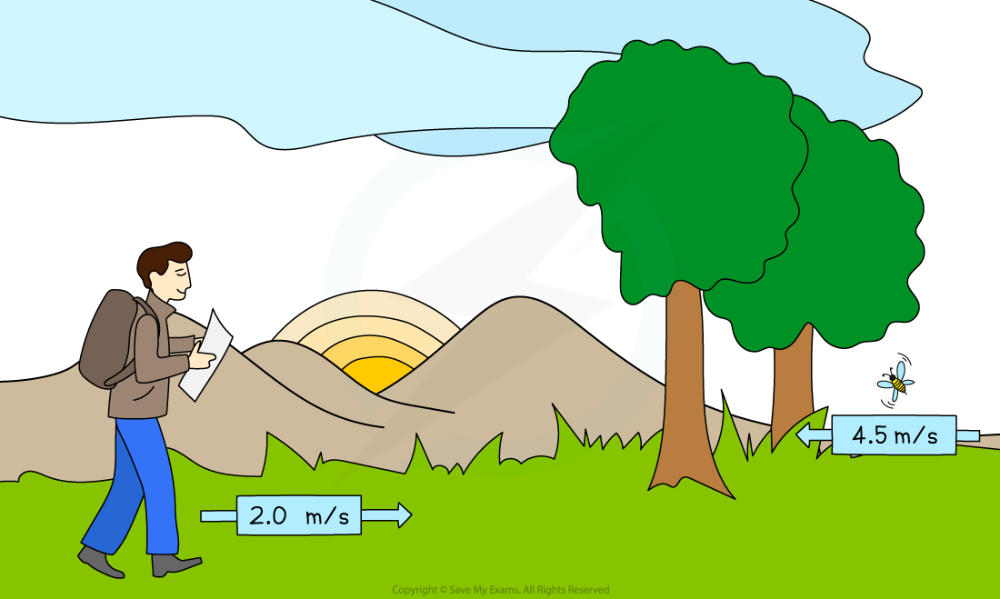
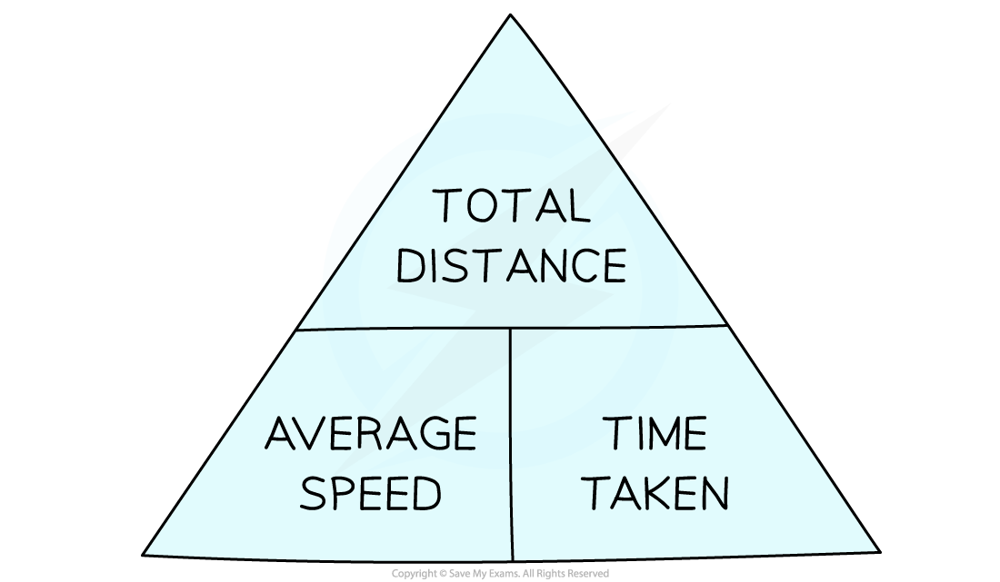
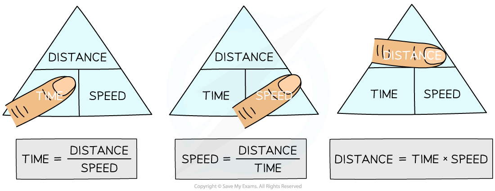

# Speed

## Calculating average speed

> **Spec point** — `spcpt_mM5BSwPjmx9gVfMB` · know and use the relationship between average speed, distance moved and time taken:

average speed = distance moved/time taken

## Calculating average speed

- The **speed** of an object is** the distance it travels every second**
- Speed is a **scalar** quantity because it has a **magnitude **but not a direction

### Average speed

- The **speed **of an object can **vary **throughout its journey
- Therefore, it is often more useful to know an object's **average speed**

***A hiker might have an average speed of 2.0 m/s, whereas a particularly excited bumble bee can have average speeds of up to 4.5 m/s***

### Average speed formula

- The equation for calculating the **average speed** of a moving object is:

$\mathrm{average} \mathrm{speed}=\frac{\mathrm{distance} \mathrm{moved}}{\mathrm{time} \mathrm{taken}}$

- **Average speed** considers the **total distance moved** and the **total time taken**

#### Average speed formula triangle

***Formula triangle for average speed, distance moved and time taken***

### How to use formula triangles

- Formula triangles are really useful for knowing how to rearrange physics equations
- To use them:

1. Cover up the quantity to be calculated, this is known as the 'subject' of the equation
2. Look at the position of the other two quantities

  - If they are on the same line, this means they are **multiplied**
  - If one quantity is above the other, this means they are **divided **- make sure to keep the order of which is on the top and bottom of the fraction!

- In the example below, to calculate average speed, cover-up the variable speed so that only distance and time are left

  - The equation is revealed as:

$\mathrm{speed}=\frac{\mathrm{distance}}{\mathrm{time}}$

***To use a formula triangle, simply cover up the quantity you wish calculate and the structure of the equation is revealed***

> **Worked Example**
> Planes fly at typical average speeds of around 250 m/s.
> 
> Calculate the distance travelled by a plane moving at this average speed for 2 hours.
> 
> **Answer:**
> 
> **Step 1: List the known quantities**
> 
> - Average speed = 250 m/s
> 
>   - Time taken = 2 hours
> 
> **Step 2: Write the relevant equation**
> 
> $\mathrm{average} \mathrm{speed}=\frac{\mathrm{distance} \mathrm{moved}}{\mathrm{time} \mathrm{taken}}$
> 
> **Step 3: Rearrange to make distance moved the subject**
> 
> $\mathrm{distance} \mathrm{moved}=\mathrm{average} \mathrm{speed}\times\mathrm{time} \mathrm{taken}$
> 
> **Step 4: Convert any units**
> 
> - The time given in the question is not in standard units
> - Convert 2 hours into seconds:
> 
> $2\mathrm{hours}=2\times60\times60$
> 
> $2\mathrm{hours}=7200s$
> 
> **Step 5: Substitute the values for average speed and time taken**
> 
> $\mathrm{distance} \mathrm{moved}=250\times7200$
> 
> $\mathrm{distance} \mathrm{moved}=1800000m$

> **Exam Hint**
> Rearranging equations is an important skill in Physics. You can use the equation triangles to help you practice, but it is better not to rely on them because they do not work for all equations you may need to rearrange in the exam.
