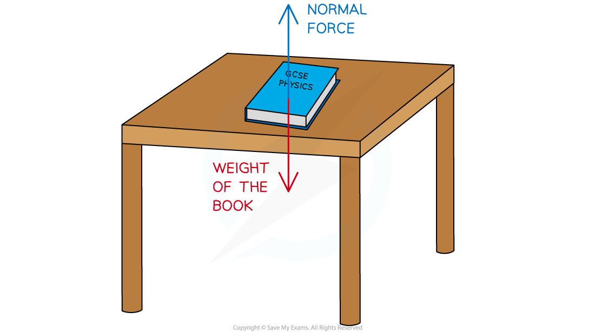
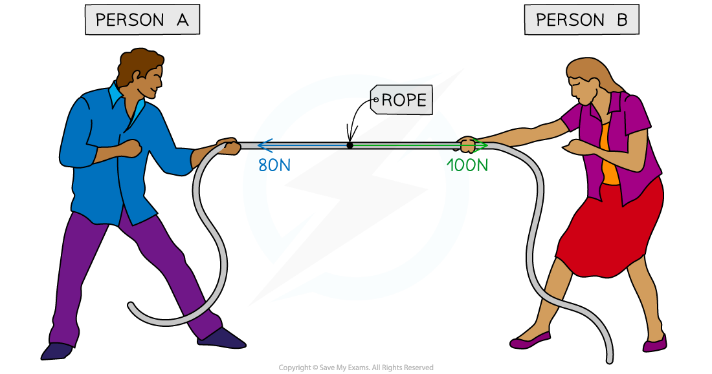

# Unbalanced Forces

## Unbalanced forces

> **Spec point** — `spcpt_Z4kyMfXH4qZXvZFc` · know and use the relationship between unbalanced force, mass and acceleration: force = mass × acceleration 
F = m × a 

## Unbalanced forces

- When **multiple forces** act on a **single object**, the forces can be added together to produce a **resultant force**

- When the forces acting on an object completely cancel out

  - the forces are **balanced**
  - the **resultant **force is **zero**
- When the forces acting on an object do not completely cancel out

  - the forces are **unbalanced**
  - there is a **resultant **force

### Balanced forces

- **Balanced** forces mean that the forces have combined in such a way that they cancel each other out and no **resultant force** acts on the body

  - For example, the **weight** of a book on a desk is balanced by the **normal** force of the desk
  - As a result, **no** **resultant force** is experienced by the book, the book and the table are **equal** and **balanced**

***A book resting on a table is an example of balanced forces***

### Unbalanced forces

- **Unbalanced** forces mean that the forces have combined in such a way that they do not cancel out completely and there is a **resultant force** on the object

  - For example, imagine two people playing a game of tug-of-war, working against each other on opposite sides of the rope
  - If person **A** pulls with 80 N to the left and person **B** pulls with 100 N to the right, these forces do not cancel each other out completely
  - Since person **B** pulled with more force than person **A** the forces will be unbalanced and the rope will experience a resultant force of 20 N to the right

***A tug-of-war is an example of when forces can become unbalanced***

### Unbalanced Forces, Mass & Acceleration

- When forces combine on an object in such a way that they do not cancel out, there is a **resultant force** on the object
- This resultant force causes the object to **accelerate **(i.e. change its ***velocity***)

  - The object might **speed up**
  - The object might **slow down**
  - The object might **change direction**

- The relationship between resultant force, mass and acceleration is given by the equation:

***F = m × a***

- Where:

  - *F* = resultant force, measured in newtons (N)
  - *m = *mass, measured in kilograms (kg)
  - *a* = acceleration, measured in metres per second squared (m/s2)
- This equation is also known as Newton's second law of motion

> **Worked Example**
> A car salesperson claims that their best car has a mass of 900 kg and can accelerate from 0 to 27 m/s in 3 seconds.
> 
> Calculate:
> 
> a) The acceleration of the car in the first 3 seconds.
> 
> b) The force required to produce this acceleration.
> 
> **Answer:**
> 
> **Part (a)**
> 
> **Step 1: List the known quantities**
> 
> - Initial velocity = 0 m/s
> - Final velocity = 27 m/s
> - Time, *t* = 3 s
> 
> **Step 2: State the equation for acceleration**
> 
> `a space equals space fraction numerator open parentheses v space minus space u close parentheses over denominator t end fraction`
> 
> **Step 3: Calculate the acceleration**
> 
> `a space equals space fraction numerator open parentheses 27 space minus space 0 close parentheses over denominator 3 end fraction`
> 
> $a=9m/s^{2}$
> 
> **Part (b)**
> 
> **Step 1: List the known quantities**
> 
> - Mass of the car, *m* = 900 kg
> - Acceleration, *a* = 9 m/s2
> 
> **Step 2: Identify which law of motion to apply**
> 
> - The question involves quantities of **force**, **mass** and **acceleration**, so Newton's second law is required:
> 
> $F=ma$
> 
> **Step 3: Calculate the force required to accelerate the car**
> 
> $F=900\times9$
> 
> $F=8100N$

> **Worked Example**
> A passenger of mass 70 kg travels in a car at a speed of 20 m/s. The vehicle is involved in a collision, which brings the car (and the passenger) to a halt in 0.1 seconds.
> 
> Calculate:
> 
> a) The deceleration of the car (and the passenger).
> 
> b) The decelerating force on the passenger.
> 
> **Answer:**
> 
> **Part (a)**
> 
> **Step 1: List the known quantities**
> 
> - Initial velocity, *u* = 20 m/s
> - Final velocity, *v* = 0 m/s
> - Time, *t* = 0.1 s
> 
> **Step 2: Write out the equation for acceleration**
> 
> `a space equals space fraction numerator open parentheses v space minus space u close parentheses over denominator t end fraction`
> 
> **Step 3: Calculate the deceleration of the car (and the passenger):**
> 
> `a space equals space fraction numerator open parentheses 0 space minus space 20 close parentheses over denominator 0.1 end fraction`
> 
> $a=\frac{-20}{0.1}$
> 
> $a=-200m/s^{2}$
> 
> **Part (b)**
> 
> **Step 1: List the known quantities**
> 
> - Mass of the passenger, *m* = 70 kg
> - Acceleration (deceleration, in this case), *a* = −200 m/s2
> 
> **Step 2: State the relationship between resultant force, mass and acceleration**
> 
> - This question involves quantities of force, mass and acceleration, so the appropriate equation for this case is:
> 
> $F=ma$
> 
> **Step 3: Calculate the decelerating force**
> 
> `F space equals space 70 space cross times space open parentheses negative 200 close parentheses`
> 
> $F=-14000N$

> **Exam Hint**
> Remember that the resultant **force** is a **vector** quantity. Examiners may ask you to comment on **why** its value is negative - this happens when the resultant force acts in the **opposite direction** to the object's motion. In the worked example above, the resultant force **opposes** the passenger's motion, slowing them down (**decelerating** them) to a halt, this is why it has a minus symbol.
