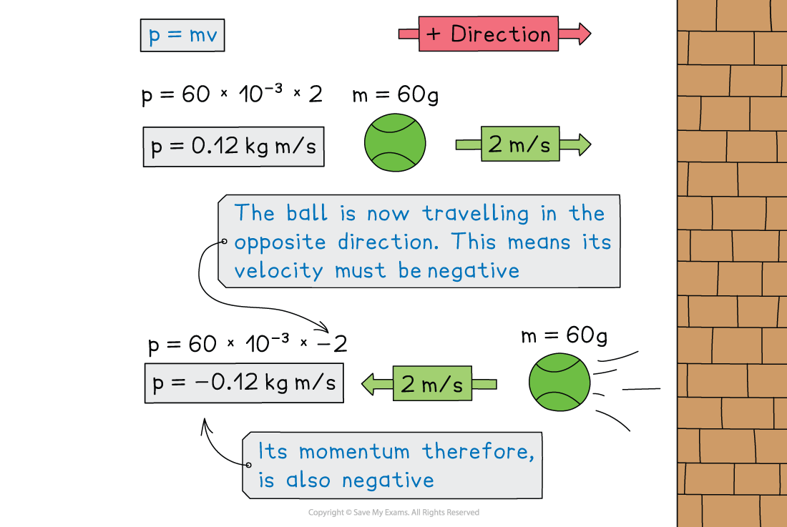
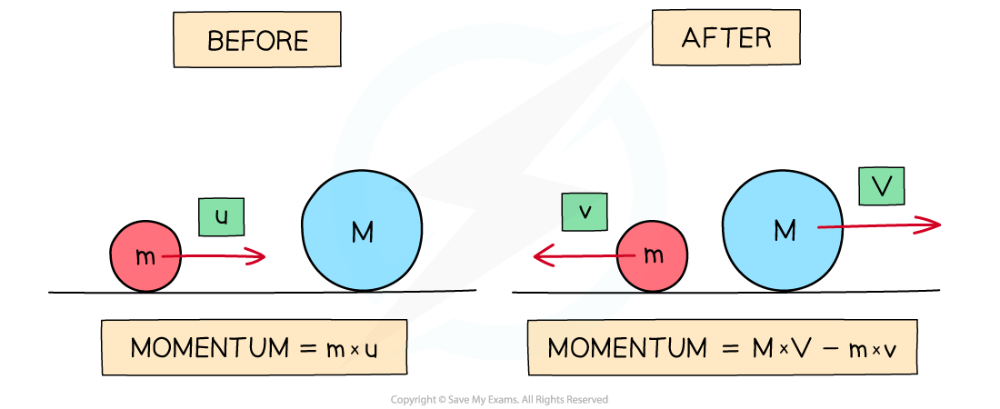

# Momentum

## Calculating momentum

> **Spec point** — `spcpt_zBvYH3D8Vp2sjnQK` · know and use the relationship between momentum, mass and velocity: 
momentum = mass × velocity p = m × v (physics only)

## Calculating momentum

- **Momentum **is a property that all moving objects have
- An object with **mass**, $m$, moving at a **velocity**, $v$, will have a momentum, $p$

### The momentum equation

- Momentum is the product of an objects mass and velocity

$p=mv$

- Where:

  - *p* = momentum in kilogram metre per second (kg m/s)
  - *m* = mass in kilograms (kg)
  - *v* = velocity in metres per second (m/s)

- This means that an object at rest (i.e. *v* = 0) has **no** momentum

- Momentum keeps an object moving in the same direction

  - It is difficult to change the direction of an object with a large momentum

- Velocity is a ***vector*** with both **magnitude **and **direction**
- Therefore, the momentum of an object depends on its **direction **of travel

  - This means momentum can be either **positive** or **negative**

- If an object travelling to the right has positive momentum, then an object travelling in the opposite direction (to the left) will have negative momentum

  - This isn't a solid rule, but in questions, usually the positive direction is to the right and negative to the left

#### How does the momentum of a ball change after a collision?

***The momentum of the tennis ball is positive as it approaches the wall and negative after the collision as it moves in the opposite direction***

- The momentum of an object will change if:

  - it's **velocity **increases or decreases (acceleration)
  - it's **direction **changes (acceleration)
  - it's **mass **changes

> **Worked Example**
> Determine which object has the most momentum, the tennis ball or the brick.
> 
> Explain your answer.
> 
> 
> 
> ** **
> 
> **Answer:**
> 
> **Step 1: Calculate the momentum of the tennis ball using the momentum equation**
> 
> *p *= *mv*
> 
> *p *= 0.06 × 75
> 
> *p *= 4.5 kg m/s
> 
> **Step 2: Calculate the momentum of the brick using the momentum equation**
> 
> *p *= *mv*
> 
> *p *= 3 × 1.5
> 
> *p *= 4.5 kg m/s
> 
> **Step 3: Explain your answer**
> 
> - Both the tennis ball and the brick have the same momentum
> - Even though the brick has a much greater mass than the ball, the ball is travelling much faster than the brick
> - This means that on impact, they would both exert a similar force (depending on the time it takes for each to come to rest)

> **Exam Hint**
> Remember the units of momentum as **kg m/s **which is the product of the units of mass (kg) and velocity (m/s).
> 
> Which direction is taken as positive is completely up to you in the exam. In general, forwards, to the right, and upwards are taken as positive, and backward, to the left, or down are taken as negative.

## Conservation of momentum

> **Spec point** — `spcpt_S9ZF5bGrV8JW7kYm` · use the conservation of momentum to calculate the mass, velocity or momentum of objects (physics only)

## Conservation of momentum

### The principle of conservation of momentum

- The principle of **conservation of momentum** states that: **The total momentum before an interaction is equal to the total momentum after an interaction, if no external forces are acting on the objects**
- In this context, an interaction can be either:

  - A **collision** i.e. where two objects collide with each other
  - An **explosion** i.e. where a stationary object explodes into two (or more) parts

### Collisions

- For a collision between two objects:

**The total momentum before a collision = the total momentum after a collision**

- In the example below:
- Before the collision:

  - The momentum is only generated by mass *m*  because it is the only moving object
  - If the right is taken as the positive direction, the total momentum of the system is ***m***** ×***** u***
- After the collision:

  - Mass *M* also now has momentum
  - The velocity of *m* is now -*v  *(since it is now travelling to the left) and the velocity of *M*  is *V*
  - The total momentum is now the momentum of *M* + the momentum of *m*
  - This is (*M*  × *V*) + (*m*  × -*v*) or **(*****M*****  × *****V*****) – (*****m***** × *****v*****) **written more simply

#### Conservation of momentum before and after a collision

***The momentum of a system before and after a collision is always conserved***

### 

- Since momentum is a ***vector*** quantity, a system of objects moving in opposite directions (e.g. towards each other) at the same speed will have an overall momentum of 0 since they will **cancel out**

  - Momentum is** always conserved** over time

> **Worked Example**
> The diagram shows a toy car and a toy van, just before and after the toy car collides with the toy van, which is initially at rest.
> 
> 
> 
> The toy car initially moves at a speed of 0.8 m/s, but this reduces to 0.1 m/s after the collision.
> 
> The mass of the toy car is 0.035 kg and the mass of the toy van is 0.085 kg.
> 
> Calculate the velocity of the toy van when it is pushed forward by the collision.
> 
> **Answer:**
> 
> **Step 1: State the principle of the conservation of momentum**
> 
> Total momentum before a collision = total momentum after a collision
> 
> **Step 2: Calculate the total momentum of the car and van before the collision**
> 
> Momentum: * *$p=mv$
> 
> - Initial momentum of the toy car:
> 
> $p_{\mathrm{car}}=0.035\times0.8=0.028\mathrm{kg}m/s$
> 
> - Initial momentum of the toy van:
> 
> $p_{\mathrm{van}}=0$ (the van is at rest, so p = v = 0)
> 
> - Total momentum before collision:
> 
> $p_{\mathrm{before}}=p_{\mathrm{car}}+p_{\mathrm{van}}$
> 
> $p_{\mathrm{before}}=0.028+0=0.028\mathrm{kg}m/s$
> 
> **Step 3: Calculate the total momentum of the car and van after the collision**
> 
> - Final momentum of the toy car:
> 
> $p_{\mathrm{car}}=0.035\times0.1=0.0035\mathrm{kg}m/s$
> 
> - Final momentum of the toy van:
> 
> * *$p_{\mathrm{van}}=0.085\timesv$
> 
> - Total momentum after collision:
> 
> $p_{\mathrm{after}}=0.0035+0.085v$
> 
> **Step 4: Rearrange the conservation of momentum equation for the velocity of the van**
> 
> $p_{\mathrm{before}}=p_{\mathrm{after}}$
> 
> $0.028=0.0035+0.085v$
> 
> $0.028-0.0035=0.085v$
> 
> $v=\frac{0.028-0.0035}{0.085}$
> 
> $v=0.29m/s$

> **Exam Hint**
> If it is not given in the question already, drawing a diagram of before and after helps keep track of all the masses and velocities (and directions) in the conservation of momentum questions.
> 
> Remember that velocity is speed with a direction. The question asks for the speed, so you do not need to include the final speed in your answer.
