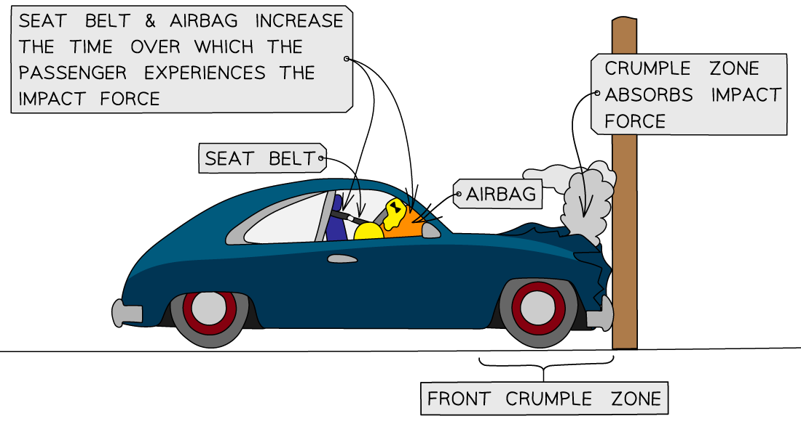
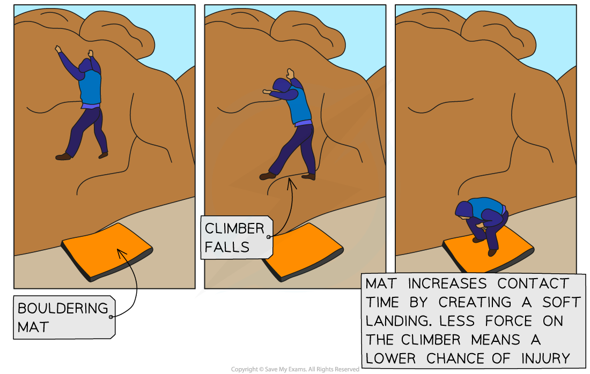

# Momentum & Safety Features

## Momentum & safety features

> **Spec point** — `spcpt_QZNKKz8Hc5gF8Jf3` · use the idea of momentum to explain safety features (physics only)

## Momentum & safety features

- Since force is equal to the rate of change in momentum, the force of an impact in a vehicle collision can be decreased by **increasing** **the contact time** over which the collision occurs

  - The contact time is the time in which the person is in contact with what they have collided with
- Therefore, **safety features** are created to reduce the impact of a force, such as in:

  - Vehicles
  - Playgrounds
  - Bicycle helmets
  - Gymnasium crashmats

### Safety features in vehicles

- Vehicle safety features are designed to absorb energy upon an impact by changing **shape**
- The main vehicle safety features are** crumple zones**, **seat belts** and **airbags**

  - For a given force upon impact, these absorb the energy from the impact and increase the time over which the force takes place
  - This, in turn, increases the time taken for the change in momentum of the passenger and the vehicle to come to rest
  - The increased time reduces the force and risk of injury on a passenger

- The usefulness of safety features depends on two main factors: **mass** and **velocity**
- If the impact is from a large mass, for example, a truck travelling very fast and colliding with a wall, the momentum will be very large

  - The change in momentum (ie. from a high speed to rest) will also be very large
  - This means that a very **long** contact time is needed to reduce the force of impact

#### Safety features on a car

***The seat belt, airbag and crumple zones help reduce the risk of injury on a passenger***

- **Seat belts**

  - These are designed to stop a passenger from colliding with the interior of a vehicle by keeping them fixed to their seat in an abrupt stop
  - They are designed to stretch slightly to increase the time for the passenger’s momentum to reach zero and reduce the force on them in a collision
- **Airbags**

  - These are deployed at the front on the dashboard and steering wheel when a collision occurs
  - They act as a soft cushion to prevent injury on the passenger when they are thrown forward upon impact
- **Crumple zones**

  - These are designed into the exterior of vehicles
  - They are at the front and back and are designed to crush or crumple in a controlled way in a collision
  - This is why vehicles after a collision look more heavily damaged than expected, even for relatively small collisions
  - The crumple zones increase the time over which the vehicle comes to rest, **lowering the impact force** on the passengers

### Crash mats

- Crash mats used in gymnasiums help reduce the risk of injury for falls in gymnastics and climbing

  - They are thick and soft to offer shock absorption of the force created by the person landing on the mat
- When a person lands on a crash mat with a large force, for example, after jumping, the soft landing means their body is in contact with the mat for a longer period of time than if it were otherwise not there
- This **increases** the **contact** **time** over which their momentum is reduced, creating a **smaller** **impact** **force** and a lower chance of injury

#### Climber using a crash mat

***A bouldering mat is a type of crash mat used to reduce the chance of injury in falls whilst climbing***

- In a similar way, playgrounds utilise cushioned surfaces as children will often fall onto these with a large force

  - The cushioned surface reduces the risk of a severe injury by increasing their **contact time** with the ground
- Meanwhile, a child in a gymnasium can use a thinner crash mat than an adult due to having a lower mass
- This is the same for activities where a person/adult will fall with a low velocity such as falling from lower heights

  - Therefore, thin crash mats are suitable for low-impact activities
- Safety features are intended to **reduce** the chance of serious injury but do not completely prevent it in all cases
