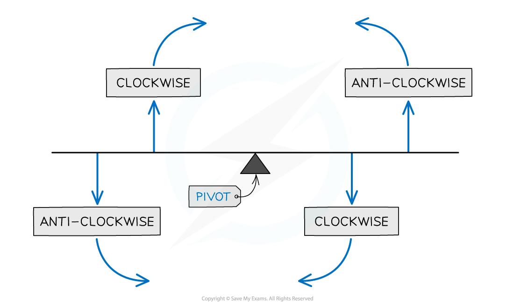
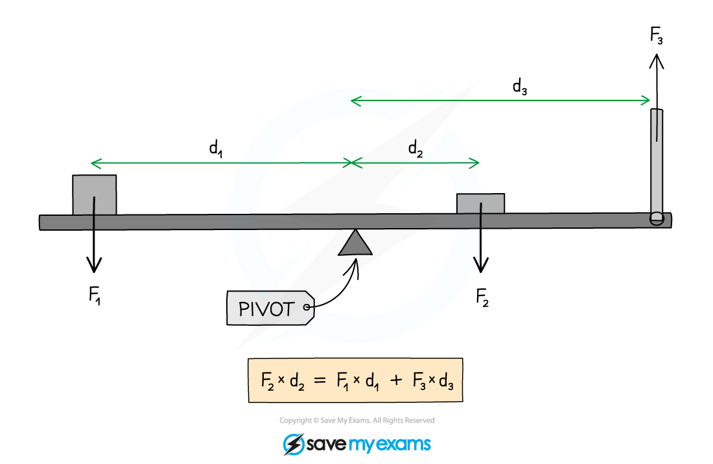
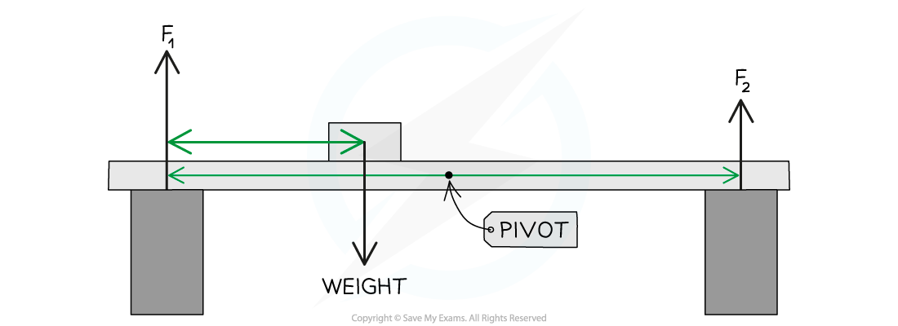
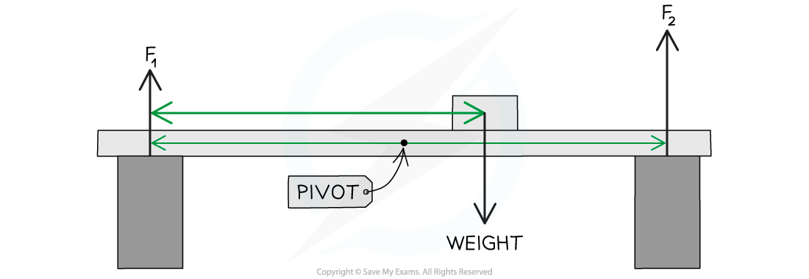
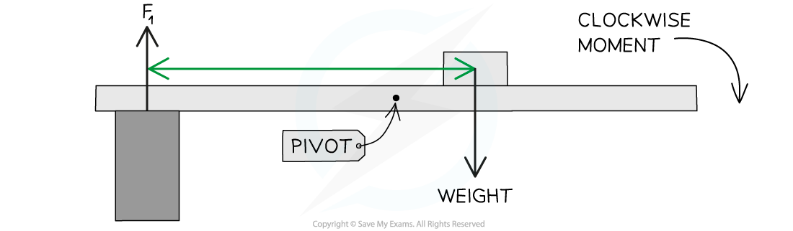

# The Principle of Moments

## The principle of moments

> **Spec point** — `spcpt_grKv8hsG7Hdd2YKc` · use the principle of moments for a simple system of parallel forces acting in  one plane (physics only)

## The principle of moments

- The **principle of moments** states that: **If an object is balanced, the total clockwise moment about a pivot equals the total anticlockwise moment about that pivot**
- For a balanced object, the moments on both sides of the pivot are **equal **

**clockwise moment = anticlockwise moment**

#### Clockwise and anticlockwise moments

***Imagine holding the beam about the pivot and applying just one of the forces. If the beam moves clockwise then the force applied is clockwise.***

- In the example below, the forces and distances of the objects on the beam are different, but they are arranged in a way that **balances **the whole system

- Remember that the moment = **force × distance from a pivot**
- The forces should be **perpendicular** to the distance from the pivot

  - For example, on a horizontal beam, the forces which will cause a moment are those directed upwards or downwards

#### Using the principle of moments

***The clockwise and anticlockwise moments acting on a beam***** are balanced**

- In the above diagram:

  - Force $F_{1}$ causes an **anticlockwise **moment of $F_{1}\timesd_{1}$ about the pivot
  - Force $F_{2}$ causes a **clockwise **moment of $F_{2}\timesd_{2}$ about the pivot
  - Force $F_{3}$ causes an **anticlockwise **moment of $F_{3}\timesd_{3}$ about the pivot

- Collecting the clockwise and anticlockwise moments:

  - Sum of the clockwise moments = $F_{2}\timesd_{2}$
  - Sum of the anticlockwise moments = `open parentheses F subscript 1 cross times d subscript 1 close parentheses space plus space open parentheses F subscript 3 cross times d subscript 3 close parentheses`

- Using the principle of moments, the beam is balanced when:

**Sum of the clockwise moments = Sum of the anticlockwise moments**

`F subscript 2 space cross times space d subscript 2 space equals space open parentheses F subscript 1 space cross times d subscript 1 close parentheses space plus space open parentheses F subscript 3 space cross times space d subscript 3 close parentheses`

> **Worked Example**
> A parent and child are at opposite ends of a playground see-saw. The parent weighs 690 N and the child weighs 140 N. The adult sits 0.3 m from the pivot.
> 
> 
> 
> Calculate the distance the child must sit from the pivot for the see-saw to be balanced.
> 
> **Answer:**
> 
> **Step 1: List the known quantities**
> 
> - Clockwise force (child), *F*child = 140 N
> - Anticlockwise force (adult), *F*adult = 690 N
> - Distance of adult from the pivot, *d*adult = 0.3 m
> 
> **Step 2: Write down the relevant equation**
> 
> - Moments are calculated using:
> 
> Moment = force × distance from pivot
> 
> - For the see-saw to balance, the principle of moments states that
> 
> Total clockwise moments = Total anticlockwise moments
> 
> **Step 3: Calculate the total clockwise moments**
> 
> - The clockwise moment is from the child
> 
> Moment of child (clockwise) = *F*child × *d*child
> 
> Moment of child (clockwise) = 140 × *d*child
> 
> **Step 4: Calculate the total anticlockwise moments**
> 
> - The anticlockwise moment is from the adult
> 
> Moment of adult (anticlockwise) = *F*adult × *d*adult
> 
> Moment of adult (anticlockwise) = 690 × 0.3 = 207 N m
> 
> **Step 5: Substitute into the principle of moments equation**
> 
> Moment of child (clockwise) = Moment of adult (anticlockwise)
> 
> 140 × *d*child = 207
> 
> **Step 6: Rearrange for the distance of the child from the pivot**
> 
> *d*child = $\frac{207}{140}$ = **1.5 m**
> 
> - The child must sit **1.5 m** from the pivot to balance the see-saw

> **Exam Hint**
> Make sure that all the distances are in the same units and that you’re considering the correct forces as **clockwise** or **anticlockwise**.
> 
> In your IGCSE exam, you will only be expected to apply the principle of moments to a situation where an object rotates in one plane (up and down or side to side)

## Supporting a beam

> **Spec point** — `spcpt_VgbvQw3fTnQMgsH7` · understand how the upward forces on a light beam, supported at its ends, vary with the position of a heavy object placed on the beam (physics only)

## Supporting a beam

- A **light beam** is one that can be treated as though it has **no mass**
- The supports, therefore, must exert upward forces that balance the downward acting weight of any object placed on the beam

***F******1****** and F******2****** upwards balance the weight of the beam downwards***

- As the mass in the above diagram is moved from the left-hand side to the right-hand side of the beam, force *F**1* will **decrease** and force *F**2* will **increase**

***F******1****** decreases F******2****** increases keep the beam balanced***

- Consider what would happen to the beam if the right-hand support was removed:

  - Force *F**2* would be 0
  - The weight of the object would produce a moment about the left-hand support, causing the beam to pivot in a clockwise direction

***When F******2****** is removed the beam will rotate by the clockwise moment***

- Therefore, the force *F**2* must therefore supply an **anticlockwise** moment about the left-hand support, which **balances** the moment supplied by the object
