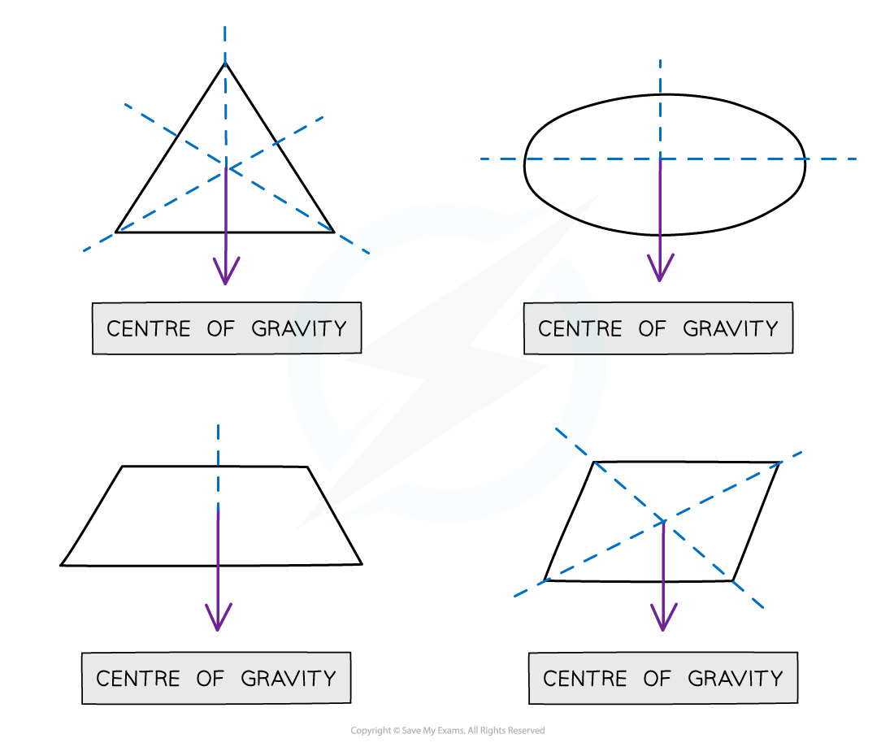
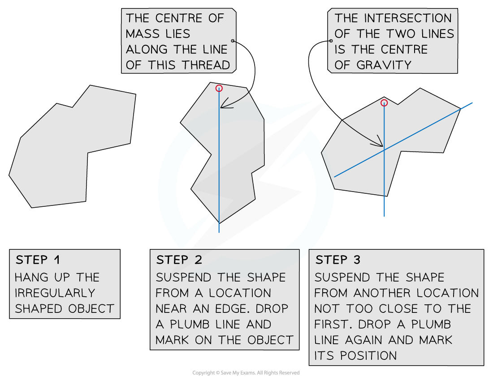

# Centre of Gravity

## Centre of gravity

> **Spec point** — `spcpt_gxgQbFzGgBcpPccw` · know that the weight of a body acts through its centre of gravity (physics only)

## Centre of gravity

- The **centre of gravity** of an object is defined as: **The point through which the weight of an object acts**
- For a symmetrical object of uniform density, the **centre of gravity is located at the point of symmetry**

  - For example, the centre of gravity of a sphere is at the centre

#### Finding the centre of gravity of symmetrical objects

***The centre of gravity of a regular shaped object can be found using symmetry***

- The centre of gravity of an irregular object can be found using suspension

- The** irregular shape** is suspended from a pivot and allowed to settle
- A plumb line (weighted thread) is then held next to the pivot and a pencil is used to draw a vertical line from the pivot (the centre of mass must be somewhere on this line)
- The process is then repeated, suspending the shape from two additional points
- The centre of mass is located at the point where all three lines cross

> **Exam Hint**
> Since the centre of gravity is a hypothetical point, it can lie inside or outside of a body. The centre of gravity will constantly shift depending on the shape of a body. For example, a human body’s centre of gravity is lower when learning forward than when standing upright
> 
> However, when you are drawing force diagrams, always draw the weight force as if it were acting from the centre of gravity of the object!
