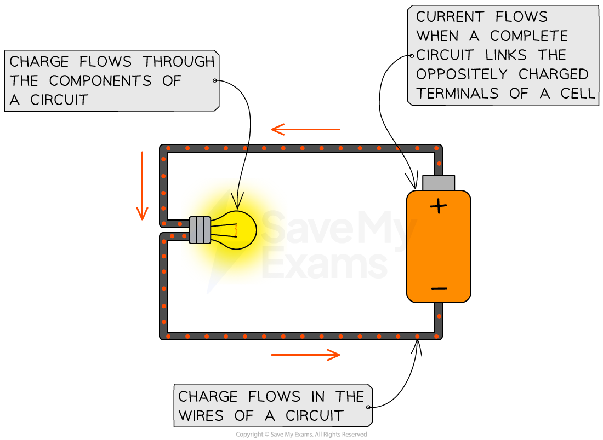
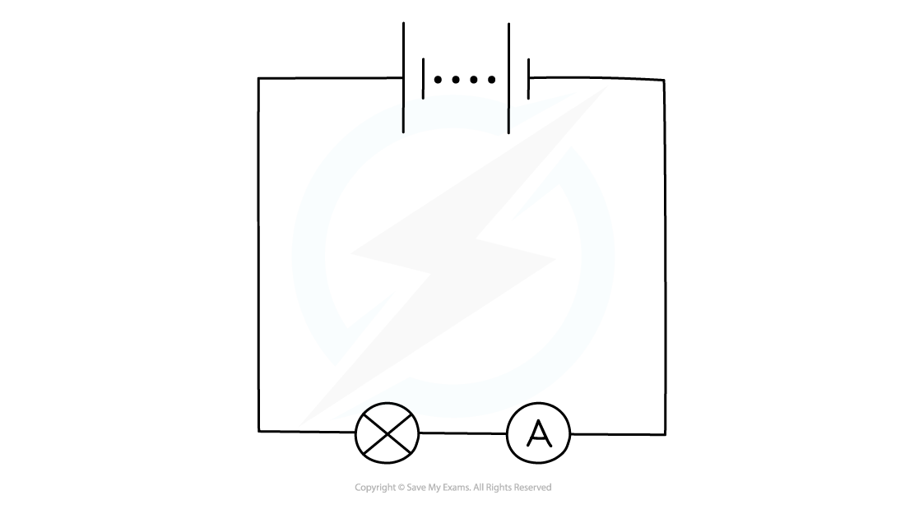
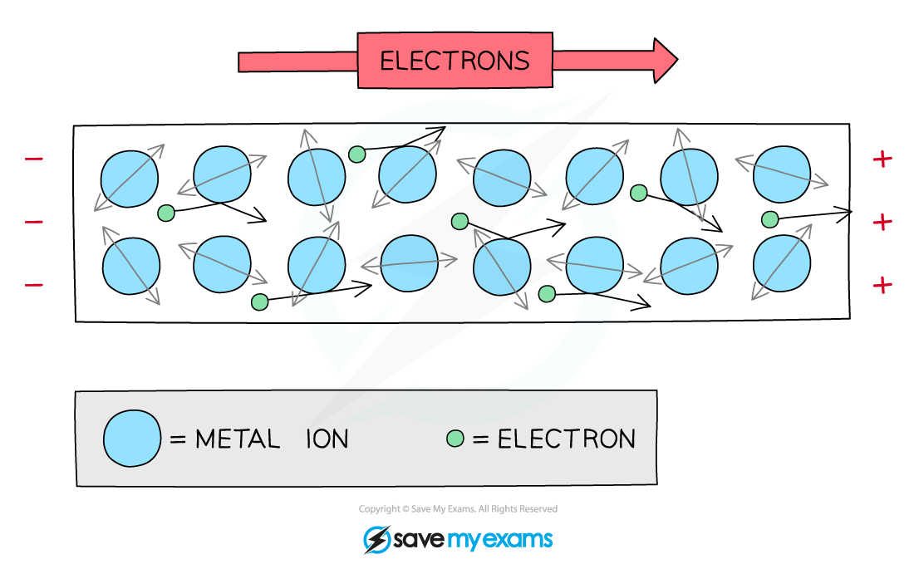
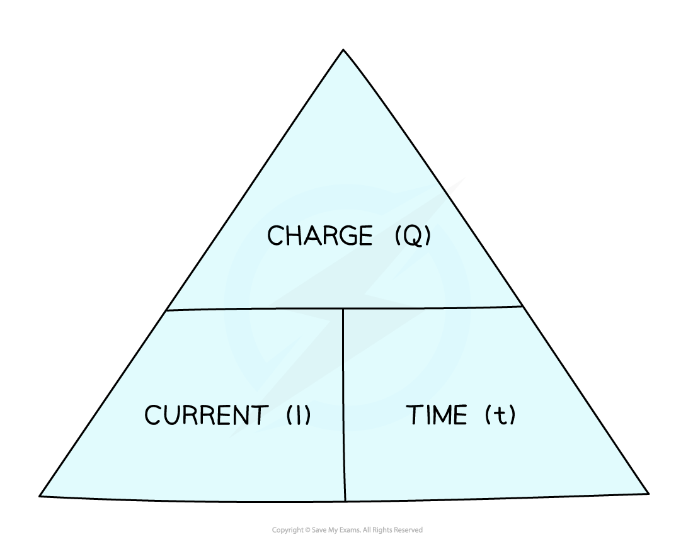

# Charge & Current

## Current

> **Spec point** — `spcpt_Sh4f54ybxrpgXXnv` · know that current is the rate of flow of charge 

## Current

- Electric current is defined as

**The rate of flow of electric charge**

- Current is measured in units of **amperes **or **amps (A)**

  - 1 amp is equivalent to a charge of 1 coulomb flowing in 1 second, or 1 A = 1 C/s

- This means the size of an electric current is the amount of charge passing through a component each second

- Current flows

  - when a **circuit **is formed e.g. when a wire connects the two oppositely charged terminals of a cell
  - from the **positive** terminal to the **negative** terminal of a cell

***Charge flows from the positive terminal to the negative terminal***

### Measuring current

- Current can be measured using an **ammeter**
- Ammeters must be connected in **series **with the component being measured

***An ammeter can be used to measure the current around a circuit***

## Charge

> **Spec point** — `spcpt_yTw9m5Ph5RKG7xqX` · know that electric current in solid metallic conductors is a flow of negatively charged electrons 

## Charge

- The wires in an electric circuit are made of **metal** because it is a good **conductor** of electric **current**
- In the wires, the current is a flow of **negatively** **charged** **electrons**

***In metal wires, the current is a flow of negatively charged electrons. When a voltage is applied, electrons flow through the lattice of metal ions***

> **Exam Hint**
> You should always consider current to be the flow of **positive **charge i.e. from the positive terminal to the negative terminal of a cell. This is known as** conventional current**.
> 
> This is in the opposite direction to **electron flow**, which is the flow of negatively charged electrons from the negative terminal to the positive terminal of a cell.
> 
> This is the convention we use because scientists defined conventional current before they discovered the electron
> 
> 

## Calculating electric charge

> **Spec point** — `spcpt_vZpQ3G6py3jfj7kY` · know and use the relationship between charge, current and time: charge = current × time 
Q = I × t 

## Calculating electric charge

- Current, charge and time are related by the equation:

charge = current × time

$Q=I\timest$

- Where:

  - *Q* = charge, measured in coulombs (C)
  - *I* = current, measured in amps (A)
  - *t* = time, measured in seconds (s)

- The current, charge and time equation can be rearranged with the help of the following formula triangle:

#### Current charge time formula triangle

***Formula triangle for the charge, current and time equation***

> **Worked Example**
> When will 8 A of current pass through an electrical circuit?
> 
> **A**.     When 8 J of energy is used by 1 C of charge
> 
> **B**.     When a charge of 4 C passes in 0.5 s
> 
> **C**.     When a charge of 8 C passes in 0.1 s
> 
> **D**.     When a charge of 1 C passes in 8 s
> 
> **ANSWER:  B**
> 
> - The equation relating current, charge and time is:
> 
> $Q=I\timest$
> 
> - Rearrange to make current *I* the subject of the equation:
> 
> $I=\frac{Q}{t}$
> 
> - Consider option **B**, where *Q* = 4 C and *t* = 0.5 s:
> 
> $I=\frac{4}{0.5}=8A$
> 
> - Therefore, the correct answer is **B**
> 
> **A** is incorrect as this is the definition of a voltage of 8 V between two points and does not describe current
> 
> **C **is incorrect as  $I=\frac{8}{0.1}=80A$
> 
> **D **is incorrect as  $I=\frac{1}{8}=0.125A$

> **Exam Hint**
> Electric currents in everyday circuits tend to be quite small, so it's common for examiners to throw in a **unit** **prefix** like 'm' next to quantities of current, e.g. 10 mA (10 milliamperes). Make sure you can convert these into standard units, e.g. 10 mA = 10 × 10-3 A.
> 
> Make sure to only use the triangle to help you **rearrange **the equation that links charge, current and time. Don't draw it if you are asked to write out the equation in full, such as *Q* = *I* × *t*, as you may lose marks for doing so.
> 
> Check out this revision note on [speed, distance and time](https://www.savemyexams.com/igcse/physics/edexcel/19/revision-notes/1-forces-and-motion/1-1-movement-and-position/1-1-2-speed/) if you need a reminder on how to use formula triangles.
