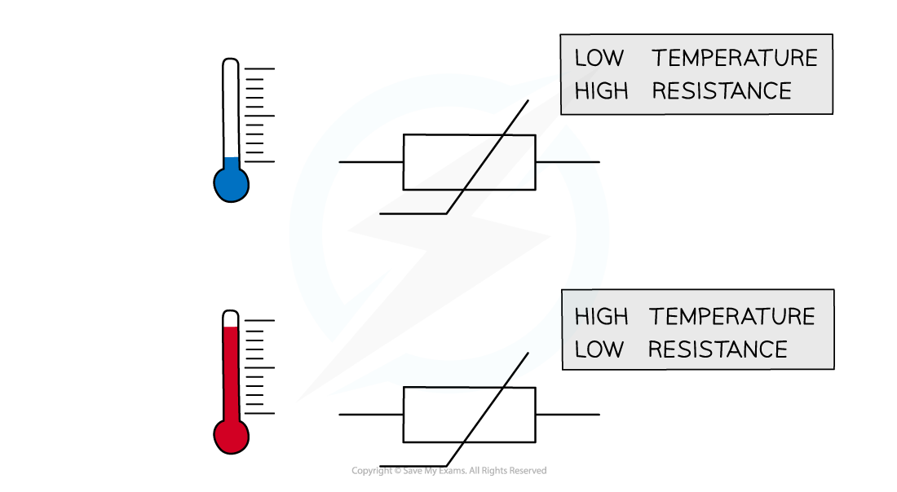
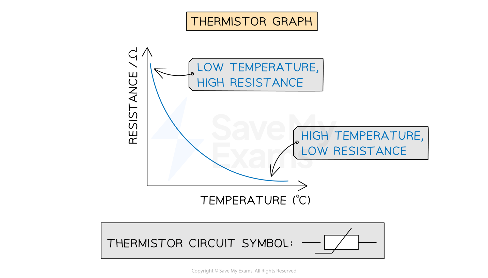
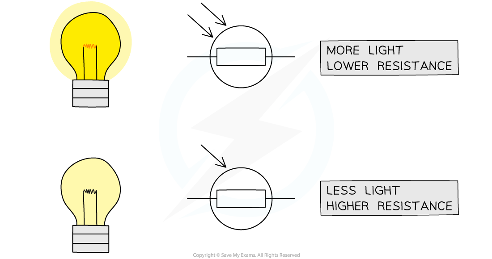
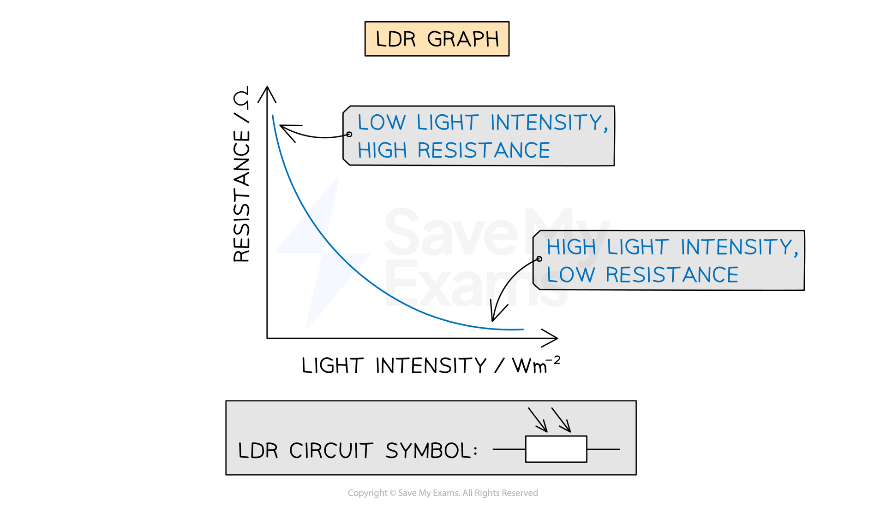

# Electrical Components

## Thermistors & LDRs

> **Spec point** — `spcpt_TxywN69ZVd5wHdfQ` · describe the qualitative variation of resistance of light-dependent resistors (LDRs) with illumination and thermistors with temperature 

## Thermistors & LDRs

- Environmental conditions, such as temperature and light intensity, can influence the resistance of resistors, such as

  - Thermistors
  - Light-dependent resistors (LDRs)

### Thermistors

- The resistance of a **thermistor** depends on its **temperature**
- The resistance of a thermistor is **high **in **cold **conditions and **low **in **hot **conditions

  - As the temperature **increases** the resistance of a thermistor **decreases**
  - As the temperature **decreases** the resistance of a thermistor **increases**

***The resistance of a thermistor depends on its temperature***

- The relationship between resistance and temperature for a thermistor can be shown on a graph

***The graph of resistance against temperature for a thermistor shows a curve indicating these quantities are inversely proportional to each other***

### Light-dependent resistors (LDRs)

- The resistance of a **light-dependent resistor** (LDR) depends on the **light intensity **on it
- The resistance of an LDR is **high **in **dark **conditions and **low **in **bright** conditions

  - As the light intensity **increases** the resistance of an LDR **decreases**
  - As the light intensity **decreases** the resistance of an LDR **increases**

***The resistance of an LDR depends on the intensity of light on it***

- The relationship between resistance and light intensity for an LDR can be shown on a graph

***The graph of light intensity against temperature for an LDR shows a curve indicating these quantities are inversely proportional to each other***

> **Exam Hint**
> Here is a list of all the circuit symbols you need to know for your exam:
> 
> 

## Lamps & LEDs

> **Spec point** — `spcpt_fF4pXdtvgwcQxy2G` · know that lamps and LEDs can be used to indicate the presence of a current in a circuit 

## Lamps & LEDs

- Lamps and light-emitting diodes (LEDs) **illuminate **(light up) when a **current** flows through them
- This makes them useful for indicating the presence of a current in a circuit

### Light-emitting diodes (LEDs)

- LEDs are a type of **diode**

  - This means they only allow current to flow through them in one direction
  - Therefore, in a circuit, an LED will only light up if it is placed in the correct direction

- The circuit symbol for an LED is as follows:

***LEDs can be used to indicate the presence of a current as they illuminate when current flows through them. The same is true for lamps***

> **Exam Hint**
> Make sure you learn the various symbols mentioned on this page. Many of them are very similar with small differences denoting what they do:
> 
> - Two arrows pointing towards a symbol mean that it is **light-dependent**
> - Two arrows pointing away mean that it is **light-emitting**
> 
> Symbols are sometimes drawn with circles around them (e.g. the LDR). These circles are often optional (although not in the case of meters and bulbs).
