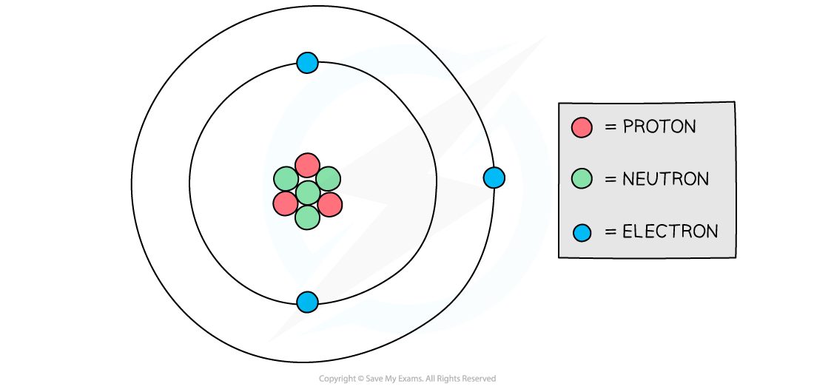
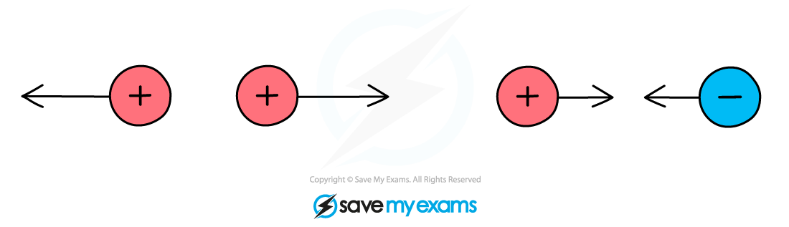
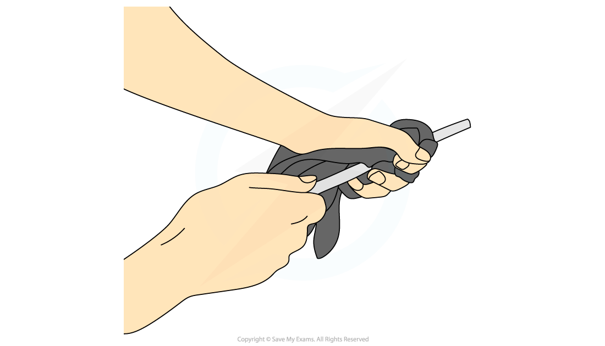
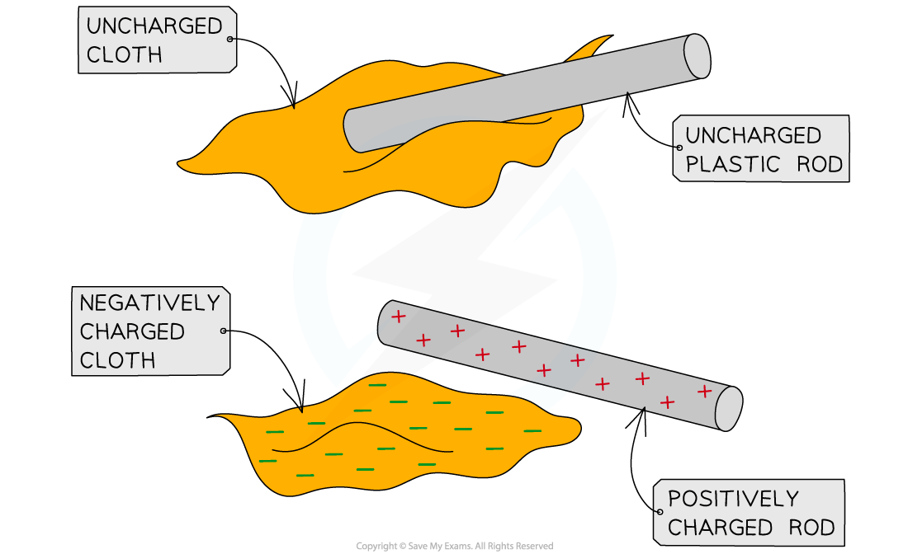

# Electric Charge

## Electric forces between charges

> **Spec point** — `spcpt_s8gz9HsYnpQKC9zb` · know that there are forces of attraction between unlike charges and forces of repulsion between like charges (physics only) 

## Electric forces between charges

- The charge of a particle can be:

  - positive
  - negative
  - neutral (no charge)

- Electrons are **negatively** charged particles, whilst protons are **positive** and neutrons are **neutral**
- This is why in a neutral atom, the number of electrons is equal to the number of protons

  - This is so the equal (but opposite) charges cancel out to make the overall charge of the atom zero

#### Diagram of a model of an atom

***The number of negative electrons in an atom balances the number of positive protons***

- Therefore, an object becomes negatively charged when it **gains** electrons and positively charged when it **loses** electrons
- When two charged particles or objects are close together, they also exert a **force **on each other
- This force could be:

  - **Attractive** (the objects get closer together)
  - **Repulsive** (the objects move further apart)

***Opposite charges attract, like charges repel***

- Whether two objects attract or repel depends on their **charge**

  - If the charges are the **opposite**, they will **attract**
  - If the charges are the **same**, they will **repel **– charges which are the same (e.g. both positive) are often referred to as **like charges**

- The force is **stronger** if the objects are **closer together**

#### Attraction or repulsion summary table

| **Charge of object 1** | **Charge of object 2** | **Attract or repel?** |
|---|---|---|
| positive | positive | repel |
| positive | negative | attract |
| negative | positive | attract |
| negative | negative | repel |

- Attraction and repulsion between two charged objects are examples of a **non-contact force**

  - This is a force that acts on an object without being physically in contact with it

> **Exam Hint**
> Remember the saying “**opposites attract**” when answering questions about forces between charged particles.

## Production of static

> **Spec point** — `spcpt_8qvyMJzGZBv2xjFt` · explain how positive and negative electrostatic charges are produced on materials by the loss and gain of electrons (physics only)

## Production of static

- **Static electricity** refers to the accumulation of charge on an object, which then attracts other objects or can even produce sparks
- When certain insulating materials are rubbed against each other they become **electrically charged**

  - This is called **charging by friction**
- The charges remain on the insulators and cannot immediately flow away

  - One becomes positive and the other negative
- An example of this is a plastic or polythene rod being charged by rubbing it with a cloth

  - Both the rod and cloth are insulating materials

***A polythene rod may be given a charge by rubbing it with a cloth***

- This occurs because negatively charged electrons are **transferred** from one material to the other

  - The material, in this case, the rod, **gains **electrons
- Since electrons are negatively charged, the rod becomes **negatively **charged

  - As a result, the cloth has **lost **electrons and therefore is left with an equal **positive **charge

> **Exam Hint**
> At this level, if asked to explain how things gain or lose charge, you must discuss **electrons** and explain whether something has gained or lost them. Remember when charging by friction, it is only the **electrons** that can move, not any 'positive' charge, therefore if an object gains a negative charge, something else must have gained a positive charge by losing negative electrons.

## Movement of electrons

> **Spec point** — `spcpt_RCVztjrxpGNZfPYt` · explain electrostatic phenomena in terms of the movement of electrons (physics only) 

## Movement of electrons

- All objects are initially electrically **neutral**, meaning the negative and positive charges are evenly distributed
- However, when the electrons are transferred through friction, one object becomes **negatively** charged and the other **positively** charged

  - The object the electrons are transferred **to** becomes **negatively charged**
  - The object the electrons transfer **from** becomes **positively charged**

- This difference in charges leads to a force of **attraction **between itself and other objects which are also electrically neutral

  - This is done by attracting the opposite charge to the surface of the objects they are attracted to

- In the example below, when the cloth and acetate rod are rubbed together, the electrons are transferred from the **rod **to the **cloth**
- This results in an **attractive **force between the two objects once separated

***Electrons are transferred from the rod to the cloth as they are rubbed together. This leaves the cloth negatively charged and the rod positively charged***
