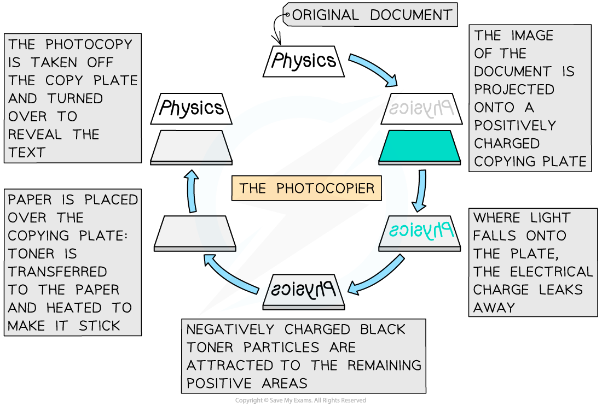
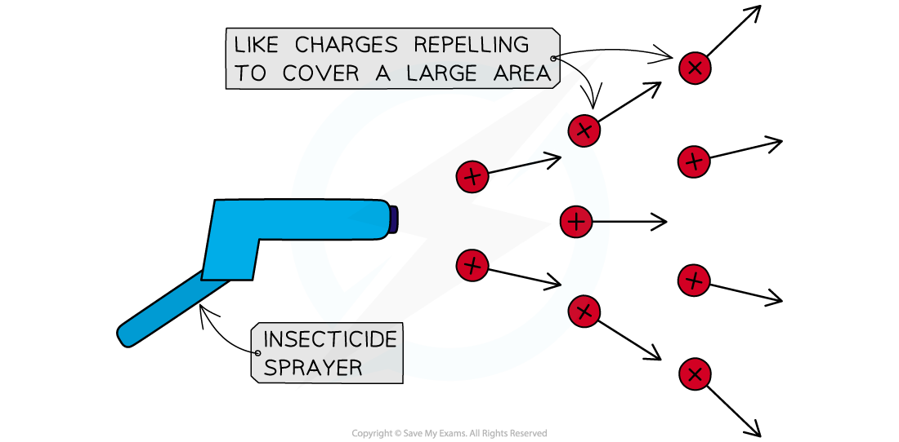
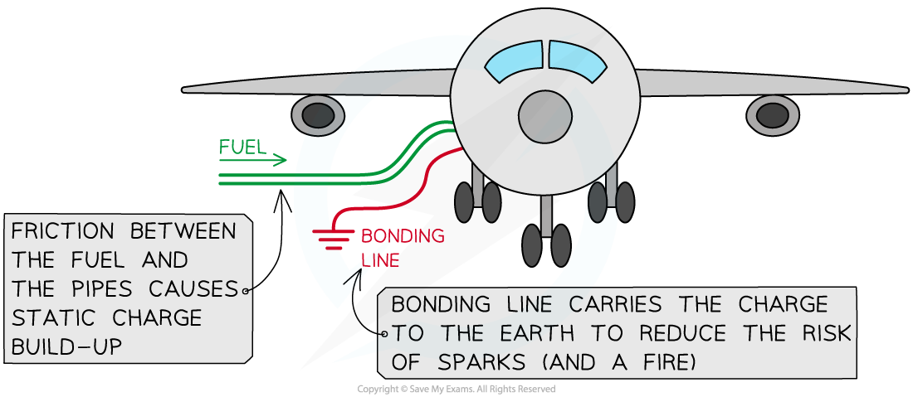

# Uses & Dangers of Static Electricity

## Uses of static electricity

> **Spec point** — `spcpt_YT36nnwt7g8TFStq` · explain some uses of electrostatic charges, e.g. in photocopiers and inkjet printers (physics only)

## Uses of static electricity

- Electrostatic charges are used in everyday situations such as photocopiers and inkjet printers

### Photocopiers

- Photocopiers use static electricity to copy paper documents, most commonly in black and white

  1. An image of the document is projected onto a positively charged copying plate
  2. The plate loses its charge in the light areas and keeps the positive charge in the dark areas (i.e the text)
  3. A negatively charged black toner powder (the ink) is applied to the plate and sticks to the part where there is a positive charge
  4. The toner is then transferred onto a new blank sheet of white paper
  5. The paper is heated to make sure the powder sticks (hence why photocopied paper feels warm)
- The photocopy of the document is now made
- Inkjet printers work in a similar way, but instead of the black toner powder, a small jet of coloured ink is negatively charged and attracted to the correct place on the page

***Diagram of the process by which a photocopier prints black text onto paper***

### Insecticide Sprayers

- Insecticides are chemicals used to kill pests in order to protect crops
- In order to spray crops effectively whilst using a minimal amount of chemicals, the sprayer has to deliver the chemicals as a **fine** **mist **and cover a **large area**
- To achieve this, the insecticide is given an electrostatic charge (e.g. positive) as it leaves the sprayer
- The droplets of insecticide then **repel** each other since they are the same charge

  - This ensures that the spray remains fine and covers a large area
- They are also attracted to the negative charges on Earth, so they will fall **quickly** and are less likely to be blown away
- A similar technique is used in the spray painting of cars

***Positively-charged particles leaving the sprayer repel one another, covering a larger area and preventing particles from grouping together.***

## Dangers of static electricity

> **Spec point** — `spcpt_RPsk9NNRNyHX7Dth` · explain the potential dangers of electrostatic charges, e.g. when fuelling aircraft and tankers (physics only)

## Dangers of static electricity

- There are various situations where static electricity can pose a hazard, for example:

  - the risk of electrocution (e.g from lightning or a loose connection in an electrical appliance)
  - the risk of a fire or explosion due to a **spark **close to a flammable gas or liquid
- Static electricity can cause sparking

  - This is where a large amount of charge builds up, producing a large potential difference across a gap
  - If the potential difference is large enough, current can travel through the air between objects – this is a spark
- There are dangers of sparking in everyday situations such as fuelling vehicles such as cars and planes
- Earthing is used to prevent the dangerous build-up of charge

  - This is done by connecting the vehicles to the Earth with a conductor

### Fuelling Vehicles

- A build-up of static charge is a potential danger when refuelling aeroplanes
- Fuel runs through pipes at a fast rate

  - This fuel is very flammable
- The friction between the fuel (a liquid insulator) and the pipe causes the fuel to **gain charge**
- If this charge were to cause a spark, the fuel could ignite and cause an explosion

***A diagram showing how the bonding line reduces the chance of sparks when fuelling a plane***

- This is prevented by the fuel tank being connected to the Earth with a copper wire called the **bonding line** during the refuelling
- The conductor **earths** the plane by carrying the charge through to the Earth which removes the risk of any sparks

  - It is easier for charge to flow down the bonding line than to spark, so sparks are very unlikely to occur

> **Exam Hint**
> - You could be asked to explain other dangers and uses in your exams
> - They may ask you to explain the movement of charge in terms of **electrons**
> - If asked to explain a danger:
> 
>   - State what the danger is (electrocution? fire?)
>   - Explain how the charge can be **removed** to get rid of the risk i.e earthing (think about which way the electrons have to move)
> - If asked to explain a use, think carefully about the forces exerted due to static electricity and what they will do
