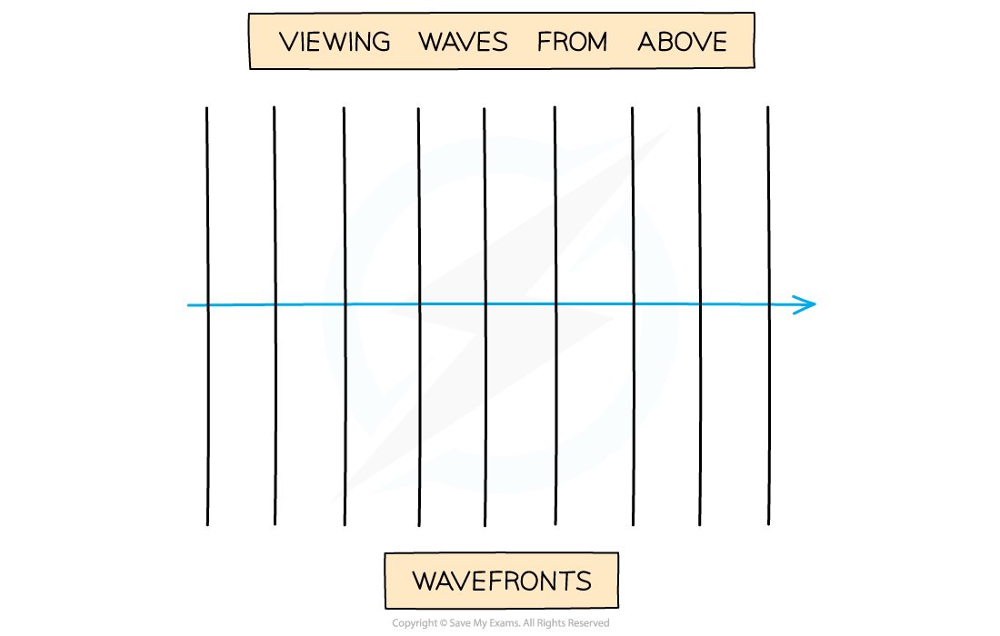
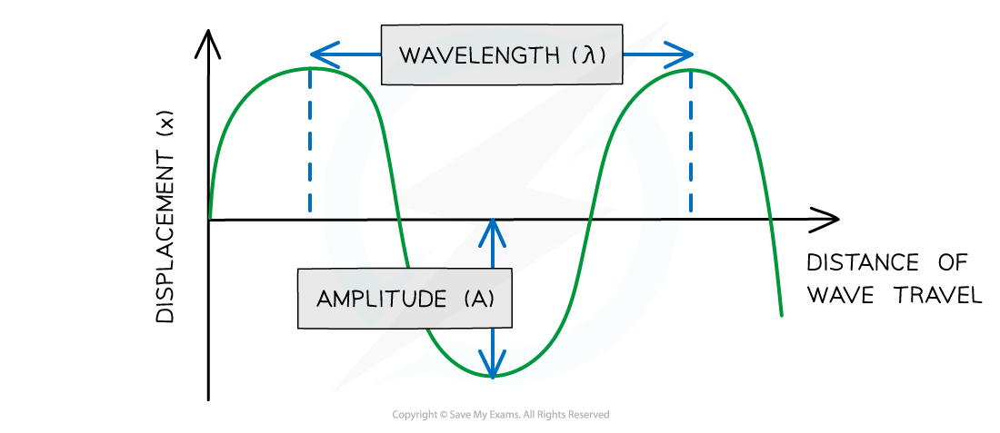

# Describing Wave Motion

## Describing wave motion

> **Spec point** — `spcpt_DdbQGhmStkT5Hg3t` · know the definitions of amplitude, wavefront, frequency, wavelength and period of a wave 

## Describing wave motion

- When describing wave motion, there are several terms which are important to know, including:

  - wavefront
  - amplitude
  - wavelength
  - frequency
  - time period

### Wavefront

- Wavefronts are a useful way of picturing waves from above
- Each wavefront, drawn as a single line, is used to represent a single wave
- The image below illustrates how wavefronts are visualised:

  - The arrow shows the direction the wave is moving and is sometimes called a **ray**
  - The space between each wavefront represents the **wavelength**
  - When the wavefronts are **close together**, this represents a wave with a **short** wavelength
  - When the wavefronts are **far apart**, this represents a wave with a **long** wavelength

#### Wavefronts as viewed from above

***Diagram showing a wave moving to the right, drawn as a series of wavefronts***

### Amplitude

- Amplitude is defined as:

**The distance from the undisturbed position to the peak or trough of a wave**

- It is given the symbol $A$ and is measured in **metres (m)**
- On a graph where the vertical axis is **displacement**, amplitude is measured from the ***undisturbed position*** to either the highest point of the wave (peak) or the lowest point (trough)

### Wavelength

- Wavelength is defined as:

**The distance from one point on the wave to the same point on the next wave**

- In a **transverse** wave:

  - The wavelength can be measured from one peak to the next peak
- In a **longitudinal **wave:

  - The wavelength can be measured from the centre of one compression to the centre of the next

- Wavelength is given the symbol $λ$ (lambda) and is measured in** metres (m)**
- On a graph where the horizontal axis is **distance**, the wavelength can be determined by measuring the distance from one point on the wave to the same point on the next wave

#### Using a graph to determine wavelength and amplitude

***Diagram showing the amplitude and wavelength of a wave***

### Frequency

- Frequency is defined as:

**The number of waves passing a point in a second**

- Frequency is given the symbol $f$*** ***and is measured in **hertz (Hz)**

  - The unit hertz is equivalent to 'per second'
  - 5 Hz = 5 waves per second

### Time period

- The time period (or sometimes just '**period**') of a wave is defined as:

**The time taken for a single wave to pass a point**

- Period is given the symbol $T$ and is measured in **seconds (s)**

  - The equation linking frequency and time period is explained in [Frequency & time period](https://www.savemyexams.com/igcse/physics/edexcel/19/revision-notes/3-waves/3-1-waves-and-the-electromagnetic-spectrum/3-1-3-the-wave-equation/)
- On a graph where the horizontal axis is **time**, the period can be determined by measuring the time from one point on the wave to the same point on the next wave

#### Using a graph to determine time period

***Diagram showing the time period of a wave***

> **Exam Hint**
> In your exam, you are expected to be able to define these keywords and identify their values from diagrams or scenarios.
> 
> The wavelength is often shown graphically between the peaks of two consecutive waves. However, the wavelength can be shown between two corresponding points on two successive waves - the distance will be the same!
