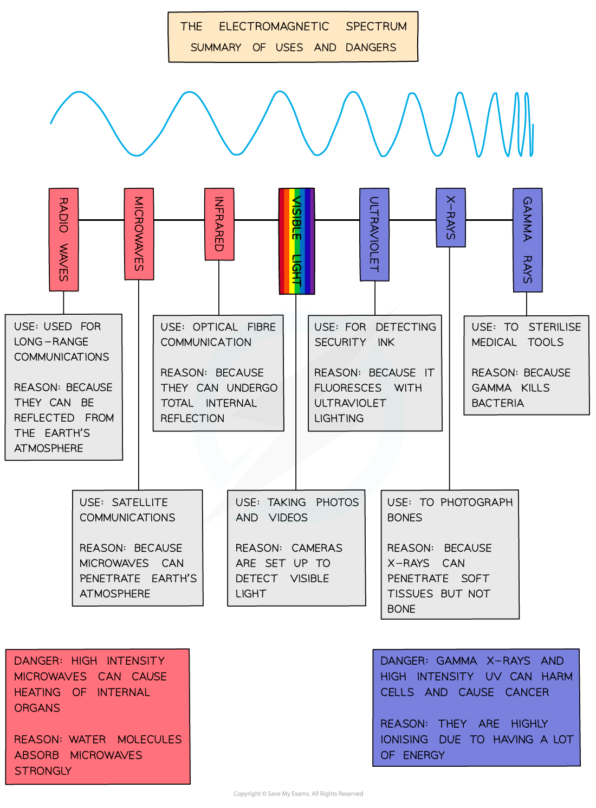

# Dangers of EM Waves

## Dangers of EM waves

> **Spec point** — `spcpt_C7kzyM4s3Y4fFNQH` · explain the detrimental effects of excessive exposure of the human body to electromagnetic waves, including: 
•        microwaves: internal heating of body tissue
•        infrared: skin burns
•        ultraviolet: damage to surface cells and blindness
•        gamma rays: cancer, mutation
and describe simple protective measures against  the risks

## Dangers of EM waves

### Risks of excessive exposure to EM radiation

- **Excessive exposure** of the human body to electromagnetic waves can have detrimental effects
- **Risks **from overexposure to certain wavelengths include:

  - **microwaves** can cause heat damage to **internal organs** due to the internal heating of body tissue
  - **infrared** can **burn** the skin
  - **ultraviolet** can damage skin cells causing **sunburn** and blindness
  - **gamma** and **X-rays** can kill cells causing **cancer** and cell mutations

#### Dangers and uses of each part of the EM spectrum

***Uses and dangers of the electromagnetic spectrum***

- As discussed in [Describing wave motion](https://www.savemyexams.com/igcse/physics/edexcel/19/revision-notes/3-waves/3-1-waves-and-the-electromagnetic-spectrum/3-1-2-describing-wave-motion/) as the **frequency** of electromagnetic (EM) waves** increases**, so does the **energy**
- **Beyond the visible part **of the EM spectrum, the energy becomes large enough to ***ionise*** atoms
- As a result of this, the danger associated with EM waves** increases** along with the frequency

  - The **shorter** the wavelength, the more **ionising** the radiation

### Protective measures against the risks of over-exposure

- Devices using hazardous EM radiation contain safety features that reduce human exposure:

  - **microwaves **from microwave ovens are prevented from escaping the oven by the metal walls and metal grid in the glass door
  - **infrared **wearing protective clothing such as gloves can prevent the skin from feeling the heat
  - **ultraviolet **ray damage to the eyes is reduced by wearing **sunglasses** that absorb ultraviolet and prevent it from reaching the eyes. **Sunscreen** also absorbs ultraviolet light preventing it from damaging the skin.
  - **gamma** and **X-rays **damage is reduced through using minimal levels in medicine. Doctors leave the room during x-rays to avoid unnecessary exposure. Radiographers wear radiation badges to measure their level of radiation exposure. People working with gamma rays routinely have their dose levels tested.

#### Radiation badges

***Radiation badges are used by people working closely with radiation to monitor exposure***

> **Exam Hint**
> In your exam, you may be asked to explain the hazards of each type of radiation and the safety precautions used to reduce these hazards.
