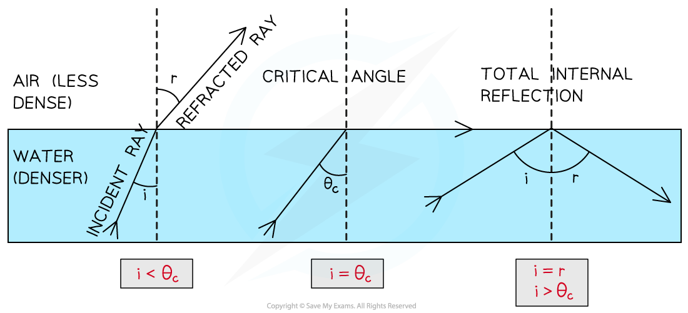
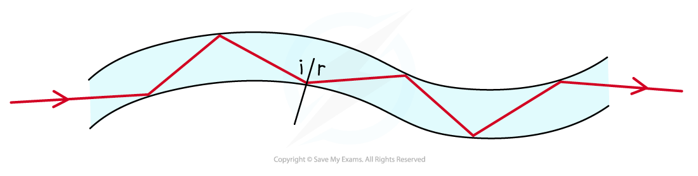
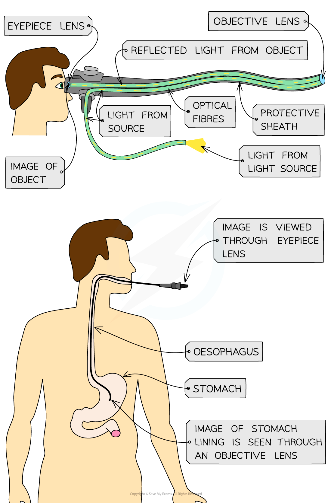
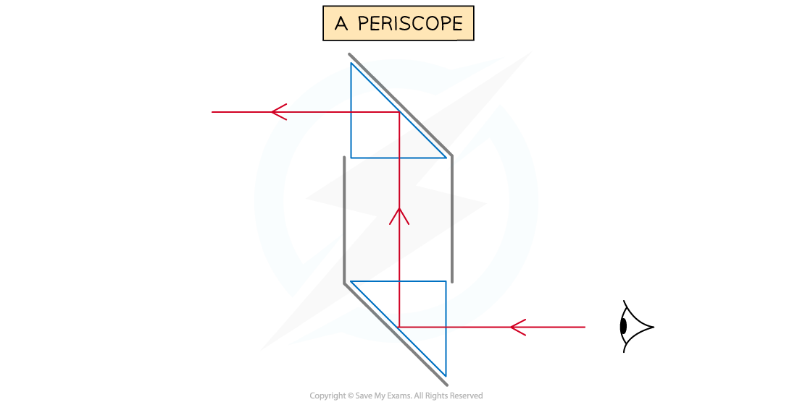
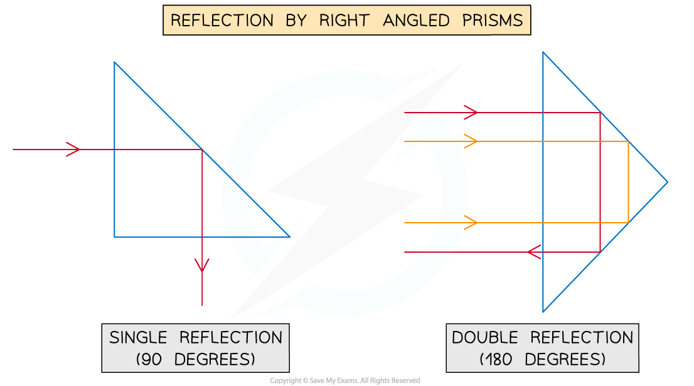

# Total Internal Reflection

## Total internal reflection

> **Spec point** — `spcpt_XttZx3BD28kWRMnC` · describe the role of total internal reflection in transmitting information along optical fibres and in prisms 

## Total internal reflection

- Sometimes, when light is moving from a denser medium towards a less dense one, instead of being refracted, all of the light is **reflected**

  - This phenomenon is called **total internal reflection**

- Total internal reflection (TIR) occurs when: **The angle of incidence is greater than the critical angle and the incident material is denser than the second material**
- Therefore, the **two** conditions for total internal reflection are:

  - The angle of incidence > the critical angle
  - The incident material is denser than the second material

#### The angles of refraction, critical and total internal reflection

***The critical angle is different for different materials. Refraction occurs when the angle of incidence is less than the critical angle, and total internal reflection occurs when it is greater***

- Total internal reflection is utilised in

  - **optical fibres** e.g. endoscopes
  - **prisms **e.g. periscopes

### Optical fibres

- Total internal reflection is used to reflect light along optical fibres, meaning they can be used for

  - communications
  - endoscopes
  - decorative lamps

- Light travelling down an optical fibre is totally internally reflected each time it hits the edge of the fibre

#### Light travelling in an optical fibre

***Optical fibres utilise total internal reflection for communications***

#### Structure of an endoscope

***Endoscopes**** ****utilise total internal reflection to see inside a patient's body***

### Prisms

- Prisms are used in a variety of optical instruments, including

  - periscopes
  - binoculars
  - telescopes
  - cameras

- Prisms are also used in safety reflectors for bicycles and cars, as well as posts marking the edges of roads
- A periscope is a device consisting of two right-angled prisms that can be used to see over tall objects

#### Reflection of light in a periscope

***When light travels through a periscope, it totally internally reflects through prisms causing the light to reflect at right angles***

- The light totally internally reflects in both prisms

#### Reflection of light by right-angled prisms

***Single and double reflection through right-angled prisms***

> **Exam Hint**
> If asked to name the phenomena make sure you give the whole name – **total internal reflection.**
> 
> Remember: total internal reflection occurs when going from a denser material to a less dense material and **ALL** of the light is reflected.
> 
> If asked to give an example of a use of total internal reflection, first state the name of the object that causes the reflection (e.g. a right-angled prism) and then name the device in which it is used (e.g. a periscope)

## Critical angle

> **Spec point** — `spcpt_KMYgbS95XS84XzdZ` · explain the meaning of critical angle c 

## Critical angle

- As the angle of incidence is increased, the angle of refraction also increases until it gets closer to 90°
- When the angle of refraction is exactly 90° the light is refracted along the boundary

  - At this point, the angle of incidence is known as the **critical angle** *c*

#### Changing the angle of incidence to obtain the critical angle

***As the angle of incidence increases it will eventually surplus the critical angle and lead to total internal reflection of the light***

- When the angle of incidence is larger than the critical angle, the refracted ray is now ***reflected***

  - This is ***total internal reflection***

> **Worked Example**
> A glass cube is held in contact with a liquid and a light ray is directed at a vertical face of the cube. The angle of incidence at the vertical face is 39° and the angle of refraction is 25° as shown in the diagram.
> 
> The light ray is totally internally reflected for the first time at **X**.
> 
> 
> 
> Complete the diagram to show the path of the ray beyond **X** to the air and calculate the critical angle for the glass-liquid boundary.
> 
> **Answer:**
> 
> **Step 1: Draw the reflected angle at the glass-liquid boundary**
> 
> - When a light ray is reflected, the angle of incidence = angle of reflection
> - Therefore, the angle of incidence (or reflection) is 90° – 25° = 65°
> 
> **Step 2: Draw the refracted angle at the glass-air boundary**
> 
> - At the glass-air boundary, the light ray refracts **away** from the normal
> - Due to the reflection, the light rays are symmetrical to the other side
> 
> **Step 3: Calculate the critical angle**
> 
> - The question states the ray is “totally internally reflected for the first time” meaning that this is the lowest angle at which TIR occurs
> - Therefore, 65° is the critical angle
> 
> 

> **Exam Hint**
> If you are asked to explain what is meant by the critical angle in an exam, you can be sure to gain full marks by drawing and labelling the same diagram above (showing the three semi-circular blocks).

## Calculating critical angle

> **Spec point** — `spcpt_XZGYrDjj29jH6FMc` · know and use the relationship between critical angle and refractive index: 
sin c = 1 / n

## Calculating critical angle

- The critical angle, *c*, of a material is related to its ***refractive index***, *n*
- The relationship between the two quantities is given by the equation:

$\mathrm{sin}c=\frac{1}{n}$

- This can also be rearranged to calculate the refractive index, n:

$n=\frac{1}{\mathrm{sin}c}$

This equation shows that:

- The larger the **refractive index** of a material, the smaller the **critical angle**
- Light rays inside a material with a **high refractive index** are more likely to be **totally internally reflected**

> **Worked Example**
> Opals and diamonds are transparent stones used in jewellery. Jewellers shape the stones so that light is reflected inside. Compare the critical angles of opal and diamond and explain which stone would appear to sparkle more.
> 
> The refractive index of opal is about 1.5
> 
> The refractive index of diamond is about 2.4
> 
> **Answer:**
> 
> **Step 1: List the known quantities**
> 
> - Refractive index of opal, no = 1.5
> - Refractive index of diamond, nd = 2.4
> 
> **Step 2: Write out the equation relating critical angle and refractive index**
> 
> $\mathrm{sin}c=\frac{1}{n}$
> 
> **Step 3: Calculate the critical angle of opal (c****o****)**
> 
> $\mathrm{sin}(c_{o})=\frac{1}{1.5}=0.6667$
> 
> $c_{o}=\mathrm{sin}^{--1}(0.6667)=41.8=42^{\circ}$
> 
> **Step 4: Calculate the critical angle of diamond (c****d****)**
> 
> $\mathrm{sin}(c_{d})=\frac{1}{2.4}=0.4167$
> 
> $c_{d}=\mathrm{sin}^{--1}(0.4167)=24.6=25^{\circ}$
> 
> **Step 5: Compare the two values and write a conclusion**
> 
> - Total internal reflection occurs when the angle of incidence of light is **larger** than the critical angle (i>c)
> - In opal, total internal reflection will occur for angles of incidence between 42° and 90°
> - The critical angle of diamond is **lower** than the critical angle of opal (co>cd)
> - This means light rays will be totally internally reflected in diamond over a **larger** range of angles (25° to 90°)
> - Therefore, more total internal reflection will occur in diamond hence it will appear to sparkle more than the opal

> **Exam Hint**
> When calculating the value of the critical angle using the above equation:
> 
> - First use the refractive index, *n*, to find sin(*c*)
> - Then use the **inverse** sin function (sin–1) to find the value of *c*
