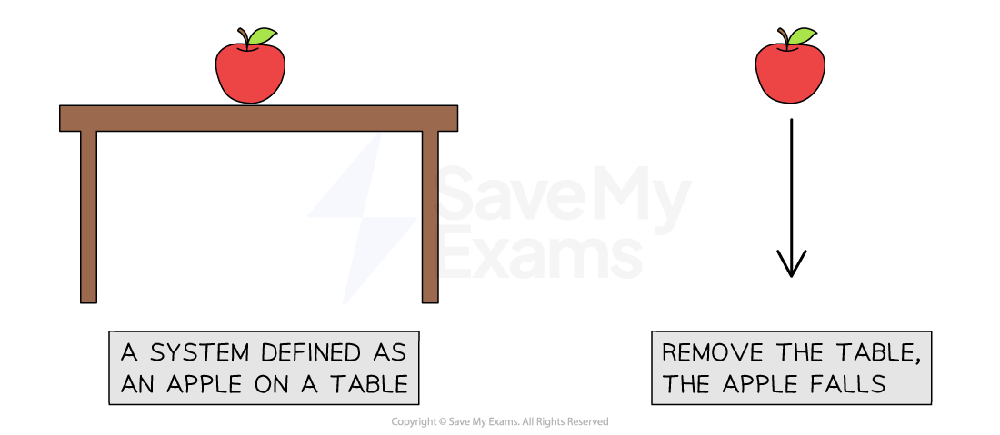
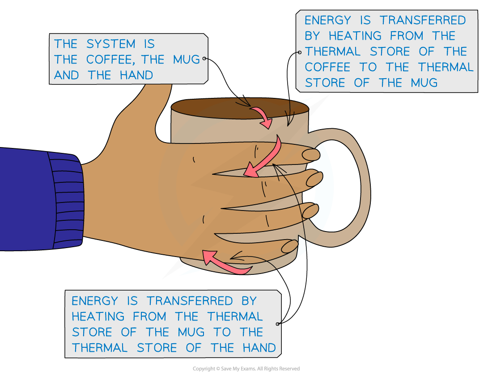

# Energy Stores & Transfers

## Energy stores & transfers

> **Spec point** — `spcpt_mdbrJYjNQHZCn7FS` · describe energy transfers involving energy stores: 
•        energy stores: chemical, kinetic, gravitational, elastic, thermal, magnetic, electrostatic, nuclear
•        energy transfers: mechanically, electrically, by heating, by radiation
(light and sound)

## Energy stores & transfers

- **Energy stores** and **transfer pathways** are a **model **for describing energy transfers in a system

### Systems in physics

- In physics, a **system **is defined as: **An object or group of objects**
- Defining the system, in physics, is a way of **narrowing **the parameters to **focus **only on what is relevant to the situation being observed
- A system could be large or small, incorporating just one object, or a whole group of objects and their surroundings

- When a system is in **equilibrium**, nothing changes, and so nothing happens
- When there is a **change** to a system, **energy is transferred**

- If an apple sits on a table, and that table is suddenly removed, the apple will fall
- As the apple falls, energy is transferred

### Energy stores

- Energy is stored in objects in different **energy stores**

#### Table of energy stores

| **Energy Store** | **Description** |
|---|---|
| Kinetic | Moving objects have energy in their kinetic store |
| Gravitational | Objects gain energy in their gravitational potential store when they are lifted through a gravitational field |
| Elastic | Objects have energy in their elastic potential store if they are stretched, squashed or bent |
| Magnetic | Magnetic materials interacting with each other have energy in their magnetic store |
| Electrostatic | Objects with charge (like electrons and protons) interacting with one another have energy in their electrostatic store |
| Chemical | Chemical reactions transfer energy into or away from a substance's chemical store |
| Nuclear | Atomic nuclei release energy from their nuclear store during nuclear reactions |
| Thermal | All objects have energy in their thermal store, the hotter the object, the more energy it has in this store |

### Energy transfers

- Energy is **transferred **between stores by different energy **transfer pathways**
- The energy transfer pathways are:

  - Mechanical
  - Electrical
  - Heating
  - Radiation
- These are described in the table below:

#### Table of energy transfer pathways

| **Transfer Pathway** | **Description** |
|---|---|
| Mechanical working | When a force acts on an object (e.g. pulling, pushing, stretching, squashing) |
| Electrical working | A charge moving through a potential difference (e.g. current) |
| Heating (by particles) | Energy is transferred from a hotter object to a colder one (e.g. conduction) |
| (Heating by) radiation | Energy transferred by electromagnetic waves (e.g. visible light) |

- An example of an energy transfer by heating is a cup of hot coffee heating up cold hands

***Energy is transferred by heating from the hot coffee to the mug to the cold hands***

> **Worked Example**
> Describe the energy transfers in the following scenarios:
> 
> a) A battery powering a torch
> 
> b) A falling object
> 
> **Answer: **
> 
> **Part a)**
> 
> **Step 1: Determine the store that energy is being transferred away from, within the parameters described by the defined system **
> 
> - For a battery powering a torch
> - The system is defined as the battery and the torch
> - Therefore, the energy transfer to focus on is from the battery to the torch
> - Therefore, the energy began in the chemical store of the cells of the battery
> 
> **Step 2: Determine the store that energy is transferred to, within the parameters described by the defined system **
> 
> - When the circuit is closed, the bulb lights up
> - Therefore, energy is transferred to the thermal store of the bulb
> - Energy is then transferred from the bulb to the surroundings, but this is not described in the parameters of the system
> 
> **Step 3: Determine the transfer pathway**
> 
> - Energy is transferred by the flow of charge around the circuit
> - Therefore, the transfer pathway is electrical
> 
> - Energy is transferred **electrically** from the **chemical store **of the battery to the** thermal store **of the bulb
> 
> **Part b)**
> 
> **Step 1: Determine the store that energy is being transferred away from, within the parameters described by the defined system **
> 
> - For a falling object
> - In order to fall, the object must have been raised to a height
> - Therefore, it began with energy in its gravitational potential store
> 
> **Step 2: Determine the store that energy is transferred to, within the parameters described by the defined system **
> 
> - As the object falls, it is moving
> - Therefore, energy is being transferred to its kinetic store
> 
> **Step 3: Determine the transfer pathway**
> 
> - For an object to fall, a resultant force must be acting on it, and that force is weight, and it acts over a distance (the height of the fall)
> - Therefore, the transfer pathway is mechanical
> 
> - Energy is transferred from the** gravitational store** to the **kinetic store** of the object via a **mechanical** transfer pathway

> **Exam Hint**
> Don't worry too much about the parameters of the system. They are there to help you keep your answers concise so you don't end up wasting time in your exam.
> 
> If you follow any process back far enough, you would get many energy transfers taking place. For example, an electric kettle heating water. The relevant energy transfer is from the thermal store of the kettle to the thermal store of the water, with some energy dissipated to the surroundings. But you could take it all the way back to how the electricity was generated in the first place. This is beyond the scope of the question. Defining the system gives you a starting point and a stopping point for the energy transfers you need to consider.

## Video Energy Transfer Pathways

> **Spec point** — `spcpt_BgFKcjv9r7THCv4s` · nan

##
