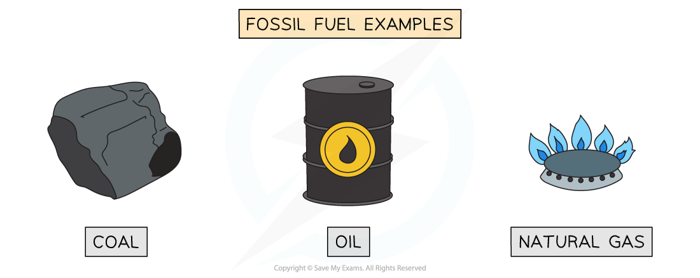
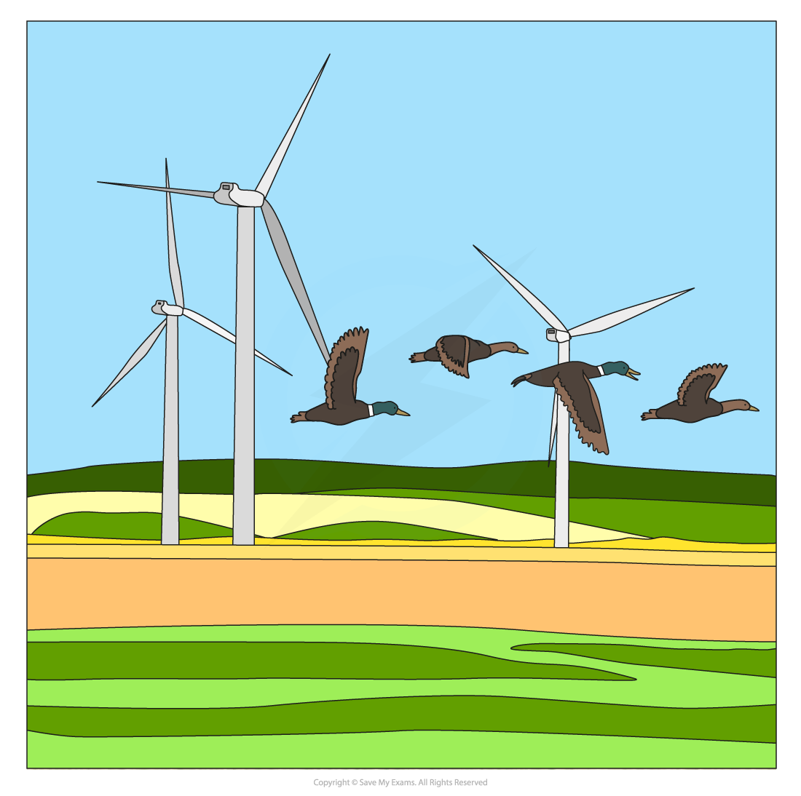
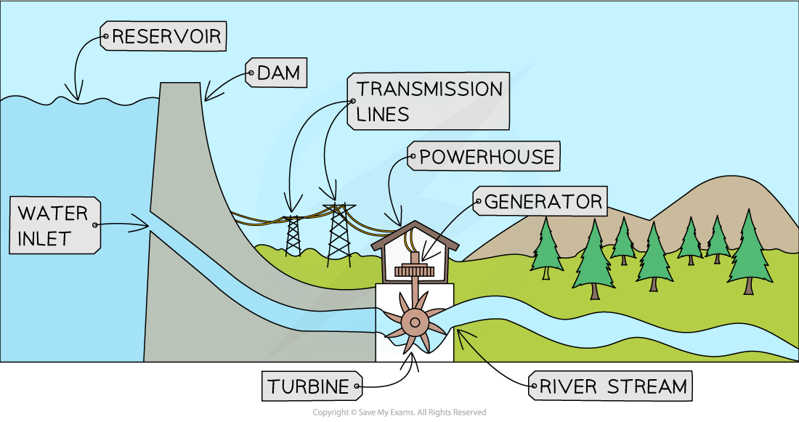
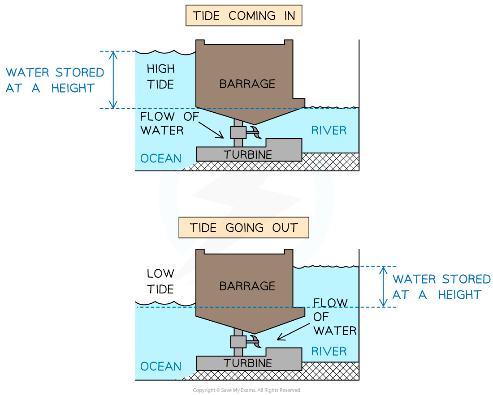
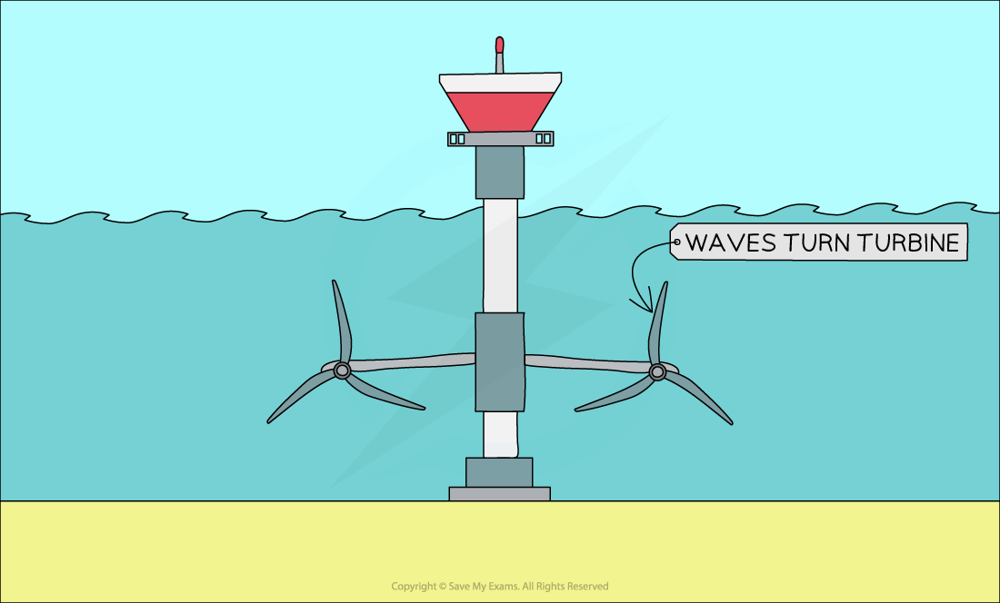
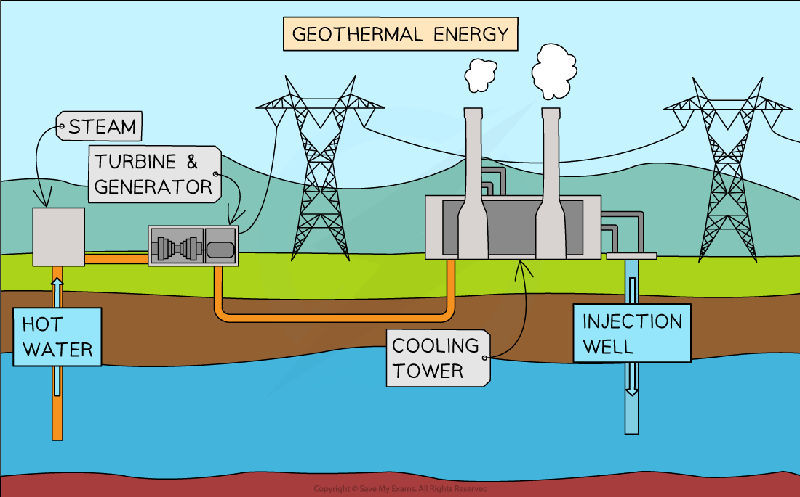
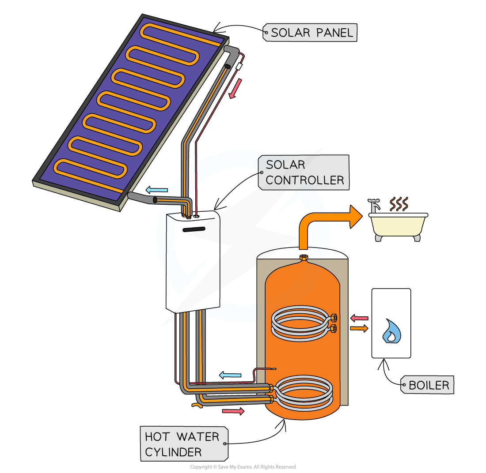
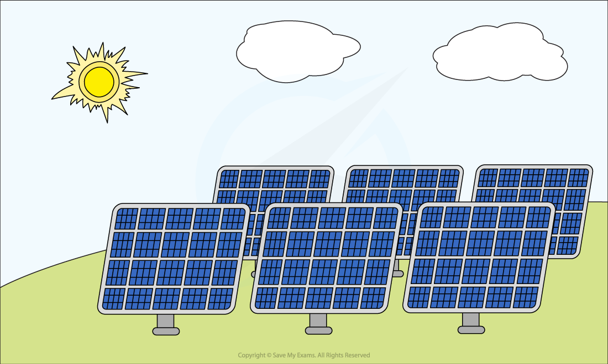
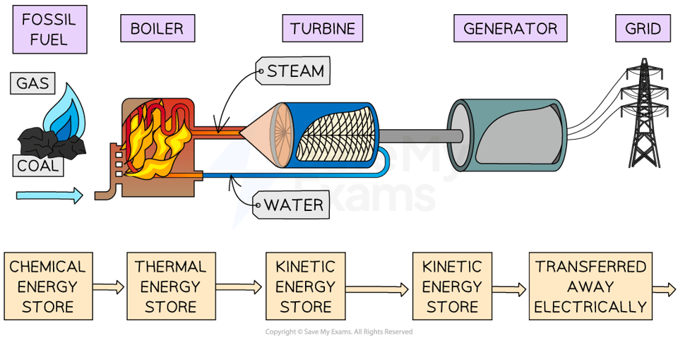

# Energy Resources

## Energy resources

> **Spec point** — `spcpt_4MhqCKMTG3gVqM3b` · describe the energy transfers involved in generating electricity using: 
•        wind
•        water
•        geothermal resources
•        solar heating systems
•        solar cells
•        fossil fuels
•        nuclear power (physics only)

## Energy resources

- **Energy resources** in physics are large stores of energy that can be used to** generate electricity** and heat homes and businesses

  - These are also sometimes called energy sources

### Renewable and non-renewable energy resources

- Some electricity drawn from the **National Grid** is generated from **non-renewable **resources, and some is generated from **renewable** resources

- A** renewable** energy resource is defined as

**An energy source that is replenished at a faster rate than the rate at which it is being used**

- As a result of this, a renewable energy resource is one that will not run out
- **Renewable **energy resources include:

  - solar heating panels
  - solar cells
  - wind
  - hydroelectricity
  - geothermal
  - wave
  - tidal
- **Non-renewable** energy resources include:

  - fossil fuels (coal, oil and natural gas)
  - nuclear fuel

***Coal, oil, and natural gas are examples of fossil fuels. These are energy resources in limited supply, meaning they will eventually run out***

### Generating electricity from energy resources

- Electricity is generated in very similar ways, no matter what energy resource is used
- A **turbine** is turned, which turns a **generator**, which generates electricity
- The element that differs is **how** the turbine is made to turn

  - Solar cells are the exception to this as they do not use a turbine

- Generating energy reliably on a national or global level requires the use of a range of different energy resources

### Energy resources and energy transfers

#### Wind

- **Wind **is used to turn turbines **directly **which turns a generator which  generates electricity
- Energy is transferred from the **kinetic **store of the wind, to the **kinetic **store of the turbine, to the **kinetic **store of the generator

*Wind turns the turbines directly, which turn generators, which generate electricity*

#### Water: hydroelectric

- **Water **is stored at a height (usually in a dam), and when released, the moving water is used to turn turbines **directly **which turns a generator, which  generates electricity
- Energy is transferred from the **gravitational potential** store of the water, to the **kinetic **store of the water, to the **kinetic **store of the turbine, to the **kinetic **store of the generator

*A hydroelectric dam transfers energy from the gravitational potential energy store of the water to its kinetic energy store mechanically to turn a turbine*

#### Water: tidal

- **Water **is stored at a height (usually by a tidal barrage) at high and low tide, when released the moving water is used to turn turbines **directly**, which turn a generator, which  generates electricity
- Energy is transferred from the **gravitational potential** store of the water, to the **kinetic **store of the water, to the **kinetic **store of the turbine, to the **kinetic **store of the generator

*Tidal power uses water stored at a height, which when released, flows over a turbine causing it to turn*

#### Water: wave

- The motion of the **water **due to waves is used to turn turbines **directly**, which turn a generator, which generates electricity
- Energy is transferred from the **kinetic **store of the water to the **kinetic **store of the turbine, to the **kinetic **store of the generator

*Wave power uses the motion of the waves to turn turbines directly, the turbines turn generators which generate electricity*

#### Geothermal resources

- Hot rocks underground are used to heat **water **to produce **steam **that turns turbines, which turn a generator, which generates electricity
- Energy is transferred from the **thermal **store of the rocks, to the **thermal **store of the water, to the **kinetic **store of the turbine, to the **kinetic **store of the generator

*Cold water is heated by the rocks and returned as hot water or steam which can be used to turn turbines to generate electricity*

#### Solar heating systems

- Solar heating **panels **use sunlight to **heat water** in small pipes within the panel to **produce warm water** for households
- Energy is transferred from the **nuclear **store of the Sun, to the **thermal **store of the panel, to the **thermal **store of the water

*Solar heating panels use energy from the sun to heat water for use in homes and businesses*

#### Solar cells

- Solar **cells **use sunlight (EM radiation) to **directly **produce a **current**
- When sunlight falls on solar cells, **electrons **are released from the metal in the solar cell, which can be directed into a **circuit**, producing a current
- Energy is transferred by radiation from the **nuclear **store of the Sun, to the **thermal **store of the solar cell

*Solar cells use energy from the sun to generate electricity directly*

#### Fossil fuels

- **Fossil fuels **are combusted to heat **water **to produce **steam **that turns turbines to generate electricity
- Energy is transferred from the **chemical **store of the fuel, to the **thermal **store of the water, to the **kinetic **store of the turbine, to the **kinetic **store of the generator

*The energy transfers involved in the production of electricity from fossil fuels*

#### Nuclear power

- **Nuclear fuels **are reacted to heat **water **to produce **steam **that turns turbines to generate electricity
- Energy is transferred from the **nuclear **store of the fuel, to the **thermal **store of the water, to the **kinetic **store of the turbine, to the **kinetic **store of the generator

> **Worked Example**
> Electricity can be generated by wind power.
> 
> Describe the energy transfers which occur when a wind turbine is used to generate electricity for the National Grid.
> 
> **Answer:**
> 
> **Step 1: Determine where the energy is transferred from **
> 
> - Energy is transferred from the kinetic store of the moving wind...
> 
> **Step 2: Determine the energy transfer involved as energy is transferred from the wind to the turbine**
> 
> - ...to the kinetic store of the turbine as the wind makes it turn.
> 
> **Step 3: Name the other energy transfers that occur in the process of generating electricity**
> 
> - Energy is transferred from the kinetic store of the turbine to the kinetic store of the generator and is transferred electrically to the National Grid.
