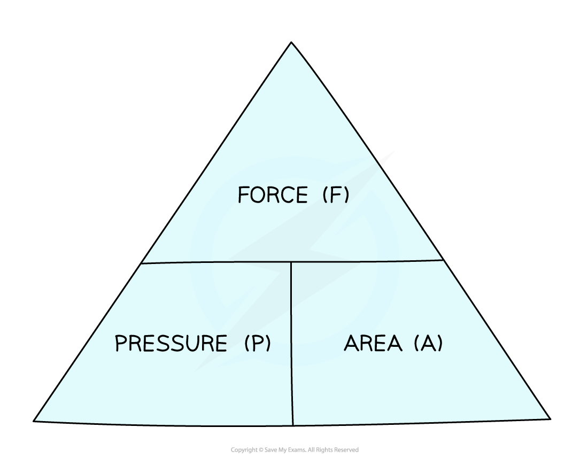
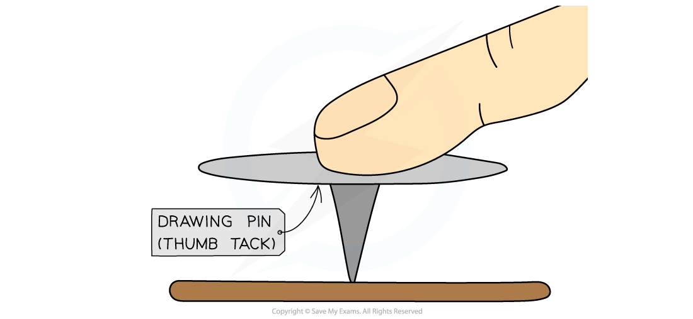
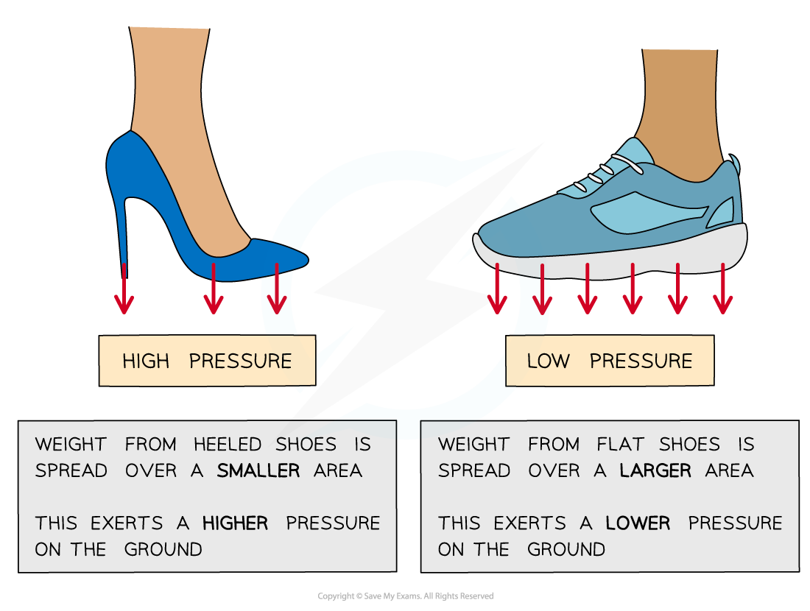

# Pressure

## Pressure

> **Spec point** — `spcpt_ZvKHPJzXrcjpKJNJ` · know and use the relationship between pressure, force and area: 
pressure =  force / area 
p = F /A 

## Pressure

- **Pressure** is defined as **The concentration of a force or the force per unit area**
- Pressure, force and area are related by the equation:

$P=\frac{F}{A}$

- Where:

  - *P *= pressure, measured in pascals (Pa)
  - *F *= force, measured in newtons (N)
  - *A *= **cross-sectional area**, measured in metres squared (m2)

- The cross-sectional area is the area that the force is applied at right angles to

#### Pressure, force, area formula triangle

***A formula triangle can help rearrange the pressure equation***

- For more information on how to use a formula triangle refer to the revision note on [speed](https://www.savemyexams.com/igcse/physics/edexcel/19/revision-notes/1-forces-and-motion/1-1-movement-and-position/1-1-2-speed/)

### Examples of applications of pressure

- For example, when a drawing pin is pushed downwards:

  - It is pushed into the surface, rather than up towards the finger
  - This is because the sharp point is more **concentrated** (a small area) creating a **larger** pressure

#### Applying a force to a drawing pin

***When you push a drawing pin, it goes into the surface (rather than your finger)***

- **Example 1:** Tractors

  - Tractors have **large tyres**
  - This spreads the weight (force) of the tractor over a large area
  - This reduces the pressure which prevents the heavy tractor from sinking into the mud

- **Example 2:** Nails

  - Nails have **sharp pointed ends** with a very small area
  - This concentrates the force, creating a large pressure over a small area
  - This allows the nail to be hammered into a wall

- This equation for pressure tells us that

  - if a force is spread over a **large** area it will result in a **small** pressure
  - if it is spread over a **small** area it will result in a **large** pressure

#### The surface area of the shoe affects the pressure applied to the ground

***High heels produce a higher pressure on the ground because of their smaller area, compared to flat shoes***

> **Worked Example**
> The diagram below shows the parts of the lifting machine used to move the platform up and down.
> 
> 
> 
> The pump creates pressure in the liquid of 5.28 × 105 Pa to move the platform upwards.
> 
> Calculate the force that the liquid applies to the piston.
> 
> **Answer:**
> 
> **Step 1: List the known quantities**
> 
> - Cross-sectional area = 2.73 × 10-2 m2
> - Pressure = 5.28 × 105 Pa
> 
> **Step 2: Write down the relevant equation**
> 
> $P=\frac{F}{A}$
> 
> **Step 3: Rearrange for the force, *****F***
> 
> $F=p\timesA$
> 
> **Step 4: Substitute the values into the equation**
> 
> $F=(5.28\times10^{5})\times(2.73\times10^{-2})=14414.4$
> 
> **Step 5: Round to the appropriate number of significant figures and quote the correct unit**
> 
> $F=14400N=14.4\mathrm{kN}(3s.f)$

> **Exam Hint**
> Look out for the units for the force! **Large pressures** produce **large forces** - this is sometimes in kN! (1 kN = 1000 N)
