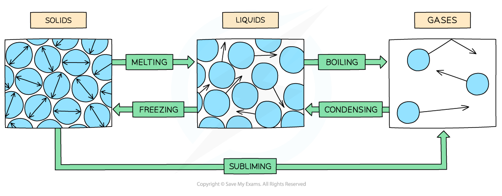

# Changes of State

## Changes of state

> **Spec point** — `spcpt_pskZ3bCkVkXPS65C` · describe the changes that occur when a solid melts to form a liquid, and when a liquid evaporates or boils to form a gas (physics only)

## Changes of state

- When a solid is heated, it **melts **to form a liquid

  - When it reaches the melting point, further energy supplied is transferred to the **potential store** of the particles
  - This breaks the rigid bonds between the particles so they can flow over each other
- When a liquid is heated, it **boils **to form a gas

  - When it reaches the boiling point, further energy supplied is transferred to the **potential store** of the particles
  - This overcomes the intermolecular bonds completely, so the particles spread far apart and move randomly

- **Evaporation** can also turn a liquid into a gas, but it is different from boiling:

  - Evaporation can happen at any temperature, not just the boiling point
  - Only the most energetic particles at the **surface** of the liquid have enough kinetic energy to escape the intermolecular bonds
  - Bubbles of gas form in the liquid during boiling, but **not** during evaporation

#### Changing between states of matter

***Changing the temperature of a solid, liquid or gas changes its state***

## Heat & temperature

> **Spec point** — `spcpt_qSrSxc4N2z36BHhN` · explain why heating a system will change the energy stored within the system and raise its temperature or produce changes of state (physics only)

## Heat & temperature

- Heating a system increases the** internal energy** of its particles
- The internal energy is made up of two parts:

  - The** kinetic energy** of the molecules, due to their motion
  - The **potential energy** of the molecules, due to their position relative to each other (the intermolecular bonds)
- The **temperature** of the material is related to the average kinetic energy of the molecules
- The increase in internal energy from heating can:

  - cause the **temperature** to increase — the energy goes into the kinetic store of the molecules, so they move around faster
  - produce a **change of state** (e.g., solid to liquid or liquid to gas) — the energy goes into the potential store of the molecules, breaking the intermolecular bonds, while the kinetic energy stays constant, so the temperature does not rise
- The higher the temperature, the higher the average **kinetic energy** of the molecules, and vice versa

#### The relationship between temperature and internal energy

***As the container is heated up, the gas molecules move faster with higher kinetic energy. The energy stored within the system - the internal energy - therefore increases***

> **Worked Example**
> A student measures the mass of a beaker of water twice, leaving 24 hours between the readings. The temperature in the room remained constant between readings, however, they noticed a decrease in the mass of the beaker of water.
> 
> 
> 
> Which of the following is **not** a correct conclusion that can be drawn from the experiment?
> 
> **A      **The difference in mass is equal to the mass of the water that evaporated
> 
> **B      **The total energy within the beaker decreased
> 
> **C      **The density of water in the air increased
> 
> **D      **The total number of water molecules in the air and water decreased
> 
> **Answer:  D**
> 
> - **A** is **true** because the mass lost from the beaker is due to those water molecules evaporating
> - **B** is **true** because evaporation causes the most energetic particles to leave the beaker
> - **C** is **true** because additional water molecules were added to the air, without a significant change in the volume of the air
> - **D** is **not true** because no mass is lost during evaporation - it is only changed from a liquid to a gas state
> 
>   - Therefore, the total number of particles in the **beaker** decreased, but the total number of water molecules in the air and water remained constant

> **Exam Hint**
> Heating a system will **always** increase the energy stored within the system. Remember this increase in 'internal energy' can have **two** effects: either the temperature of the system will increase, or the system will change state (e.g., from a solid to a liquid, or a liquid to a gas).
