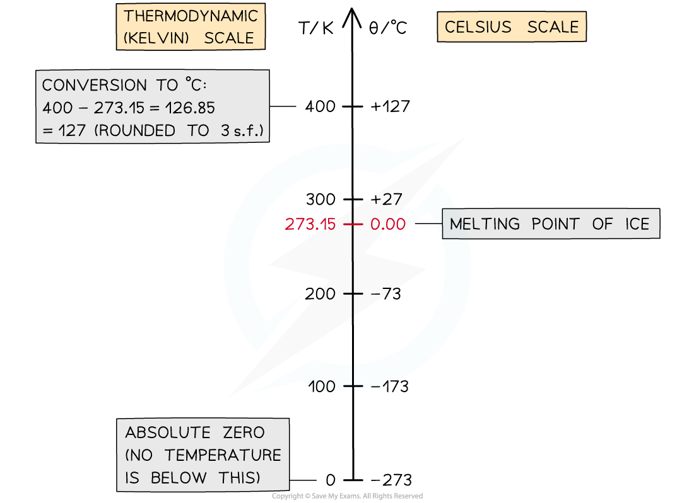

# Absolute Zero

## Absolute zero

> **Spec point** — `spcpt_9GdWRhy4vtGW2WSP` · understand why there is an absolute zero of temperature which is –273 °C 

## Absolute zero

- The amount of pressure that a gas exerts on its container is dependent on the temperature of the gas

  - This is because particles move with more energy as their temperature increases
- As the temperature of the gas decreases, the pressure on the container also decreases
- In 1848, mathematician and physicist, Lord Kelvin, recognised that there must be a temperature at which the particles in a gas exert no pressure

  - At this temperature they must **no longer be moving**, and hence not colliding with their container
- This temperature is called **absolute zero **and is equal to −273 °C

***At absolute zero, or −273 °C, particles will have no net movement. It is therefore not possible to have a lower temperature***

- Absolute zero is defined as: **The temperature at which the molecules in a substance have zero kinetic energy **
- This means for a system at absolute zero, it is not possible to remove any more energy from it
- Even in space, the temperature is roughly 2.7 K above absolute zero

## The Kelvin scale

> **Spec point** — `spcpt_WrMgxnfKQz24GzTp` · describe the Kelvin scale of temperature and be able to convert between the Kelvin and Celsius scales 

## The Kelvin scale

- The **Kelvin temperature scale** begins at absolute zero

  - **0 K is equal to -273 °C **
  - An increase of 1 K is the same change as an increase of 1 °C
- It is not possible to have a temperature lower than 0 K
- This means a temperature in Kelvin will **never** be a negative value

- To convert between temperatures *θ* in the Celsius scale, and T in the Kelvin scale, use the following conversion:

***θ *****/ ****°****C = T / K − 273**

**T / K = *****θ *****/ ****°****C + 273**

***Conversion chart relating the temperature on the Kelvin and Celsius scales***

- The divisions on both scales are equal. This means: **A change in a temperature of 1 K is equal to a change in temperature of 1 °C**

> **Worked Example**
> The temperature in a room is 300 K.
> 
> What is this temperature in Celsius?
> 
> **Answer:**
> 
> **Step 1:** **Kelvin to Celsius equation**
> 
> *θ */ °C = T / K − 273
> 
> **Step 2:** **substitute in value of 300 K**
> 
> 300 K − 273 = **27 ****°****C**

> **Exam Hint**
> If you forget in the exam whether it’s +273 or −273, just remember that 0 °C = 273 K. This way, when you know that you need to +273 to a temperature in degrees to get a temperature in Kelvin. For example:  0 °C + 273 = 273 K.
