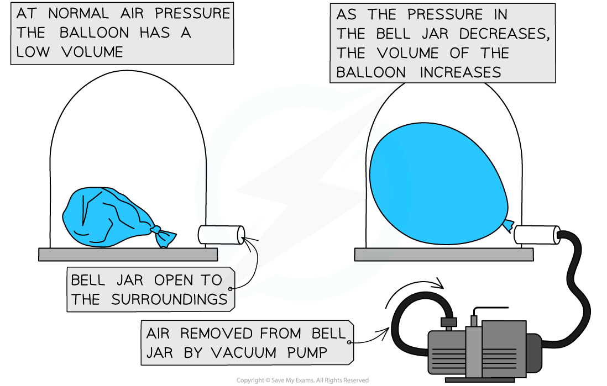
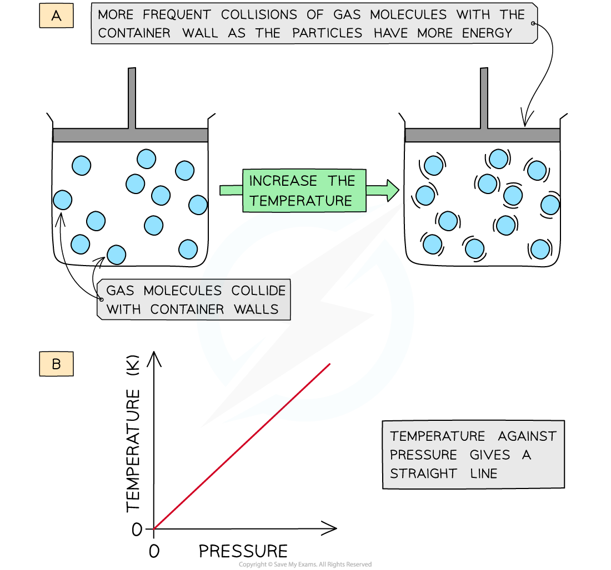

# The Gas Laws

## The gas laws

> **Spec point** — `spcpt_HQkMXSR6tJGNyCgZ` · explain, for a fixed amount of gas, the qualitative relationship between: 
•        pressure and volume at constant temperature
•        pressure and Kelvin temperature at constant volume.

## The gas laws

- Gas laws provide explanations for the relationships between:

  - Pressure and volume at a constant temperature
  - Pressure and (kelvin) temperature at a constant volume

### Pressure & volume

- If the temperature of a gas remains **constant**, the pressure of the gas changes when it is:

  - **compressed** – decreases the volume which **increases** the pressure
  - **expanded** – increases the volume which **decreases** the pressure

***Pressure increases when a gas is compressed***

- Similarly, a change in pressure can cause a change in volume
- A **vacuum pump** can be used to remove the air from a sealed container
- The diagram below shows the change in volume to a tied up balloon when the pressure of the air around it decreases:

***By changing the pressure around the balloon, its change in volume can be seen***

- For a fixed temperature, if the gas is compressed, the pressure will increase

  - The particles travel the same speed as before, but the distance they travel is reduced when the container is smaller
  - The molecules will hit the walls of the container **more frequently**
  - This creates a larger overall **net force** on the walls which increases the **pressure**

### Pressure & temperature

- The motion of molecules in a gas changes according to the **temperature**
- As the temperature of a gas increases, the average **speed** of the molecules also **increases**
- Since the average kinetic energy depends on their speed, the kinetic energy of the molecules also increases if its volume remains constant

  - The **hotter** the gas, the **higher** the average kinetic energy
  - The **cooler** the gas, the **lower** the average kinetic energy

- If the gas is heated up, the molecules will travel at a higher **speed**

  - This means they will collide with the walls **more often**
  - This creates an increase in **pressure**

- Therefore, at a constant volume, an **increase** in temperature **increases** the pressure of a gas and vice versa
- Diagram A shows molecules in the same volume collide with the walls of the container more with an increase in temperature
- Diagram B shows that since the temperature is proportional to the pressure, the graph against each is a straight line

***At constant volume, an increase in the temperature of the gas increases the pressure due to more collisions on the container walls***

> **Exam Hint**
> You are required to be able to describe the links between pressure & volume and pressure & temperature **qualitatively**. This means that the correct use of terms such as 'collision', 'kinetic energy' and 'frequency', will be really important.
