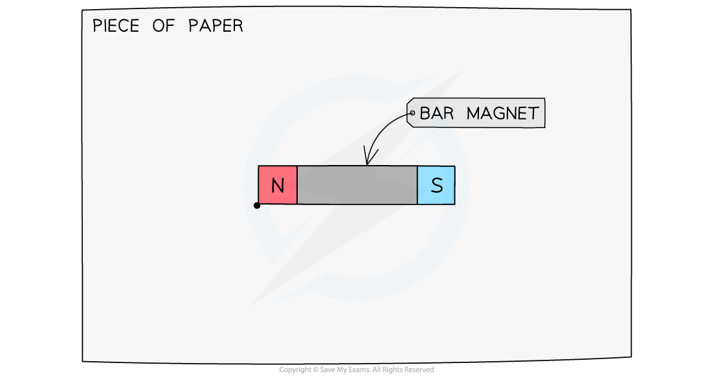
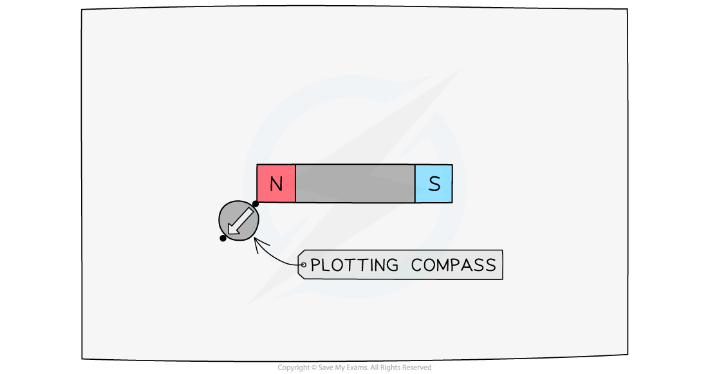
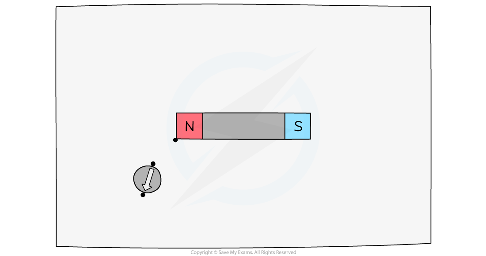
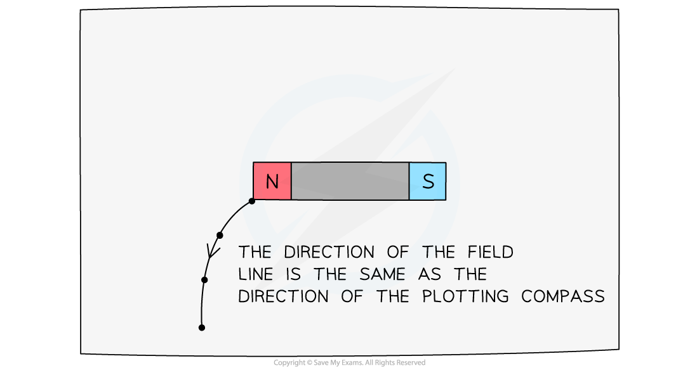
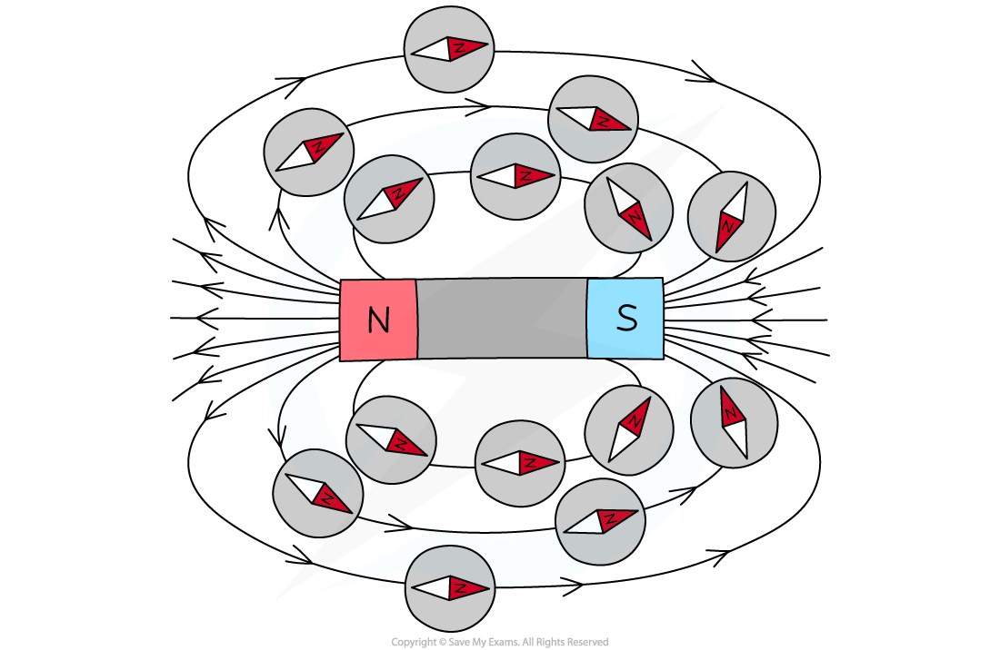
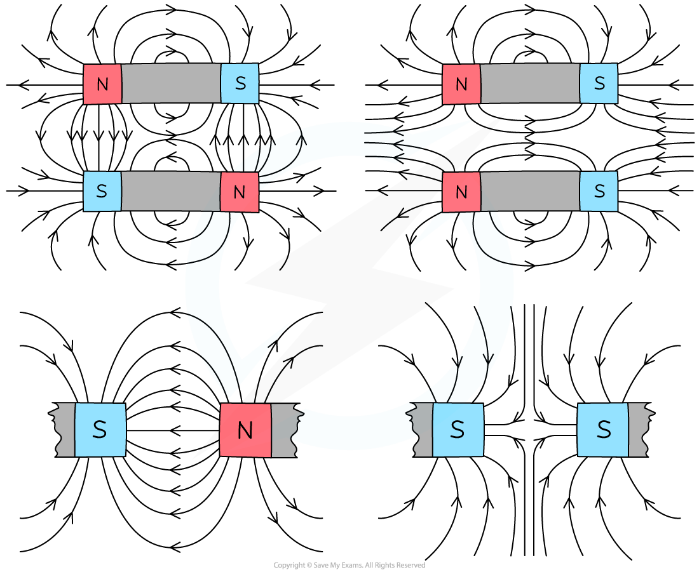

# Core Practical: Investigating Magnetic Fields

## Core practical 12: investigating magnetic fields

> **Spec point** — `spcpt_nppDtjbxmwrwXwpb` · Core practical 12: investigate the magnetic field pattern for a permanent bar magnet and between two bar magnets 

## Core practical 12: investigating magnetic fields

### Aim of the experiment

- To investigate the magnetic field pattern for a permanent bar magnet and between two bar magnets

### Equipment

#### Equipment List

| **Equipment** | **Purpose** |
|---|---|
| Two bar magnets | Produce a magnetic field which is plotted |
| Plotting compasses | Show the direction of the magnetic field at a given point |
| Paper | Plot the magnetic field pattern on this |
| Pencil | Plot the magnetic field pattern with this |

### Method

**Step 1:**

- Place the magnet on top of a piece of paper
- Draw a dot at one end of the magnet (near its corner)

**Step 2:**

- Place a plotting compass next to the dot, so that one end of the needle of the compass points away from the dot
- Use a pencil to draw a new dot at the other side of the compass needle

**Step 3:**

- Move the compass so that it points away from the new dot, and repeat the process above

**Step 4:**

- Keep repeating the previous process until there is a chain of dots going from one end of the magnet to the other
- Then remove the compass, and link the dots using a smooth curve – this will be the magnetic field line

**Step 5:**

- Repeat the whole process several times to create several other magnetic field lines

**Step 6:**

- Repeat the whole process for two bar magnets placed 5 cm apart first facing the same pole then facing opposite poles

### Analysis of results

- The magnetic field pattern for the single bar magnetic should look like this:

***The magnetic field of a bar magnet plotted***

- The magnetic field pattern for two bar magnets should look like this:

***Magnetic field of two bar magnets interacting***

### Evaluating the experiment

- Make sure the pencil you use is sharp to provide a clear and accurate drawing of the field lines
- Read the marker on the compass from above and not at an angle
- Allow the compasses to settle for a couple of seconds before taking the reading
