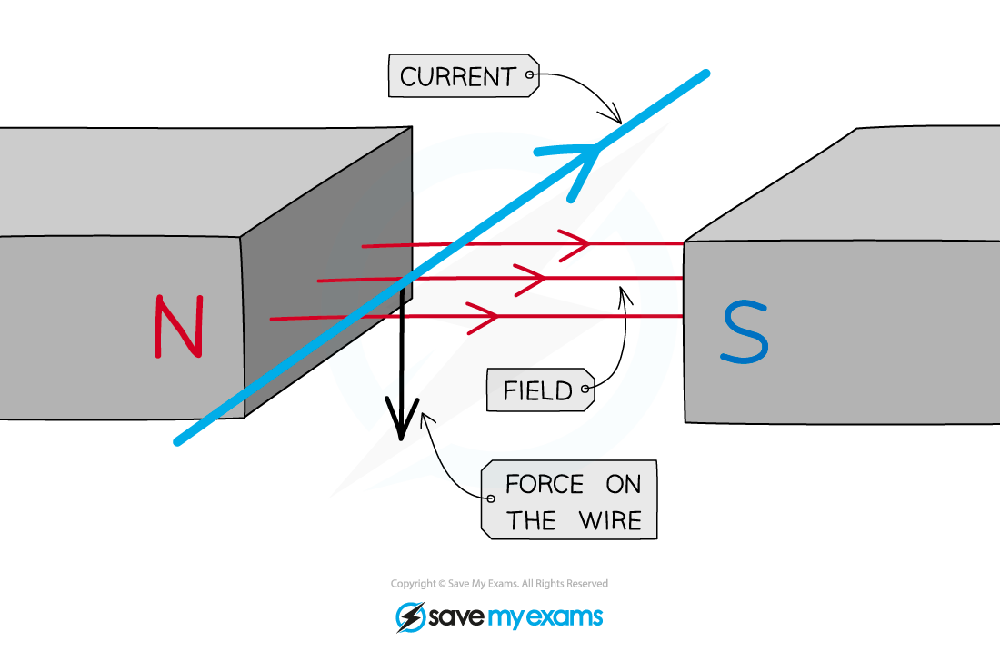
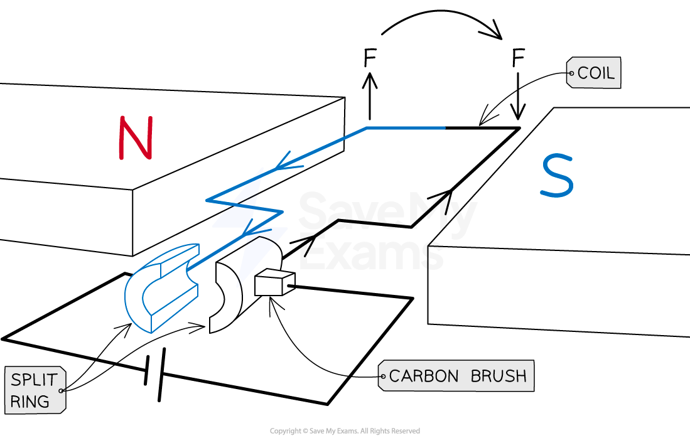
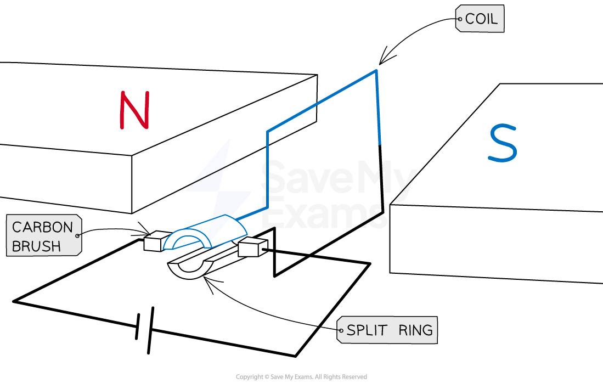
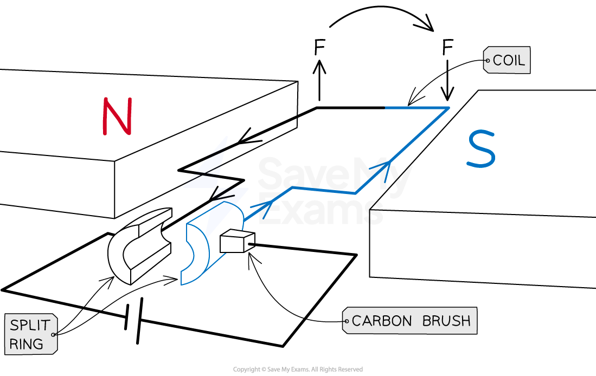
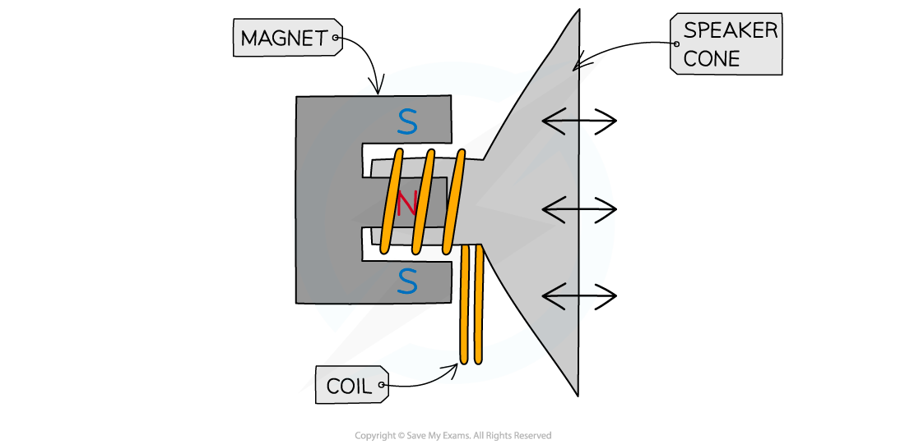

# The Motor Effect

## Magnetic force on a current-carrying wire

> **Spec point** — `spcpt_sZRXK6RCFyVJgn6g` · understand why a force is exerted on a current-carrying wire in a magnetic field, and how this effect is applied in simple d.c. electric motors and loudspeakers 

## Magnetic force on a current-carrying wire

- The **motor effect** occurs when: **A wire with current flowing through it is placed in a magnetic field and experiences a force**
- This effect is a result of **two** interacting ***magnetic fields***

  - One is produced around the wire due to the current flowing through it
  - The second is the magnetic field into which the wire is placed, for example, between two magnets

- As a result of the interactions of the two magnetic fields, the wire will experience a **force**
- When no current is passed through a conductor in a magnetic field, however, it will experience no force

***The motor effect is a result of two magnetic fields interacting to produce a force on the wire***

### The D.C. motor

- The ***motor effect*** can be used to create a simple ***d.c.*** electric motor

  - The force on a current-carrying coil is used to make it **rotate** in a single direction

- The simple D.C. motor consists of a coil of wire (which is free to rotate) positioned in a ***uniform*** ***magnetic field***
- The coil of wire, when horizontal, forms a complete circuit with a cell

  - The coil is attached to a **split ring **(a circular tube of metal split in two)
  - This split ring is connected in a circuit with the cell via contact with conducting **carbon brushes**

#### Forces on the horizontal coil in a D.C. motor

***Forces acting in opposite directions on each side of the coil, causing it to rotate. The split ring connects the coil to the flow of current***

- Current flowing through the coil produces a magnetic field

  - This magnetic field interacts with the uniform external field, so a **force **is exerted on the wire
- Forces act in opposite directions on each side of the coil, causing it to rotate:

  - On the blue side of the coil, current travels towards the cell so the force acts upwards (using ***Fleming's left-hand rule***)
  - On the black side, current flows away from the cell so the force acts downwards
- Once the coil has rotated 90°, the split ring is **no longer in contact** with the brushes

  - No current flows through the coil so no forces act

#### Coil in the vertical position

***No force acts on the coil when vertical, as the split ring is not in contact with the brushes***

- Even though no force acts, the momentum of the coil causes the coil to continue to rotate slightly
- The split ring reconnects with the carbon brushes and current flows through the coil again

  - Now the blue side is on the right and the black side is on the left
- Current still flows toward the cell on the left and away from the cell on the right, even though the coil has flipped

  - The black side of the coil experiences an upward force on the left and the blue side experiences a downward force on the right
  - The coil continues to rotate in the same direction, forming a continuously spinning motor

#### Forces on the coil when rotated 180°

***Even though the coil has flipped, current still flows anticlockwise and the forces still cause rotation in the same direction***

### Factors affecting the D.C. motor

- The **speed** at which the coil rotates can be increased by:

  - Increasing the **current**
  - Increasing the strength of the **magnetic field**
- The **direction of rotation** of coil in the D.C. motor can be changed by:

  - Reversing the direction of the **current**
  - Reversing the direction of the magnetic field by reversing the **poles** of the magnet
- The **force** supplied by the motor can be increased by:

  - Increasing the **current** in the coil
  - Increasing the strength of the **magnetic field**
  - Adding **more turns** to the coil

### Loudspeakers

- Loudspeakers and headphones convert electrical signals into sound

  - They work due to the **motor effect**
- They work in the opposite way to microphones
- A loudspeaker consists of a **coil of wire** which is wrapped around one pole of a **permanent magnet**

***Diagram showing a cross-section of a loudspeaker***

- An ***alternating current*** passes through the coil of the loudspeaker

  - This creates a **changing magnetic field** around the coil
- As the current is constantly changing direction, the direction of the magnetic field will be **constantly changing**
- The magnetic field produced around the coil **interacts** with the field from the permanent magnet
- The interacting magnetic fields will exert a **force** on the coil

  - The direction of the force at any instant can be determined using **Fleming’s left-hand rule**

- As the magnetic field is constantly changing direction, the **force** exerted on the coil will **constantly change direction**

  - This makes the coil **oscillate**
- The oscillating coil causes the speaker cone to oscillate

  - This makes the air oscillate, creating **sound waves**

> **Worked Example**
> A d.c. motor is set up as shown below.
> 
> 
> 
> Determine whether the coil will be rotating clockwise or anticlockwise.
> 
> **Answer:**
> 
> **Step 1: Draw arrows to show the direction of the magnetic field lines**
> 
> - These will go from the north pole of the magnet to the south pole of the magnet
> 
> 
> 
> **Step 2: Draw arrows to show the direction the current is flowing in the coils**
> 
> - Current will flow from the positive terminal of the battery to the negative terminal
> 
> 
> 
> **Step 3: Use Fleming’s left hand rule to determine the direction of the force on each side of the coil**
> 
> - Start by pointing your **F**irst **F**inger in the direction of the (magnetic) **F**ield
> - Now rotate your hand around the first finger so that the se**C**ond finger points in the direction of the **C**urrent
> - The **TH**umb will now be pointing in the direction of the **TH**rust (the force)
> 
> 
> 
> **Step 4: Use the force arrows to determine the direction of rotation**
> 
> - The coil will be turning **clockwise**
> 
> 

> **Exam Hint**
> It is important to remember all the steps that cause the rotation of the coil in a d.c. motor. Use Fleming's Left Hand rule to convince yourself of the direction of the force on each side of the coil, these should be in opposite directions because the directions of the current through each side are opposite.
> 
> Additionally, don't be confused if you see the phrase 'split-ring **commutator**'. This is another way of referring to the split ring in the circuit and they mean the same thing.
> 
> The explanation of the loudspeaker is very similar to the explanation of a motor, however **direct current** is used in a d.c motor and **alternating current** is used in a loudspeaker. You need to learn how both work.
> 
> When explaining how a loudspeaker works remember to refer to the **alternating current** and the **changing magnetic field** that it creates.

## Factors affecting magnetic force

> **Spec point** — `spcpt_jdQbvFrSvkM5VxMN` · describe how the force on a current-carrying conductor in a magnetic field changes with the magnitude and direction of the field and current 

## Factors affecting magnetic force

- Magnetic forces are due to interactions between **magnetic fields**

  - **Stronger** magnetic fields produce **stronger** forces and vice versa
- For a current carrying conductor, the size of the force exerted by the magnetic fields can be **increased** by:

  - Increasing the amount of **current** flowing through the wire
  
    - This will increase the magnetic field around the wire
  - Using **stronger magnets**
  
    - This will increase the magnetic field between the poles of the magnet
  - Placing the wire at **90****o** to the direction of the magnetic field lines between the poles of the magnet
  
    - This will result in the maximum interaction between the two magnetic fields

- Note: If the two magnetic fields are **parallel** there will be no interaction between the two magnetic fields and therefore **no force** produced
