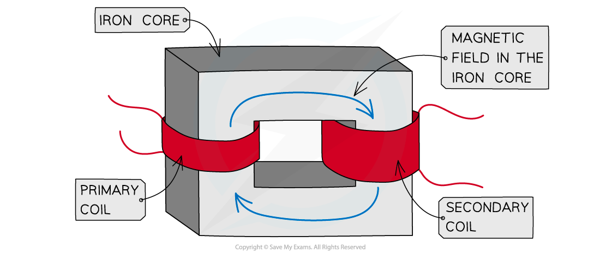
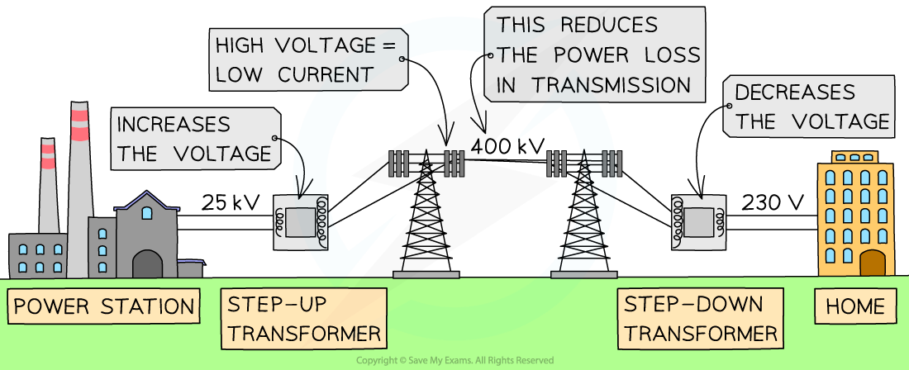

# Transformers

## Transformers

> **Spec point** — `spcpt_D8FSQDXY2CJv5qr6` · describe the structure of a transformer, and understand that a transformer changes the size of an alternating voltage by having different numbers of turns on the input and output sides (physics only)

## Transformers

- A **transformer** is a device used to **change **the value of an **alternating potential difference **or ***current***
- This is achieved using the ***generator effect***

### Structure of a transformer

- A basic transformer consists of:

  - A **primary coil**
  - A** secondary coil**
  - An **iron core**

- Iron is used because it is easily **magnetised**

***Structure of a transformer***

#### How a transformer works

- An **alternating current** is supplied to the **primary coil**
- The **current** is continually **changing direction**

  - This means it will produce a **changing magnetic field** around the primary coil

- The iron core is **easily magnetised**, so the changing magnetic field passes through it
- As a result, there is now a **changing magnetic field** inside the **secondary coil**

  - This changing field **cuts** through the secondary coil and **induces a potential difference**

- As the magnetic field is continually changing the potential difference induced will be **alternating**

  - The alternating potential difference will have the **same frequency** as the alternating current supplied to the primary coil
- If the secondary coil is part of a **complete circuit** it will cause an **alternating current** to flow

## Step-up & Step-down transformers

> **Spec point** — `spcpt_fhfHnfShGHDpBcYW` · explain the use of step-up and step-down transformers in the large-scale generation and transmission of electrical energy (physics only)

## Step-up & Step-down Transformers

- A transformer can change the **size **of an alternating voltage
- They also have a number of other roles, such as:

  - To increase the potential difference of electricity before it is transmitted across the national grid
  - To lower the high voltage electricity used in power lines to the lower voltages used in houses
  - Used in adapters to lower mains voltage to the lower voltages used by many electronic devices

- A **step-up** transformer **increases the potential difference** of a power source.

  - A step-up transformer has **more** turns on the secondary coil than on the primary coil
- A **step-down** transformer **decreases the potential difference** of a power source.

  - A step-down transformer has **fewer** turns on the secondary coil than on the primary coil

### Transformers in electricity transmission

- Electricity is transmitted through power cables at a low current to prevent dissipation of energy

  - When current flows in a wire, there is heating in the wire due to resistance
  - Therefore, energy is dissipated to the surroundings, this energy is wasted
  - The lower the current, the more efficient the energy transfer

#### What does a step-up transformer do?

- When electricity is transmitted over large distances, the **current** in the wires **heats** them, resulting in **energy loss**
- The electrical energy is transferred at **high voltages** from power stations
- It is then transferred at** lower voltages** in each locality for domestic uses
- The voltage must be stepped up by a **step-up **transformer

  - These are placed **after the power station**

#### Why are step-down transformers used?

- For the domestic use of electricity, the voltage must be much lower
- This is done by stepping down by the voltage using a **step-down** transformer

  - These are placed **before buildings**

***Electricity is transmitted at high voltage, reducing the current and hence power loss in the cables using transformers***

> **Exam Hint**
> Electrical power is equal to voltage × current, or  $P=IV$
> 
> This means that a low current can be achieved for the same power output by increasing the voltage
> 
> - A **smaller current** flowing through the power lines results in **less heating** in the wire
> - This **reduces **the **energy loss **in the power cables
> 
> - The key **advantages **of high-voltage transmission of electricity are:
> 
>   - the reduced power loss in transmission cables increases the efficiency of energy transfer
>   - lower currents in cables mean thinner, and therefore, cheaper cables can be used
