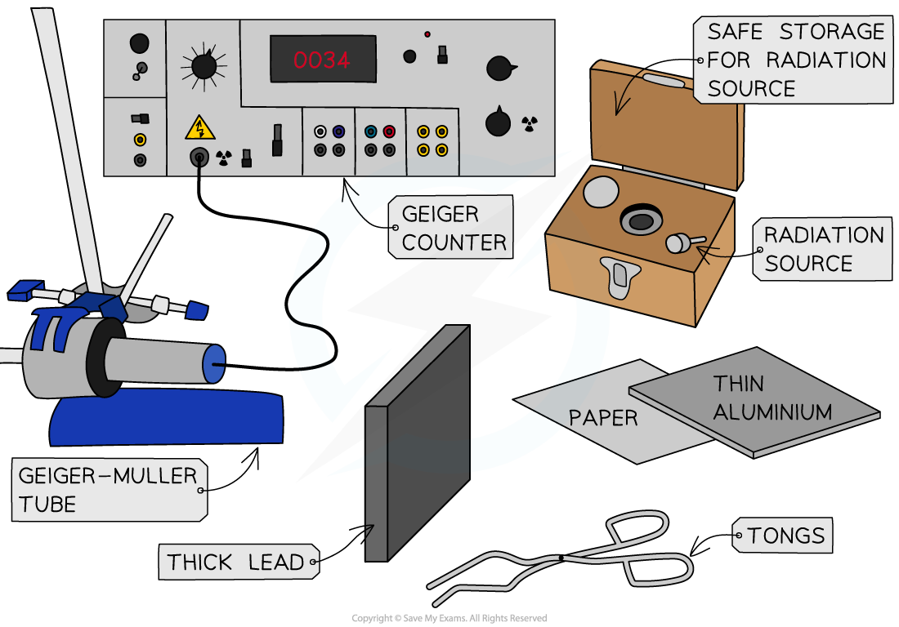
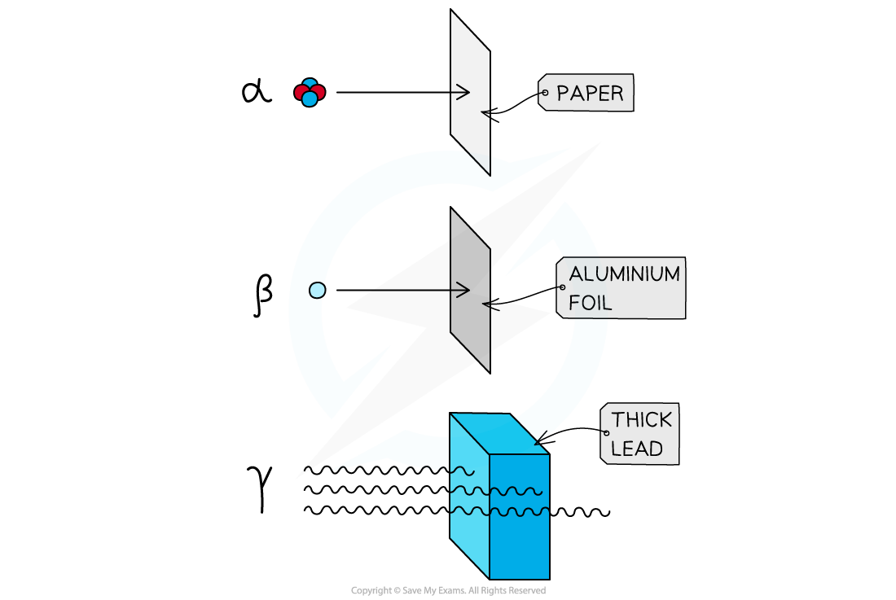

# Core Practical: Investigating Radiation

## Core practical 13: investigating radiation

> **Spec point** — `spcpt_WZBSpN2Np89Xc3tx` · Core practical 13: investigate the penetration powers of different types of radiation using either radioactive sources or simulations 

## Core practical 13: investigating radiation

### Aim of the experiment

- The aim of this experiment is to investigate the penetration powers of different types of radiation using either radioactive sources or simulations
- This experiment is usually performed by teachers, or by using simulations

#### Variables:

- ***Independent variable*** = Absorber material
- ***Dependent variable*** = Count rate
- Control variables:

  - Radioactive source
  - Distance of GM tube to source
  - Location / background radiation

### Equipment List

| **Equipment** | **Purpose** |
|---|---|
| radioactive sources (α, β and γ) | to use as a source of radioactive emission |
| ruler | to measure the distance between the source and detector |
| mount for radioactive source | to secure the source in place |
| Geiger-Muller tube and counter | to measure the count rate of a radioactive source |
| tongs | to safely handle the sources at a distance |
| selection of absorbing materials (paper, aluminium foil, lead) | to place between the source and detector to investigate effect on count rate |
| lead-lined containers for radioactive sources | to store sources in when not in use |

- ***Resolution*** of measuring equipment:

  - Ruler = 1 mm
  - Geiger-Müller tube = 0.01 μS/hr

### Method

***Apparatus for investigating the penetrating powers of different types of radiation***

1. Connect the Geiger-Müller tube to the counter and, without any sources present, measure background radiation over a period of one minute
2. Repeat this three times, and take an average. Subtract this value from all subsequent readings.
3. Place a radioactive source a fixed distance of 3 cm away from the tube and take another reading of count rate over a period of one minute
4. Take a set of absorbers, i.e. some paper, several different thicknesses of aluminium (increasing in 0.5 mm intervals) and different thicknesses of lead
5. One at a time, place these absorbers between the source and the tube and take another reading of count rate over a period of one minute
6. Repeat the above experiment for other radioactive sources

### Analysis of results

- If the count rate is similar to background levels (allowing for a little random variation), then the radiation has all been absorbed

  - **Note**: some sources will emit more than one type of radiation

- If the count rate reduces when **paper** is present, the source is emitting **alpha**
- If the count rate reduces when a** few mm of aluminium** is present, then the source is emitting **beta**
- If some radiation is **still able to penetrate** a few mm of **lead**, then the source is emitting **gamma**

***Penetrating power of alpha, beta and gamma radiation***

### Evaluating the experiment

***Systematic Errors:***

- Make sure that the sources are stored well away from the counter during the experiment
- Conduct all runs of the experiment in the same location to avoid changes in background radiation levels

***Random Errors:***

- The accuracy of such an experiment is improved with using reliable sources with a long half-life and an activity well above the natural background level

### Safety considerations

- When not using a source, keep it in a lead-lined container
- When in use, try and keep a good distance (a metre or so) between yourself and the source
- When handling the source, do so using tweezers (or tongs) and point the source away from you

> **Exam Hint**
> When answering questions about the core practicals you could try to remember the acronym SCREAMS:
> 
> - S: Which variable will you keep the **same**
> - C: which variable should you **change**
> - R: what will you do to make your experiment **reliable**
> - E: what special **equipment and equations** are required
> - A: how will you **analyse** your results
> - M: which variable will you **measure**
> - S: what **safety** precautions will you take?
