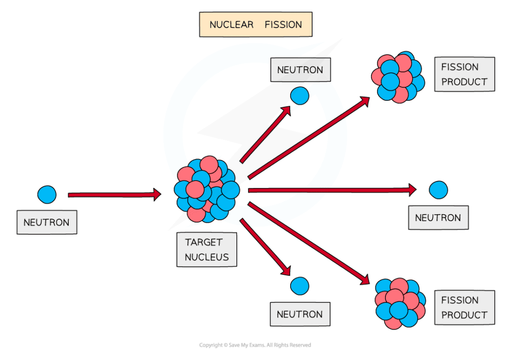

# Nuclear Energy

## Nuclear energy

> **Spec point** — `spcpt_YXPBTJyG8b8j7C9j` · know that nuclear reactions, including fission, fusion and radioactive decay, can be a source of energy 

## Sources of nuclear energy

- The nucleus of an atom contains a huge amount of **nuclear energy**

  - When harnessed safely, nuclear energy can significantly reduce our dependency on fossil fuels
  - However, it also has the potential to be highly destructive (nuclear weapons, for example)

- Sources of nuclear energy include:

  - Nuclear fusion
  - Nuclear fission
  - Radioactive decay

### Nuclear fusion

- Nuclear fusion is when: **Two small nuclei join together to produce a larger nucleus**
- Nuclear fusion does not happen on Earth naturally, but it does in **stars**

  - However, fusion has been achieved on Earth, and fusion reactors are currently in development

- When deuterium and tritium nuclei (isotopes of hydrogen) fuse, they form a **helium** nucleus with the release of energy
- The amount of energy released during nuclear fusion is huge:

  - The energy from 1 kg of hydrogen that undergoes fusion is equivalent to the energy from burning about 10 million kilograms of coal

***The fusion of deuterium and tritium to form helium with the release of energy***

### Nuclear fission

- Nuclear fission is when: **One large nucleus splits into two smaller nuclei**
- The large nucleus that splits is often referred to as the **parent** nucleus

  - The smaller nuclei that are produced are referred to as the **daughter** nuclei

- This is the process used to generate electricity in nuclear power stations

***The fission of a nucleus, such as uranium, to produce smaller daughter nuclei with the release of energy***
