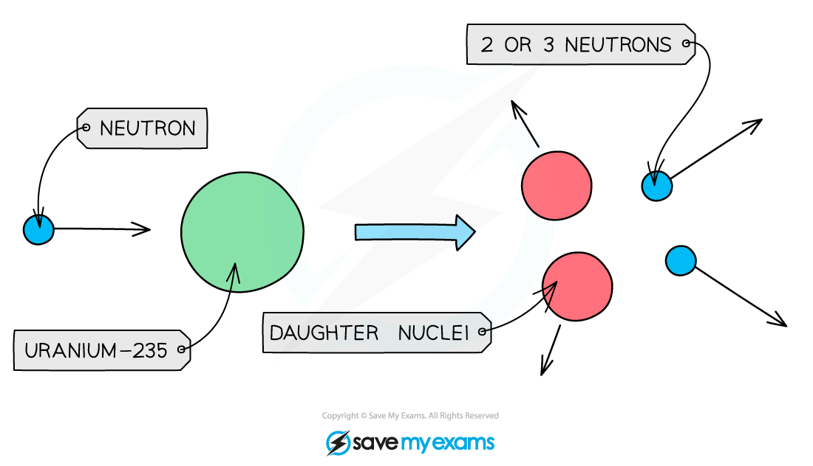
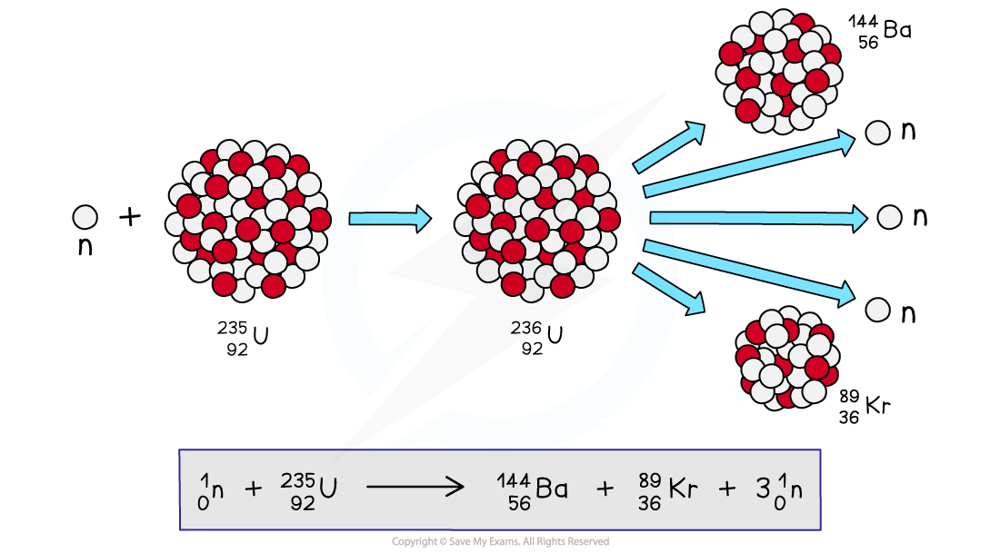

# Nuclear Fission

## Fission

> **Spec point** — `spcpt_5CGWN95WkZfH7gDC` · understand how a nucleus of U-235 can be split (the process of fission) by collision with a neutron, and that this process releases energy as kinetic energy of the fission products 

## Nuclear fission

- Nuclear fission is defined as: **The splitting of a large, unstable nucleus into two smaller nuclei**
- Some isotopes of uranium and plutonium are known as **fissile **materials
- This means they can undergo fission under the right conditions
- This makes them ideal to use as **fuels **in nuclear power stations

### Spontaneous and induced fission

- It is **rare** for nuclei to undergo fission without additional energy being put into the nucleus

  - When nuclear fission occurs in this way it is called **spontaneous fission**

- Usually, for fission to occur, the unstable nucleus must first absorb a **neutron**
- This makes a nucleus more unstable so that it decays almost immediately

  - When nuclear fission occurs in this way it is called **induced fission**

### Fission of uranium-235

- Uranium-235 is commonly used as a fuel in nuclear reactors
- It has a very **long half-life** of 700 million years

  - This means that it has a low activity and releases energy very slowly
  - This is unsuitable for producing energy in a nuclear power station

- Therefore, the fission of uranium-235 must be **induced**
- During induced fission, the uranium-235 nucleus absorbs a **neutron **and becomes uranium-236
- Uranium-236 is very unstable and splits by nuclear fission almost immediately to produce

  - two smaller daughter nuclei
  - two or three neutrons

***When a uranium-235 nucleus is struck by a neutron, it breaks into two smaller daughter nuclei and 2 or 3 neutrons***

> **Exam Hint**
> You need to remember that uranium and plutonium are possible elements for fission, but you do not need to know the specific daughter nuclei that are formed.
> 
> Use your knowledge of balancing nuclear equations to work these out.

## Products of fission

> **Spec point** — `spcpt_G6KRg6WwxF3RRdmp` · know that the fission of U-235 produces two radioactive daughter nuclei and a small number of neutrons 

## Products of fission

- During fission, when a neutron collides with an unstable nucleus, the nucleus splits into

  - two smaller nuclei (**daughter nuclei**)
  - two or three **neutrons**
  - gamma rays are also emitted

- One of the many decay reactions uranium-235 can undergo is shown below:

***When fission is induced in a uranium-235 nucleus it may split into two smaller daughter nuclei, such as barium-144 and krypton-89***

- The products of the fission reaction move away very **quickly**
- This is because energy is transferred from the **nuclear potential energy** stored in the original nucleus into the **kinetic energy **of the products
- In a nuclear power station, this energy can be harnessed and converted into** electrical energy**

> **Worked Example**
> During a particular spontaneous fission reaction, plutonium-239 splits as shown in the equation below:
> 
> `Pu presubscript 94 presuperscript 239 space rightwards arrow space Pd presubscript 46 presuperscript 112 space plus space Cd presubscript 48 presuperscript 124 space plus space. presubscript... end presubscript presuperscript... end presuperscript..`
> 
> Which answer shows the section missing from this equation?
> 
> **A.  ** `n presubscript 0 presuperscript 3`
> 
> **B.  ** `straight gamma presubscript 0 presuperscript 0`
> 
> **C.  ** `straight alpha presubscript 2 presuperscript 4`
> 
> **D.  ** `3 straight n presubscript 0 presuperscript 1`
> 
> **ANSWER:  D**
> 
> **Step 1: Identify the different mass and atomic numbers**
> 
> - Pu (plutonium) has mass number 239 and atomic number 94
> - Pd (palladium) has mass number 112 and atomic number 46
> - Cd (cadmium) has mass number of 124 and atomic number 48
> 
> **Step 2: Calculate the mass and atomic number of the missing section**
> 
> - Mass number is equal to the difference between the mass numbers of the reactants and the products
> 
> mass number = 239 – (112 + 124) = 3
> 
> - Atomic number is equal to the difference between the atomic numbers of the reactants and the products
> 
> atomic number = 94 – (46 + 48) = 0
> 
> - The answer is therefore not **B** or **C**
> 
> **Step 3: Determine the correct notation**
> 
> - Neutrons have a mass number of 1
> - The answer is therefore not **A**
> - Therefore, this must be three neutrons, which corresponds to **D**
