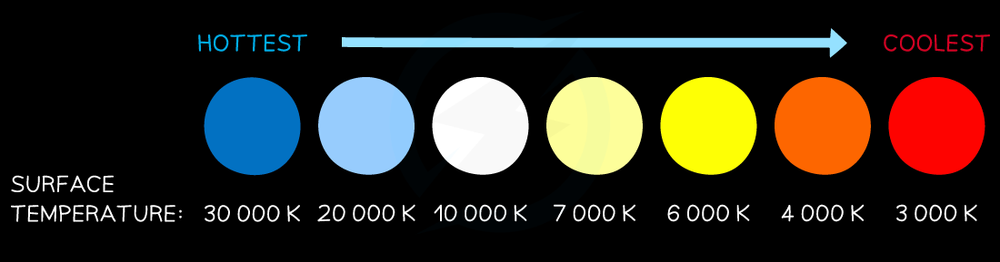

# Classification of Stars

## Classification of stars

> **Spec point** — `spcpt_NykczBzCWsSMxqcn` · understand how stars can be classified according to their colour. Know that a star’s colour is related to its surface temperature 

## Classification of stars

- Stars come in a wide range of sizes and colours, from yellow stars to red dwarfs, from blue giants to red supergiants

  - These can be classified according to their **colour**

- Warm objects emit infrared and extremely hot objects emit visible light as well

  - Therefore, the **colour** they emit depends on how **hot** they are

- A star's colour is related to its **surface temperature**

  - A **red** star is the **coolest** (at around 3000 K)
  - A **blue** star is the **hottest** (at around 30 000 K)

#### Star colour and surface temperature

***The colour of a star correlates to its temperature. The bluer the star, the hotter its surface temperature. The redder the star, the cooler its surface temperature***

- Astronomical objects **cool **as they **expand** and **heat **up as they **contract**

  - This means that their colour will also change according to their surface temperature

- When a star becomes a red giant it becomes **redder **as it **expands **and **cools**
- When a star becomes a white dwarf it becomes **whiter **as it **contracts **and **heats up**

> **Exam Hint**
> We often remember red as being hot and blue as cool in everyday life, but remember this is the other way around when describing the temperature of stars!
