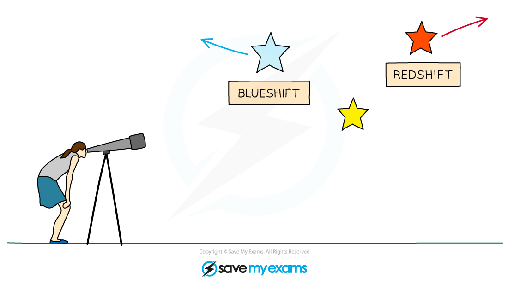
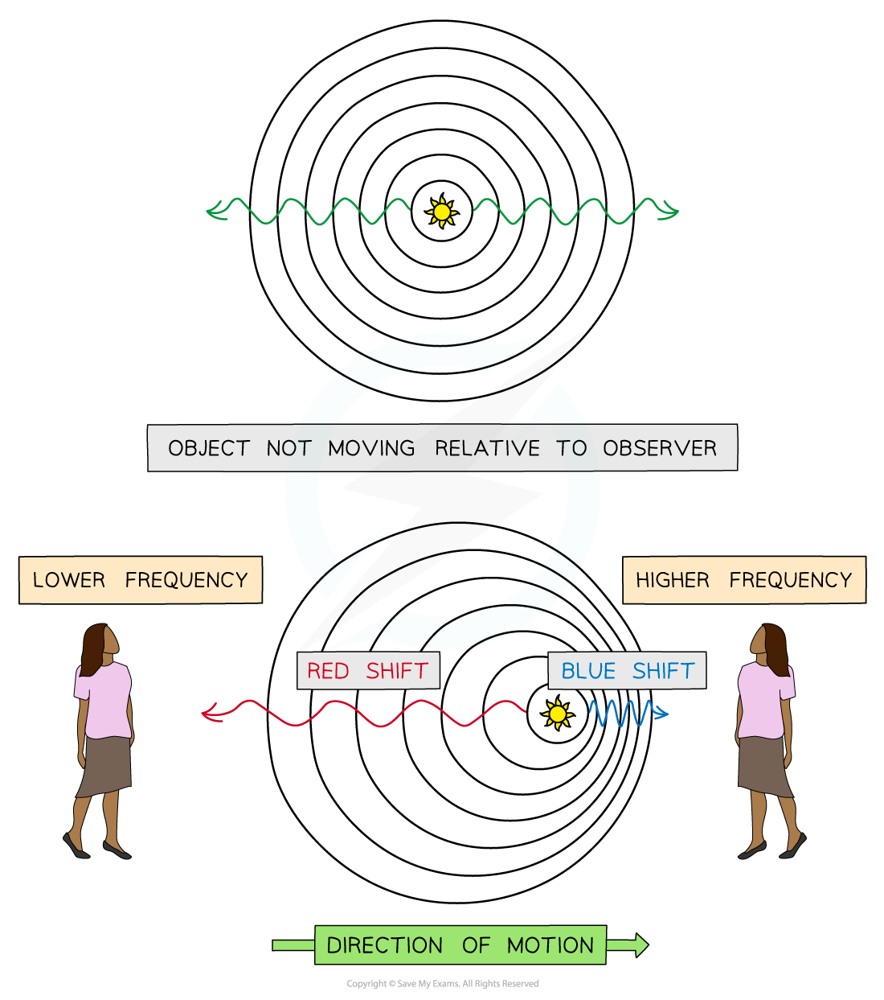
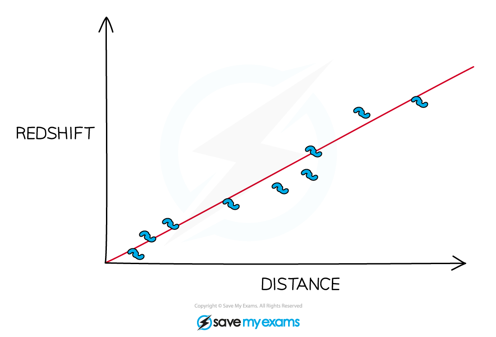

# Galactic Red-shift

## Galactic redshift

> **Spec point** — `spcpt_Pgxd3BfhwppqFHHm` · nan

## Galactic redshift

- The Doppler effect affects all types of waves, including **light**
- Light emitted from stars and galaxies will be at a certain wavelength in the visible part of the electromagnetic spectrum
- If an object moves **away** from an observer the **wavelength** of light** increases**

  - This is known as **redshift** as the light moves towards the red end of the spectrum
- The redshift definition is therefore: **The phenomenon of the wavelength of light appearing to increase when the source moves away from an observer**
- If an object moves **towards** an observer the **wavelength **of light **decreases**

  - This is known as **blueshift** as the light moves towards the blue end of the spectrum

***Light from a star that is moving towards an observer will show blueshift and light from a star moving away from an observer will show redshift***

- An **increase** in wavelength (redshift) is a **decrease** in frequency and vice versa

***The observer in front observes a blue shift, the observer behind observes a redshift***

> **Exam Hint**
> You need to know that in the visible light spectrum** red light** has the **longest wavelength** and the **smallest frequency **compared to **blue light** which has a **shorter wavelength** and **higher frequency**
> 
> 
> 
> To help you to remember what happens to the wavelength and the frequency of an object as it moves further away, it is useful to think about how the sound of a **motorbike** would change as it travels **away** from you. As the motorbike travels away from you the pitch of the sound will become **lower**. This means the frequency of the sound is **decreasing**. If the frequency has decreased, the wavelength must also have increased. Don't get caught up on the redshift definition, but focus on the application of the phenomenon in different contexts.

## The expanding Universe

> **Spec point** — `spcpt_K56ybkz3Mf4WDxmf` · explain why the red-shift of galaxies provides evidence for the expansion of the universe (physics only)

## The expanding Universe

- Galactic redshift provides evidence for the Big Bang Theory and the expansion of the universe
- The diagram below shows the **light** coming to us from a **close object**, such as the Sun, and the light coming to the Earth from a **distant galaxy**

#### Redshift diagram for a light spectrum

***Comparing the light spectrum produced from the Sun and a distant galaxy. The spectral lines from the distant galaxy are redshifted.***

Red shift provides evidence that the Universe is expanding because:

- Red shift is observed when the spectral lines from the distant galaxy move closer to the **red **end of the spectrum

  - This is because light waves are **stretched** by the expansion of the universe so the wavelength increases (or frequency decreases)
  - This indicates that the galaxies are moving **away** from us

- Light spectrums produced from **distant** galaxies are red shifted **more** than **nearby** galaxies

  - This shows that the **greater** the **distance** to the galaxy, the **greater** the **redshift**
  - This means that the **further away** a galaxy is, the **faster** it is moving away from the Earth

- These observations imply that the universe is **expanding** and therefore **support** the Big Bang Theory

***Graph showing the greater the distance to a galaxy, the greater the redshift***
