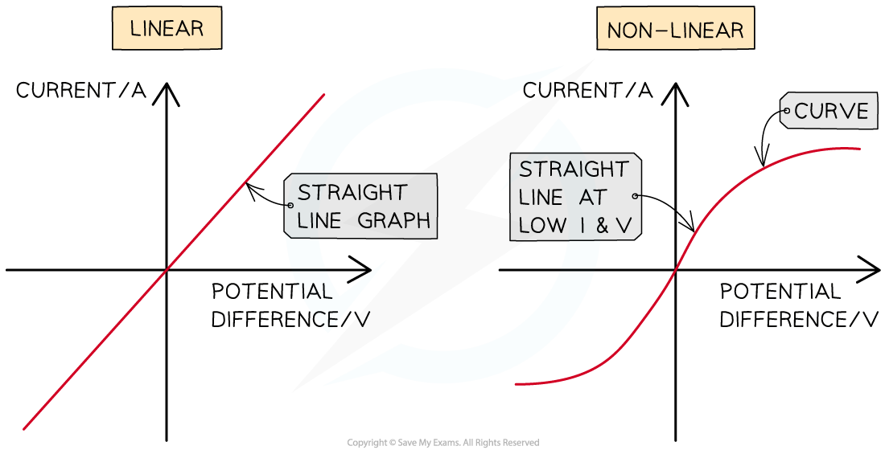
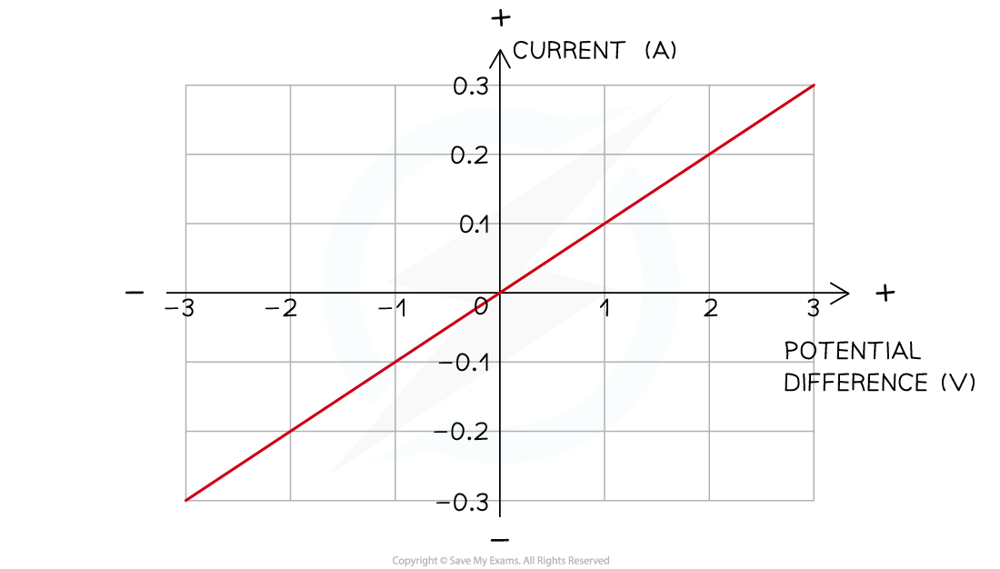
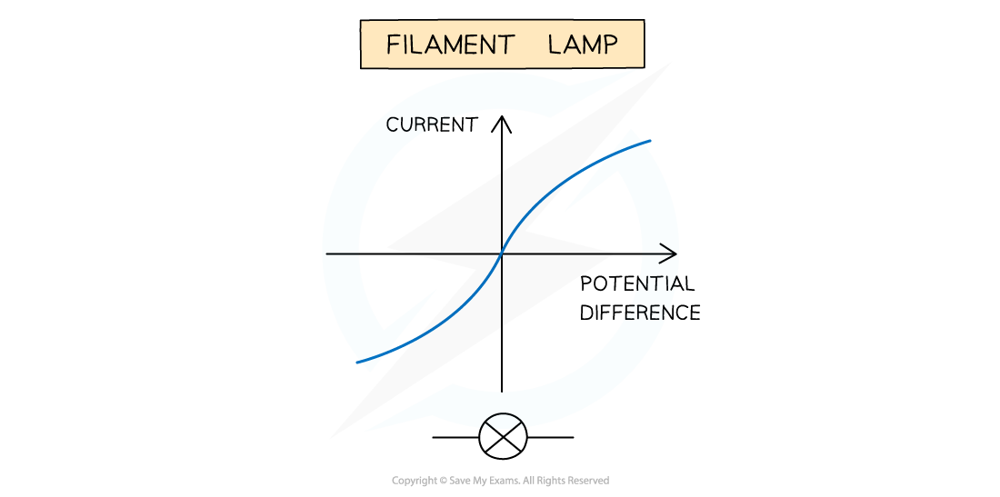
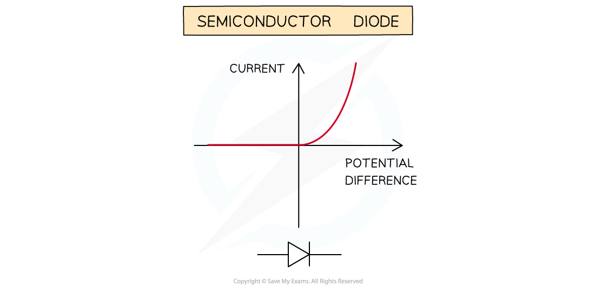
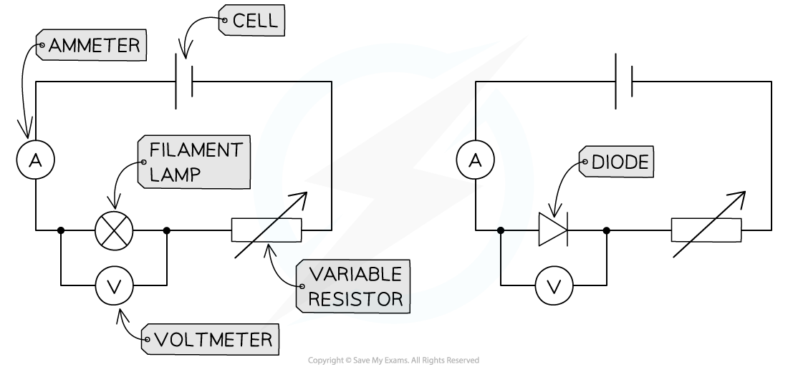

# IV Graphs

## IV graphs

> **Spec point** — `spcpt_d6CKw7BRGwdyXYHj` · describe how current varies with voltage in wires, resistors, metal filament lamps and diodes, and how to investigate this experimentally

## IV graphs

- When the voltage *V* across a component is varied, the current *I* flowing through it may vary **linearly **or **non-linearly**
- The relationship between current and voltage of a component can be shown on an *IV* graph

- When the relationship between current and voltage is **linear**:

  - the *IV* graph is a **straight line **which passes through the** origin**
  - the resistance is **constant**

- When the relationship between current and voltage is **non-linear**:

  - the *IV* graph that is **not** a straight line
  - the resistance is **not **constant

#### Linear and non-linear IV graphs

***Linear IV graphs are straight lines through the origin, indicating a constant resistance. Non-linear IV graphs are curved, indicating a variable resistance***

- Components with **linear***** ****IV* graphs include:

  - fixed resistors (at constant temperature)
  - wires (at constant temperature)

- Components with **non-linear ***IV* graphs include:

  - filament lamps
  - diodes
  - LDRs
  - thermistors

### IV graph for a wire or a resistor

- The relationship between current and voltage for a wire or fixed resistor is linear, or **directly proportional**, which means

  - the IV graph is a straight line, so voltage and current increase (or decrease) by the **same **amount
  - the slope of the graph is constant, so resistance is **constant**

***The current is directly proportional to the potential difference (voltage) as the graph is a straight line through the origin***

### IV graph for a filament bulb

- The relationship between current and voltage for a filament lamp is non-linear, or **not **directly proportional, which means

  - the *IV* graph is not a straight line, so voltage and current do **not **increase (or decrease) by the same amount
  - the slope of the graph is not constant, so resistance **changes**

- The *IV *graph for a filament lamp shows as voltage increases

  - the current increases at a proportionally **slower **rate
  - the resistance **increases**;** **the flatter the slope, the higher the resistance

***IV graph for a filament lamp***

- As current through a filament lamp increases, the resistance **increases** because:

  - the higher current causes the **temperature** of the filament to increase
  - the higher temperature causes the atoms in the metal lattice of the filament to **vibrate** more
  - this causes an increase in resistance as it becomes more difficult for **free** **electrons** (the current) to pass through
  - since resistance **opposes** the current, this causes it to increase at a **slower** rate

### IV graph for a diode

- A diode allows current to flow in **one** direction only

  - This is called **forward bias**
- In the reverse direction, the diode has very** high resistance**, and therefore **no** current flows

  - This is called** reverse bias**

- When the current is in the direction of the arrowhead symbol, this is **forward bias**

  - On the IV graph, this is shown by a sharp increase in voltage and current on the right side of the graph
  - This shows the resistance is very **low**

- When the diode is switched around, this is **reverse bias**

  - On the IV graph, this is shown by a zero reading of current or voltage on the left side of the graph
  - This shows the resistance is very **high**

***IV graph for a semiconductor diode***

### Investigating the relationship between current and voltage

- In order to investigate the relationship between **current** and **voltage** different components, the following equipment is required:

  - an **ammeter** - to measure the current through the component
  - a **voltmeter** - to measure the voltage across the component
  - a **variable resistor** - to vary the current through the circuit
  - a** power** **source** - to provide a source of potential difference (voltage)
  - **wires** - to connect the components together in a circuit

- The image below shows the circuits set up to obtain *IV* graphs for a filament lamp and a diode

***These circuits enable the investigation of current and voltage for a filament lamp or diode to be investigated***

- The **current** is the **independent** **variable**

  - The **variable resistor** is used to change the current flowing through the filament lamp / diode

- The **voltage** is the **dependent** **variable**

  - The **voltmeter** is used to measure the voltage across the filament lamp / diode

- Recording measurements of current and voltage as the current increases enables an *IV *graph to be plotted for each component

## Resistance

> **Spec point** — `spcpt_wBrStYbjwXnF726n` · describe the qualitative effect of changing resistance on the current in a circuit

## Resistance

- Resistance is the **opposition** to the flow of **current**

  - The **higher** the resistance of a circuit the **lower** the current
- Resistors come in two types:

  - **Fixed** resistors
  - **Variable** resistors
- Fixed resistors have a resistance that remains **constant**
- Variable resistors can **change** the resistance by changing the **length** of wire that makes up the circuit

  - A **longer** length of wire has **more** **resistance** than a shorter length of wire

***Fixed and variable resistor circuit symbols***
