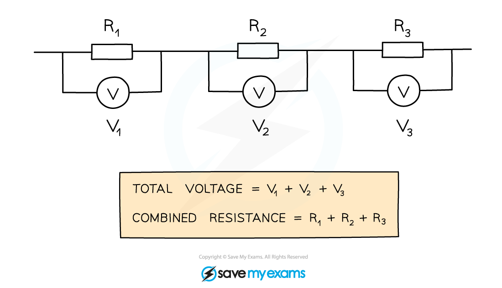

# Resistors in Series

## Resistors in series

> **Spec point** — `spcpt_Kb64JYfhX6pGV3kk` · calculate the currents, voltages and resistances of two resistive components connected in a series circuit

## Resistors in series

- When two or more resistors are connected in series, the **total resistance** is equal to the **sum** of their individual resistances
- For two resistors of resistance *R**1* and *R**2*, the total resistance can be calculated using the equation:

$R=R_{1}+R_{2}$

- Where:

  - *R* is the total resistance, in ohms (Ω)

- Increasing the number of resistors **increases** the overall resistance

  - The charge now has **more** resistors to pass through

- The **total** **voltage** is also the **sum** of the voltages across each of the **individual** **resistors**

***Three resistors connected in series. The total voltage is the sum of the individual voltages, and the total resistance is the sum of the three individual resistances***

### Summary of series and parallel circuits

- For components connected in **series**:

  - the **current **is the same at all points and in each component
  - the **voltage** of the power supply is shared between the components
  - the **total resistance** is the sum of the resistances of each component

- For components connected in **parallel**:

  - the **current **from the supply splits in the branches
  - the **voltage **across each branch is the same
  - the **total resistance** is less than that of each component

> **Worked Example**
> The combined resistance *R* in the following series circuit is 60 Ω.
> 
> What is the resistance value of *R**2*?
> 
> 
> 
> **A**     100 Ω               **B**     30 Ω               **C**     20 Ω               **D**     40 Ω
> 
> **ANSWER:  C**
> 
> **Step 1: Write down the equation for the combined resistance in series**
> 
> $R=R_{1}+R_{2}+R_{3}$
> 
> **Step 2: Substitute the values for total resistance *****R***** and the other resistors**
> 
> 60 Ω = 30 Ω + *R**2* + 10 Ω
> 
> **Step 3: Rearrange for *****R******2***
> 
> *R**2* = 60 Ω – 30 Ω – 10 Ω = **20 Ω**

> **Worked Example**
> Dennis sets up a series circuit as shown below.
> 
> 
> 
> The cell supplies a current of 2 A to the circuit, and the fixed resistor has a resistance of 4 Ω.
> 
> (a) How much current flows through the fixed resistor?
> 
> (b) What is the reading on the voltmeter?
> 
> **Answer:**
> 
> Part (a)
> 
> **Step 1: Recall that current is conserved in a series circuit**
> 
> - Since current is conserved in a series circuit, it is the **same size** if measured anywhere in the series loop
> - This means that since the cell supplies 2 A to the circuit, the current is 2 A everywhere
> - Therefore, **2 A** flows through the fixed resistor
> 
> Part (b)
> 
> **Step 1: List the known quantities**
> 
> - Current, *I = *2 A
> - Resistance, *R = *4 Ω
> 
> **Step 2: State the equation linking potential difference, resistance and current**
> 
> - The equation linking potential difference, resistance and current is:
> 
> $V=I\timesR$
> 
> **Step 3: Substitute the known values into the equation and calculate the potential difference**
> 
> *V = *2 × 4 = 8 V
> 
> - Therefore, the voltmeter reads **8 V** across the fixed resistor
