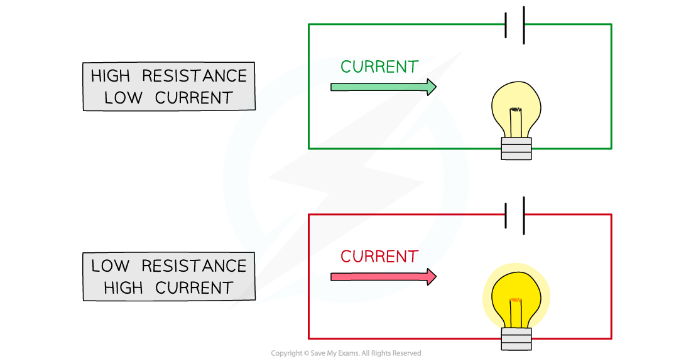
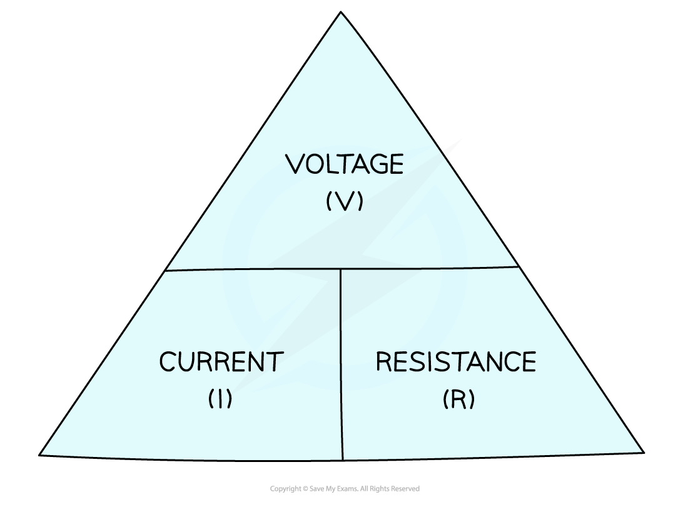

# Resistance

## Calculating current, resistance & potential difference

> **Spec point** — `spcpt_T33QxYM6fy6g3vyr` · know and use the relationship between voltage, current and resistance: voltage = current × resistance 
V = I × R

## Calculating current, resistance & potential difference

- Resistance is defined as

**The opposition of a component to the flow of electric current through it**

- Resistance is measured in units of** ohms (Ω)**

  - A resistance of 1 Ω is equivalent to a voltage across a component of 1 V which produces a current of 1 A through it

- The resistance of a component controls the size of the current in a circuit
- For a given voltage across a component:

  - The **higher **the resistance, the **lower **the current that can flow
  - The **lower **the resistance, the **higher **the current that can flow

- All electrical components, including wires, have some value of resistance
- Wires are often made from copper because it has a **low** electrical resistance

  - This is why it is known as a **good conductor**

#### Comparing current and resistance

***A greater resistance means there is a lower current and vice versa***

- The current, resistance and potential difference of a component in a circuit are calculated using the equation:

voltage = current × resistance

$V=I\timesR$

- Where:

  - *V* = voltage, measured in volts (V)
  - *I* = current, measured in amps (A)
  - *R* = resistance, measured in ohms (Ω)

- This equation can be rearranged with the help of the following formula triangle:

#### Voltage current resistance formula triangle

***Formula triangle for the voltage, current and resistance equation***

- Check out this revision note on [speed, distance and time](https://www.savemyexams.com/igcse/physics/edexcel/19/revision-notes/1-forces-and-motion/1-1-movement-and-position/1-1-2-speed/) if you need a reminder on how to use formula triangles

> **Worked Example**
> Calculate the voltage across a resistor of resistance 10 Ω if there is a current of 0.3 A through it.
> 
> **Answer:**
> 
> **Step 1: List the known quantities**
> 
> - Resistance, *R* = 10 Ω
> - Current, *I* = 0.3 A
> 
> **Step 2: Write the equation relating resistance, potential difference and current**
> 
> $V=I\timesR$
> 
> **Step 3: Substitute in the values**
> 
> *V* = 0.3 × 10 = **3 V**

> **Exam Hint**
> In exam questions, the resistance of the wires, batteries, ammeters and voltmeters are always assumed to be **zero **(in the case of voltmeters, they have extremely high resistances so that current does not flow through them, and this has a negligible effect on the overall resistance of the circuit)
