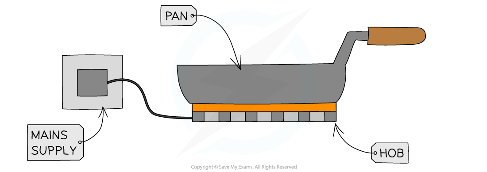

# Electricity & Heat

## Electricity & heat

> **Spec point** — `spcpt_XNtqTrjX8pr25tQZ` · understand why a current in a resistor results in the electrical transfer of energy and an increase in temperature, and how this can be used in a variety of domestic contexts

## Electricity & heat

- A **current** passing through a resistor (or wire) results in the **electrical transfer of energy**

  - As explained in [Charge & current,](https://www.savemyexams.com/igcse/physics/edexcel/modular/24/unit-1/revision-notes/electricity/current-potential-difference-resistance/charge-current/) current is the **rate of flow of charge**
- The temperature of a resistor increases due to the **collisions** of the **free electrons** within the wire
- Some of the **energy is dissipated** into the surroundings by **heating**

- This heating effect is **utilised** in many domestic contexts, including:

  - Electric **heaters**
  - Electric **ovens**
  - Electric **hob**
  - **Toasters**
  - **Kettles**

#### Heating a pan on an electrical hob

***The heating effect of current can be used for many applications such as electric hobs***

> **Exam Hint**
> Remember that a charge moving around an electrical circuit are an example of an electrical transfer pathway. If you are unsure of how to explain energy stores and transfers use the [Energy stores & transfers](https://www.savemyexams.com/igcse/physics/edexcel/19/revision-notes/4-energy-resources-and-energy-transfers/4-1-energy-stores-and-transfers/4-1-1-energy-stores-and-transfers/) revision note to help.
