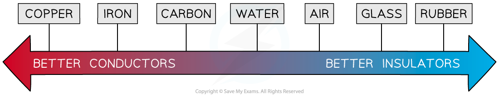

# Conductors & Insulators

## Conductors & insulators

> **Spec point** — `spcpt_FrqGdXDjjzqyT8Kv` · identify common materials which are electrical conductors or insulators, including metals and plastics (physics only)

## Conductors & insulators

### Conductors

- A **conductor** is a material that allows **charge** (usually electrons) to flow through it easily
- Examples of conductors are:

  - Silver
  - Copper
  - Aluminium
  - Steel

- Conductors tend to be **metals**

***Different materials have different properties of conductivity***

- On the atomic scale, conductors are made up of positively charged metal ions with their outermost electrons **delocalised**

  - This means the electrons are free to move

- Metals conduct electricity very well because:

  - Current is the rate of flow of electrons
  - So, the more easily electrons are able to flow, the **better** the conductor

***The lattice structure of a conductor with positive metal ions and delocalised electrons***

### Insulators

- An **insulator** is a material that has** no free charges, **hence does **not** allow the flow of charge through them very easily
- Examples of insulators are:

  - Rubber
  - Plastic
  - Glass
  - Wood

- Some non-metals, such as wood, allow **some **charge to pass through them
- Although they are not very good at conducting, they do conduct a little in the form of **static** electricity

  - For example, two insulators can build up charge on their surfaces and if they touch this would allow that charge to be conducted away
