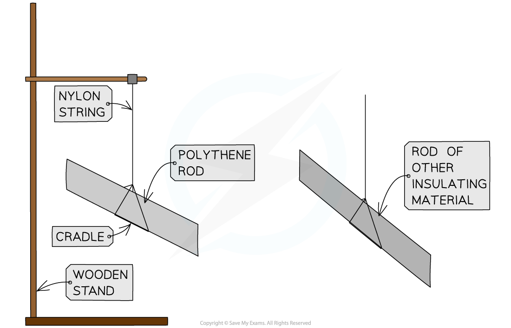
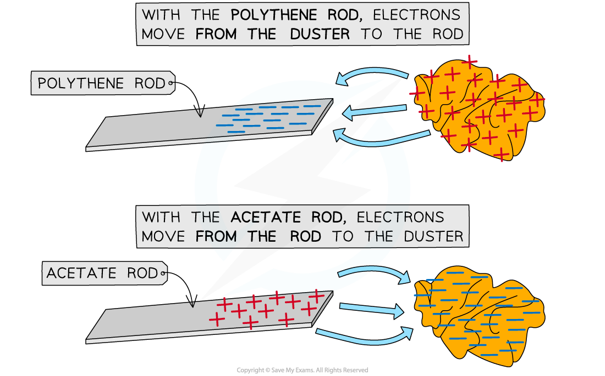

# Core Practical: Investigating Charging by Friction

## Core practical 3: investigating charging by friction

> **Spec point** — `spcpt_q78bR4FJWm99HybX` · Core practical 3: investigate how insulating materials can be charged by friction (physics only)

## Core practical 3: investigating charging by friction

### Aim of the experiment

- The aim of this experiment is to investigate how insulating materials can be charged by friction

### Variables

- ***Independent variable*** = Rods of different material
- ***Dependent variable*** = Charge on the rod
- Control variables:

  - Time spent rubbing the rod
  - Using the same type of cloth
  - Using the same length of rod

### Equipment

| **Equipment** | **Purpose** |
|---|---|
| Polythene rod | to charge and hang from a cradle to test against each material |
| Rods of different materials (acrylic, acetate, glass, wood) | to observe the effects of these on the polythene rod |
| Cloths (one per material) | to rub the materials to charge them |
| Cradle | to suspend rods from, allowing them to move freely when subjected to a force |
| Nylon string | to hang the rods |
| Wooden stand | to suspend the string and cradle from |

### Method

***Apparatus for investigating charging by friction***

1. Take a polythene rod, hold it at its centre and rub both ends with a cloth
2. Suspend the rod, without touching the ends, from a stand using a cradle and nylon string
3. Take an acrylic rod and rub it with another cloth
4. Without touching the ends of the acrylic rod bring each end of the acrylic rod up to, but without touching, each end of the polythene rod (if the ends do touch, the rods will **discharge **and the forces will no longer be present)
5. Record any observations of the polythene rod's motion
6. Repeat, changing out the acrylic rod for rods of different materials

### Analysis of Results

- When two insulating materials are rubbed together, electrons will transfer from one insulator onto the other insulator
- A polythene rod is given a negative charge by rubbing it with the cloth

  - This is because electrons are transferred to the polythene from the cloth
  - Electrons are negatively charged, hence the polythene rod becomes negatively charged
- Conversely, an acetate rod is given a positive when rubbed with a cloth

  - This is because electrons are transferred away from the acetate to the cloth
  - Electrons are negatively charged, so when the acetate **loses** negative charge, it becomes **positively** charged

***Electrons are transferred to the polythene rod whilst they move from the acetate rod***

- If the material is **repelled** by (rotates away from) the polythene rod, then the materials have the **same charge**
- If the material is **attracted** to (moves towards) the polythene rod, then they have **opposite charges**

  - In the example from the diagram above, the acetate rod would be attracted to the polythene rod, as they have opposite charges

### Evaluating the Experiment

*Random errors*

- Ensure the experiment is done in a space with no draft or breeze and the table is free of vibrations (e.g. from electrical equipment in the room), as this could affect the motion of the polythene rod
- If the deflection of the rod is very small, the direction could be misinterpreted – rub the other material for a longer period to transfer more charge and produce a more visible deflection
- This experiment can be carried out in several different ways
- To improve the outcome of the experiment, consider investigating a variable with a numerical result
- For example:

  - the independent variable could stay the same (using rods of different material)
  - the dependent variable could change to be the number of paper circles picked up by each rod
- Collecting numerical data allows:

  - more analysis to be carried out e.g. creating a graph or a chart
  - better conclusions to be drawn e.g. the rod made of ___ picked up more circles of paper than the other rods, therefore it became the most charged

> **Exam Hint**
> Many students struggle with the concept of becoming positively charged by losing negative electrons. Luckily this can be explained using a very simple equation.
> 
> A neutral object has a charge of 0. When we remove an electron, we are subtracting a negative charge from our neutral object. This is the same as the following equation:
> 
> 0 − (−1) = +1
> 
> By removing a negative charge from a neutral object, we end up with a positively charged object, as shown by the +1 answer.
